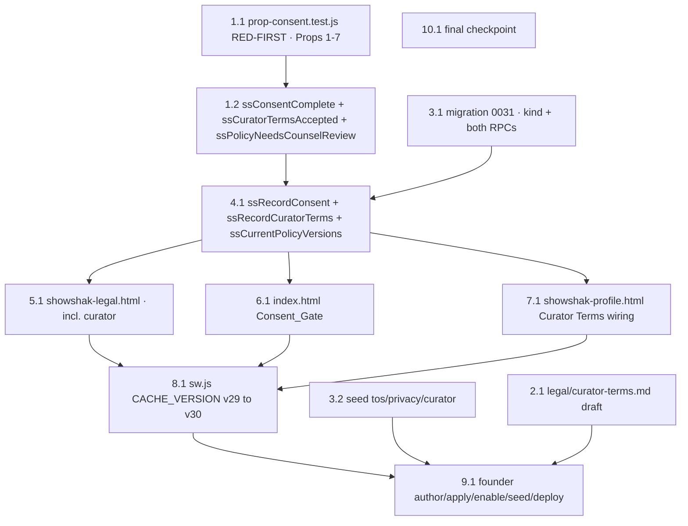

# Implementation Plan

## Overview

A single, dependency-ordered phase that ships the **DPDP affirmative consent + 18+ gate** as
onboarding Step 1, the real-draft policy seed, **and the one-time Curator Terms acceptance at the
"Become a Curator" step**, as **one compliance unit** (the version contract). The pure validators
and their property tests are written **red-first**, then implemented to green; the database
(migration `0031` + `ss_record_consent` / `ss_record_curator_terms` `SECURITY DEFINER` RPCs +
own-row RLS over a shared `consents` store) is the security boundary; the founder authors the
final policy text, applies the migration, runs the seed, and toggles the Supabase Auth setting
manually.

The onboarding consent and the Curator Terms acceptance share **one** `consents` table separated
by a `kind` discriminator (`'user_consent'` | `'curator_terms'`), the **same** reused
`policy_versions` table (a new `doc = 'curator'` row), the **same** Legal_Surface, and **sibling**
validator/wrapper/RPC pairs beside the consent ones. The Curator Terms acceptance binds **before**
the `users.role` flip in `bcActivate()`, complementing — not replacing — the per-upload DMCA
attestation from `0029`.

Conventions (matching `dmca-moderation-scaffolding` and `watch-it-curator-availability`):

- All pure decision logic lives in `showshak-shared.js`, **dual-exported** (`window.*` +
  `module.exports`), DOM-free, never throws. The new file `tests/prop-consent.test.js` carries
  the **seven correctness properties** in one fast-check file (`installDomStub()` before
  `require('../showshak-shared.js')`, `{ numRuns: ITER }`, each tagged
  `// Feature: beta-consent-gate, Property <n>` + `**Validates: Requirements X.Y**`),
  **auto-discovered** by `tests/run-all.js` (it globs `tests/*.test.js` — no manual registration
  needed). Run `node tests/run-all.js` after every `showshak-shared.js` change; the suite MUST
  stay green.
- **Pure functions and their property tests come BEFORE the impure wiring that depends on them**,
  and the tests are written **red-first** (authored to fail, then implemented to green). The JS
  validators are the gate's / curator-activate's enable condition and the spec the SQL
  re-validation honors — they are NEVER the security boundary.
- **Migrations and the policy seed are founder-applied** in the Supabase SQL editor and flagged
  **[founder-run]** — the agent authors the `.sql` files; the founder applies/runs them. `0030`
  is RESERVED for DMCA Phase 2, so this feature uses **`0031`**. The reused `policy_versions`
  table (from `0029`) is referenced, never recreated.
- **The Curator Terms draft is agent-authored content.** `legal/curator-terms.md` does not exist
  yet; the agent authors a counsel-review-required draft with `[PLACEHOLDER]` tokens, and the
  founder later fills the placeholders and counsel-reviews it before the final-text re-seed. It is
  not a `.sql` file and not the security boundary.
- **Enabling Anonymous sign-ins** in Supabase Auth settings is a **[founder-run]** dashboard
  toggle (Design Decision 1) — not an agent action.
- Vanilla HTML/CSS/JS, no build step. The Consent_Gate is **self-contained inside `index.html`**
  (inline styles, no external script/style dependency — Req 2.9). The Curator Terms acceptance is
  wired into the existing `#bc-overlay` / `bcStep` / `bcActivate()` in `showshak-profile.html`.
  **Sacred rules preserved** (title-blind, hide-the-scoreboard, RLS-not-UI); the player/feed/CDN/MP4
  are untouched. All legal prose stays placeholder copy carrying the visible
  **"counsel review required"** marker until counsel-approved final text is re-seeded.

## Tasks

- [x] 1. Pure consent + curator core + property tests (`showshak-shared.js`)
  - [x] 1.1 Write `tests/prop-consent.test.js` **RED-FIRST** — the seven correctness properties
    - Plain Node + fast-check, `installDomStub()` before `require('../showshak-shared.js')`,
      `{ numRuns: ITER }`, each property tagged
      `// Feature: beta-consent-gate, Property <n>` + `**Validates: Requirements …**`. Authored
      to fail first (the functions don't exist yet), then driven green by task 1.2.
    - **Property 1: Complete consent is accepted** — generate complete consents (both flags
      strictly `true`, random non-empty / whitespace-padded version strings) → assert
      `ssConsentComplete === true`. **Validates: Requirements 5.1, 2.6**
    - **Property 2: Any incomplete consent is rejected** — flags as `1`/`'true'`/`0`/missing,
      versions as non-strings / empty / all-whitespace, plus `fc.anything()` non-objects →
      assert `=== false`. **Validates: Requirements 5.1, 5.2, 5.3, 5.4, 5.5, 5.6, 2.5, 2.11, 3.7**
    - **Property 3: Validator is total and strictly boolean** — `fc.anything()` → result is
      strictly `true` or `false` and never throws. **Validates: Requirements 5.7**
    - **Property 4: Validator is pure (deterministic, non-mutating)** — deep-freeze / snapshot
      input, call twice, assert equal results and the input is unchanged.
      **Validates: Requirements 5.8**
    - **Property 5: Counsel-review marker tracks placeholder tokens** — bodies with / without
      bracketed `[…]` tokens (plus `null` / non-string / empty) → assert
      `ssPolicyNeedsCounselReview` matches token presence with the fail-safe on non-strings.
      **Validates: Requirements 1.4, 8.3**
    - **Property 6: Curator-terms acceptance validity** — generate valid acceptances
      (`affirmative:true`, random non-empty / whitespace-padded `curator_version`) → assert
      `ssCuratorTermsAccepted === true`; generate broken acceptances (`affirmative` as
      `1`/`'true'`/`0`/missing; `curator_version` non-string / empty / all-whitespace) and
      `fc.anything()` non-objects → assert `=== false`.
      **Validates: Requirements 9.11, 9.2, 9.14**
    - **Property 7: Curator-terms validator is total, strictly boolean, and pure** —
      `fc.anything()` → `ssCuratorTermsAccepted` never throws and returns strictly `true`/`false`,
      plus a deep-freeze + double-call equality check (determinism + no mutation).
      **Validates: Requirements 9.11**
    - _Files: tests/prop-consent.test.js_
    - _Requirements: 5.10, 5.7, 5.8, 1.4, 9.11, 9.13_

  - [x] 1.2 Implement `ssConsentComplete(consent)`, `ssCuratorTermsAccepted(acceptance)`, and
    `ssPolicyNeedsCounselReview(body)` to green
    - Add all three **beside `ssAttestationComplete`**, dual-exported in the
      `if (typeof window !== 'undefined')` block AND the consolidated `module.exports` block
      (Req 5.9 / 9.11). `ssConsentComplete` returns the strict boolean `true` IFF `consent` is a
      non-null object, `consent.affirmative === true`, `consent.age18plus === true`,
      `typeof consent.tos_version === 'string' && consent.tos_version.trim().length >= 1`, and
      `typeof consent.privacy_version === 'string' && consent.privacy_version.trim().length >= 1`;
      else strict `false`. `ssCuratorTermsAccepted` returns the strict boolean `true` IFF
      `acceptance` is a non-null object, `acceptance.affirmative === true`, and
      `typeof acceptance.curator_version === 'string' && acceptance.curator_version.trim().length >= 1`;
      else strict `false`. `ssPolicyNeedsCounselReview` returns `true` when `body` is not a
      non-empty string OR matches `/\[[^\]]+\]/`, else `false`. All three: `null`/`undefined`/
      non-object → `false`, never throw, no mutation, deterministic. Run `node tests/run-all.js` →
      `prop-consent` green.
    - _Files: showshak-shared.js_
    - _Requirements: 5.1, 5.2, 5.3, 5.4, 5.5, 5.6, 5.7, 5.8, 5.9, 1.4, 9.11_

- [x] 2. Author the Curator Terms legal draft (`legal/curator-terms.md`)
  - [x] 2.1 Create `legal/curator-terms.md` — counsel-review-required draft
    - Author a new working draft mirroring the other `legal/*.md` drafts in tone and structure:
      the `<!-- DRAFT — COUNSEL REVIEW REQUIRED BEFORE LAUNCH. Not legal advice. -->` header, the
      `**Version:** [VERSION] · **Effective date:** [EFFECTIVE_DATE]` line, the open-beta / India
      status line, and `[PLACEHOLDER]` tokens (`[ENTITY_NAME]`, emails, etc.) so the founder can
      fill them and counsel can review later. This is **agent-authored content** (the founder
      fills placeholders + counsel-reviews); it is the verbatim body the seed (task 3.2) publishes
      as `doc = 'curator'`. The draft body MUST state, in plain India-aware prose:
      - **Ownership retained** — the curator retains ownership of the clips they post (Req 8.6).
      - **License grant** — the curator grants ShowShak a **non-exclusive, worldwide,
        royalty-free, sublicensable** license to ShowShak and its infrastructure, content-delivery
        (CDN), and video providers (e.g. Mux) to host, store, reproduce, transcode, create
        thumbnails and previews of, display, distribute, and promote the clip on and through the
        service for as long as the clip is on the platform, plus a reasonable backup and
        legal-retention tail (Req 8.7).
      - **Neutral host / no ownership** — ShowShak claims no ownership of clips and is a neutral
        host and showcase that does not host the underlying shows or movies; the "Watch It" action
        links out to third-party streaming platforms (Req 8.8).
      - **Rights warranty** — the curator represents and warrants they created or hold all
        necessary rights, licenses, and permissions to the clip and everything in it, including
        video, audio and music, and any third-party material, and that the clip does not infringe
        (Req 8.9).
      - **Sole responsibility + indemnity** — the curator is solely responsible for their clips and
        indemnifies ShowShak against claims arising from those clips (Req 8.10).
      - **Guidelines compliance** — the curator agrees to the Community Guidelines and the
        Copyright Policy, will post neither infringing content nor unlicensed music or audio, and
        that repeat infringers may be suspended or terminated (Req 8.11).
    - _Files: legal/curator-terms.md_
    - _Requirements: 8.6, 8.7, 8.8, 8.9, 8.10, 8.11_

- [x] 3. **[founder-run]** Author the database artifacts (migration + policy seed)
  - [x] 3.1 Create `supabase/migrations/0031_beta_consent_gate.sql`
    - Mirror the `0029` attestation shape: a **shared** `consents` table holding both acceptance
      kinds (`subject_id uuid not null` with **NO FK and NO `on delete cascade`** so the record
      outlives the session — Req 3.9 / 9.10; `accepted_at`, `affirmative`, plus a
      **`kind text not null default 'user_consent'`** discriminator and **nullable** version
      columns `age18plus`, `tos_version`, `privacy_version`, `curator_version` used per-kind;
      `created_at`/`updated_at`/`deleted_at`, `meta jsonb default '{}'`). Add the per-kind
      integrity constraints: `consents_kind_ck check (kind in ('user_consent','curator_terms'))`,
      `consents_user_consent_ck` (when `kind = 'user_consent'` ⇒ `age18plus` non-null + non-empty
      trimmed `tos_version` + non-empty trimmed `privacy_version`), and `consents_curator_terms_ck`
      (when `kind = 'curator_terms'` ⇒ non-empty trimmed `curator_version`) so a malformed row
      cannot exist no matter which RPC wrote it (Req 9.5). Indexes on `subject_id`, `accepted_at`,
      and **`kind`** (`idx_consents_kind`). Enable RLS with **`consents_read_own`**
      `using (subject_id = auth.uid())` governing **all** kinds and **no insert policy**. Author
      **two** sibling `SECURITY DEFINER` RPCs with locked `search_path`, each setting
      `subject_id := auth.uid()` server-side (client claim ignored — Req 3.5 / 9.6) and raising
      `insufficient_privilege` when `auth.uid()` is null (Req 3.6 / 9.6):
      - `ss_record_consent(p_affirmative, p_age18plus, p_tos_version, p_privacy_version)` —
        server-side re-validation mirroring `ssConsentComplete` (both flags strictly true +
        non-empty trimmed versions — Req 3.7), single transactional insert at `now()` with
        `kind = 'user_consent'` (Req 3.1 / 3.8), `grant execute … to authenticated`.
      - `ss_record_curator_terms(p_curator_version)` — server-side re-validation mirroring
        `ssCuratorTermsAccepted` (non-empty trimmed `curator_version`; the RPC is itself the
        affirmative act so it always inserts `affirmative = true` — Req 9.14), single
        transactional insert at `now()` with `kind = 'curator_terms'`, `curator_version` = bound,
        leaving `age18plus`/`tos_version`/`privacy_version` null (Req 9.5 / 9.8),
        `grant execute … to authenticated`.
      End with `notify pgrst, 'reload schema';`. The store carries no fires/tap-count/title
      columns (Req 3.10 / 9.10).
    - **[founder-run]** the founder applies `0031` in the Supabase SQL editor (see task 9).
    - _Files: supabase/migrations/0031_beta_consent_gate.sql_
    - _Requirements: 3.1, 3.2, 3.3, 3.4, 3.5, 3.6, 3.7, 3.8, 3.9, 3.10, 9.5, 9.6, 9.7, 9.8, 9.10, 9.14_

  - [x] 3.2 Create `supabase/seed/seed_policy_versions.sql` (founder-run data, idempotent)
    - Publish the **verbatim** bodies of `legal/terms-of-service.md`, `legal/privacy-policy.md`,
      **and `legal/curator-terms.md`** into the **reused** `policy_versions` table as rows
      `doc='tos'`, `doc='privacy'`, and `doc='curator'`, each with a non-empty `version`
      (e.g. `1.0-beta`), a non-empty `effective_date`, and `is_current = true`, guarded
      `insert … select … where not exists` (idempotent). Include the commented re-seed recipe: a
      later counsel-approved version is a **new** immutable row plus an atomic repoint of
      `is_current` (prior rows' `body`/`version`/`effective_date` are never mutated —
      Req 1.5/1.8/2.8/8.13), so the final-text swap is data, not code.
    - **[founder-run]** the founder runs this seed in the Supabase SQL editor (see task 9).
    - _Files: supabase/seed/seed_policy_versions.sql_
    - _Requirements: 1.1, 1.3, 1.5, 1.7, 1.8, 8.1, 8.12, 8.13_

- [x] 4. Client consent + curator wrappers (`showshak-shared.js`, window-only)
  - [x] 4.1 Add `ssRecordConsent(consent)`, `ssRecordCuratorTerms(acceptance)`, and
    `ssCurrentPolicyVersions(opts?)` beside the existing `ssRecordAttestation` /
    `ssLoadPolicyVersion` wrappers (window-only, NOT in `module.exports`), fail-soft, never throw.
    `ssRecordConsent`: gate FIRST with `ssConsentComplete` (false → no RPC, Req 6.5/6.6); require
    `window.ssDB` (unavailable → no RPC, Req 6.3); resolve identity via `ssCurrentUser()` and, when
    null, lazily mint a session with `ssDB.auth.signInAnonymously()` then re-read (still null → no
    RPC, Req 6.3/3.6); call `ssDB.rpc('ss_record_consent', …)`; return `{ ok:true, id }` on success
    (Req 6.2) or `{ ok:false, error }` on RPC error (Req 6.4); wrapped in try/catch so it never
    throws (Req 6.7). `ssRecordCuratorTerms`: mirror `ssRecordConsent` — gate FIRST with
    `ssCuratorTermsAccepted` (false → no RPC, Req 9.14); require `window.ssDB`; resolve identity via
    the **same** lazy `ssCurrentUser()` → `signInAnonymously()` path (curator step normally already
    has a permanent session; still null → no RPC, Req 9.6/9.8); call
    `ssDB.rpc('ss_record_curator_terms', { p_curator_version: acceptance.curator_version })`;
    return `{ ok:true, id }` (Req 9.5) or `{ ok:false, error }` (Req 9.8); never throws.
    `ssCurrentPolicyVersions(opts?)`: direct read of `policy_versions where is_current and
    deleted_at is null`; default (no opts) resolves `('tos','privacy')`, returning `ok:true` only
    when BOTH resolve, else `{ ok:false }` (Req 4.1); `{ curator:true }` additionally resolves the
    current `doc='curator'` row, returning `ok:true` only when `curator` resolves, else
    `{ ok:false }` (Req 9.3/9.4).
    - _Files: showshak-shared.js_
    - _Requirements: 6.1, 6.2, 6.3, 6.4, 6.5, 6.6, 6.7, 4.1, 3.6, 9.3, 9.5, 9.6, 9.8, 9.14_

- [x] 5. Legal_Surface — `showshak-legal.html` (render current version, honor `?v=`, incl. curator)
  - [x] 5.1 Enhance `renderDoc(doc)` to resolve the current version (via `ssCurrentPolicyVersions()`
    / `is_current`) instead of a hardcoded version, then load the exact body with
    `ssLoadPolicyVersion(doc, version)`; on success render the stored body / version /
    effective_date and suppress the built-in scaffolding (Req 1.2 / 8.2). **`doc = 'curator'` is
    handled identically to `tos`/`privacy`** — add a `curator` entry to the page's doc `cfg` map
    (title + scaffolding) so the same resolve → load → render → fallback path applies. When the URL
    carries `&v=<version>` (the gate's or the curator step's bound link), load that exact version
    (Req 4.4 / 9.3). Show the counsel banner when `ssPolicyNeedsCounselReview(renderedBody)` is
    `true` — for scaffolding AND for any stored body (including `curator`) still containing `[…]`
    tokens (Req 1.4 / 8.3). On no current row or a load error, degrade to the existing
    clearly-marked placeholder scaffolding with version / effective-date / counsel markers so the
    surface stays reachable for any `doc` incl. `curator` (Req 1.6/1.9/8.4/8.5). Title-blind,
    scoreboard-safe.
    - _Files: showshak-legal.html_
    - _Requirements: 1.2, 1.4, 1.6, 1.9, 4.4, 8.2, 8.3, 8.4, 8.5_

- [x] 6. Consent_Gate — new first onboarding panel in `index.html` (inline, self-contained)
  - [x] 6.1 Inject `#ob-panel-0` as the **first** interactive onboarding surface (Req 2.1): two
    **unticked** checkboxes (`#consent-accept`, `#consent-age18`) that reset to unticked on every
    fresh `openOnboarding()` (Req 2.2/2.3); two `target="_blank"` policy links (Req 2.4); a
    `#consent-policy-status` region; the progress row gains a **4th node** and Genres / Platforms /
    Sign-In each shift `+1` (Req 7 — single added step). On open `await ssCurrentPolicyVersions()`,
    bind `{ tosVersion, privacyVersion }` **once** and set the link `href`s to
    `showshak-legal.html?doc=…&v=<bound>` (Req 4.2); on miss show "policies currently unavailable"
    and keep advance disabled regardless of checkbox state (Req 4.5/4.6). Inline gate
    `obConsentReady() = #consent-accept.checked && #consent-age18.checked && policiesResolved`
    drives `#ob-next-btn.disabled` (Req 2.5/2.6) — defined entirely in `index.html` with no
    external-script dependency (Req 2.9). `obConsentAdvance()` builds
    `{ affirmative:true, age18plus:true, tos_version:boundTos, privacy_version:boundPrivacy }`,
    calls `await window.ssRecordConsent(consent)`, and **only** advances on `{ ok:true }`,
    otherwise surfaces "consent could not be saved" and stays on the gate (Req 2.7/2.8/2.10/2.11/
    3.8/4.3). No personal-data collection occurs before this gate is passed.
    - _Files: index.html_
    - _Requirements: 2.1, 2.2, 2.3, 2.4, 2.5, 2.6, 2.7, 2.8, 2.9, 2.10, 2.11, 4.2, 4.3, 4.5, 4.6, 7.1_

- [x] 7. Curator Terms acceptance — Become-a-Curator wiring in `showshak-profile.html`
  - [x] 7.1 Wire the Curator Terms acceptance into the existing `#bc-overlay` / `bcStep`
    progression / `bcActivate()` on the **final (Curator Terms) step**. On entering that step
    (in `bcRender()` for the final step, or `openBecomeCurator()`),
    `await window.ssCurrentPolicyVersions({ curator:true })`; on `ok` bind
    `boundCurator = curator.version` **once** and set the Curator Terms link `href` to
    `showshak-legal.html?doc=curator&v=<boundCurator>` with `target="_blank"` so opening it never
    dismisses the modal or resets state (Req 9.3); on miss show a "Curator Terms unavailable"
    notice and keep the activate control disabled (Req 9.4). Render the agree control
    **unticked by default** on every fresh entry (`openBecomeCurator()` already resets
    `bcAgreed = false`) and enable the activate control (`bc-next` on the final step) **iff**
    `bcAgreed && boundCurator` is resolved — extending the current `next.disabled = !bcAgreed`
    (Req 9.1/9.2). In `bcActivate()`, **before** the existing `ssBuildOnboardingPatch(...)` +
    `ssDB.from('users').update(patch)` role flip: build
    `acceptance = { affirmative:true, curator_version: boundCurator }`; gate with
    `if (!window.ssCuratorTermsAccepted(acceptance)) return;` (Req 9.14 — no flip); then
    `const r = await window.ssRecordCuratorTerms(acceptance);` (Req 9.5 — bind FIRST); on
    `r.ok === false` surface "couldn't save your acceptance" and **do NOT** flip the role
    (Req 9.8); only on `r.ok === true` proceed to the existing `users.role` flip (Req 9.5/9.12).
    This replaces the current UI-only `bcAgreed` gate with a recorded, version-stamped acceptance.
    - _Files: showshak-profile.html_
    - _Requirements: 9.1, 9.2, 9.3, 9.4, 9.5, 9.8, 9.9, 9.12, 9.14_

- [x] 8. **[founder-run]** Bump `sw.js` CACHE_VERSION for the new surfaces
  - [x] 8.1 Increment `CACHE_VERSION` from `'v29'` to `'v30'` (exactly one greater; `CACHE_NAME`
    derives as `'showshak-' + CACHE_VERSION`). Confirm `PRECACHE` already includes `'./'`
    (precaches `index.html` as scope root), `'showshak-legal.html'`, **and
    `'showshak-profile.html'`**, that the one-by-one `cache.add(...).catch(...)` ignores individual
    precache misses so install never aborts, and that `activate` cleanup deletes every
    `showshak-*` cache except the active `CACHE_NAME` and the version-independent `SEG_CACHE`
    (`'showshak-seg'`) — no change needed there. **[founder-run]**: the founder deploys so the
    installed PWA picks up the new service worker.
    - _Files: sw.js_
    - _Requirements: 7.1, 7.2, 7.3, 7.4, 7.5_

- [ ] 9. **[founder-run]** Author final policy text, apply DB artifacts, enable anonymous sign-ins, deploy
  - [~] 9.1 Founder-only steps (no agent execution): finalize the legal drafts — **fill the
    `[PLACEHOLDER]` tokens in `legal/curator-terms.md` (and `terms-of-service.md` /
    `privacy-policy.md`) and counsel-review them**; in the Supabase dashboard **enable Anonymous
    sign-ins** in Auth settings (Design Decision 1 — required so `ssRecordConsent` /
    `ssRecordCuratorTerms` can mint a pseudonymous `auth.uid()` when no session exists); apply
    `0031_beta_consent_gate.sql` in the SQL editor; run `seed_policy_versions.sql` in the SQL
    editor (now publishes the real `tos`/`privacy`/**`curator`** drafts); then push to `main` and
    reopen the installed PWA **twice** so the bumped service worker activates. Verify in the SQL
    editor: `ss_record_consent` **and `ss_record_curator_terms`** exist and are granted to
    `authenticated`; `consents` has RLS with `consents_read_own`, the `kind` discriminator + check
    constraints, and nullable version columns; a valid consent call inserts exactly one
    `user_consent` own-row record and a valid curator call inserts exactly one `curator_terms`
    own-row record; a call with `auth.uid()` null / a false flag / an empty bound version inserts
    nothing; `showshak-legal.html` shows the seeded `tos`/`privacy`/`curator` bodies and keeps the
    counsel banner while `[…]` tokens remain.
    - _Requirements: 1.7, 3.2, 3.5, 6.3, 8.1, 9.6_

- [x] 10. Final checkpoint — suite green
  - [x] 10.1 Run `node tests/run-all.js`; the full suite (existing files + the new
    `prop-consent.test.js` carrying Properties 1–7, including the curator-terms Properties 6 & 7)
    MUST be green. Run `node --check` on changed JS and confirm HTML diagnostics are clean for
    `index.html`, `showshak-legal.html`, and `showshak-profile.html`. Ensure all tests pass, ask
    the user if questions arise.
    - _Requirements: 5.10, 9.13_

## Notes

- **Single shippable phase.** The pure validators (`ssConsentComplete`, `ssCuratorTermsAccepted`)
  + their red-first property tests (task 1) come first and are the spec the SQL re-validation in
  `ss_record_consent` / `ss_record_curator_terms` must honor — the database (RLS +
  `SECURITY DEFINER` RPCs + server-side re-validation) is the security boundary, never the JS. The
  own-row read boundary is an RLS guarantee (`subject_id = auth.uid()`) over **all** kinds, never
  UI-only.
- **One store, two kinds.** The onboarding consent and the Curator Terms acceptance share the
  `consents` table via a `kind` discriminator (`'user_consent'` | `'curator_terms'`), with
  nullable per-kind version columns and per-kind `check` constraints, written by two
  single-purpose `SECURITY DEFINER` RPCs. The Curator Terms acceptance binds **before** the
  `users.role` flip in `bcActivate()`, complementing the per-upload DMCA attestation from `0029`.
- **Agent-authored content vs founder-run.** The agent authors `legal/curator-terms.md` (task 2),
  `0031_beta_consent_gate.sql`, `seed_policy_versions.sql`, and the `sw.js` bump; the founder
  fills the `[PLACEHOLDER]` tokens + counsel-reviews the drafts, enables Anonymous sign-ins,
  applies the migration, runs the seed, and deploys/reopens the PWA (tasks 8, 9). `0030` stays
  reserved for DMCA Phase 2, so this feature uses `0031`; `policy_versions` is reused, never
  recreated.
- **Suite stays green** after every `showshak-shared.js` change: run `node tests/run-all.js`. The
  new `tests/prop-consent.test.js` is **auto-discovered** by the runner (it globs `tests/*.test.js`)
  — no manual registration is required.
- **Version contract**: the current `tos`/`privacy` versions are resolved **once** when the gate
  opens, and the current `curator` version is resolved **once** when the Become-a-Curator step
  opens; each resolved identifier is reused for the policy links, the Legal_Surface display, and
  the persisted record — so the user consents/accepts exactly what they read. If a current version
  can't be resolved, the surface shows an "unavailable" notice and keeps advance/activate disabled
  (no bind, no persist).
- **Sacred rules** hold throughout (title-blind, hide-the-scoreboard, RLS-not-UI); exactly one
  onboarding step is added; the player, feed, and CDN/MP4 pipeline are untouched. All legal copy
  (including the new `legal/curator-terms.md`) carries the visible **"counsel review required"**
  marker until counsel-approved text is re-seeded.

## Task Dependency Graph



Critical path: 1.1 → 1.2 → 4.1 → (5.1, 6.1, 7.1) → 8.1 → 9.1 → 10.1. Tasks 1.1, 2.1, 3.1, and 3.2
are independent and can run in parallel in the first wave; the `legal/curator-terms.md` authoring
(2.1) feeds the curator seed/apply at founder time (9.1). 1.2 and 4.1 are in separate waves because
both write `showshak-shared.js` (single-writer ordering). 5.1, 6.1, and 7.1 are independent of one
another once 4.1 lands and all depend on the same wrappers.

```json
{
  "waves": [
    { "id": 0, "tasks": ["1.1", "2.1", "3.1", "3.2"] },
    { "id": 1, "tasks": ["1.2"] },
    { "id": 2, "tasks": ["4.1"] },
    { "id": 3, "tasks": ["5.1", "6.1", "7.1"] },
    { "id": 4, "tasks": ["8.1"] },
    { "id": 5, "tasks": ["9.1"] },
    { "id": 6, "tasks": ["10.1"] }
  ]
}
```

## Workflow Complete

This planning workflow is complete — requirements, design, and this task plan are the artifacts.
No implementation has been done. To begin, open
`.kiro/specs/beta-consent-gate/tasks.md` and click **Start task** next to a task item (begin with
task 1.1 — the red-first property tests).
