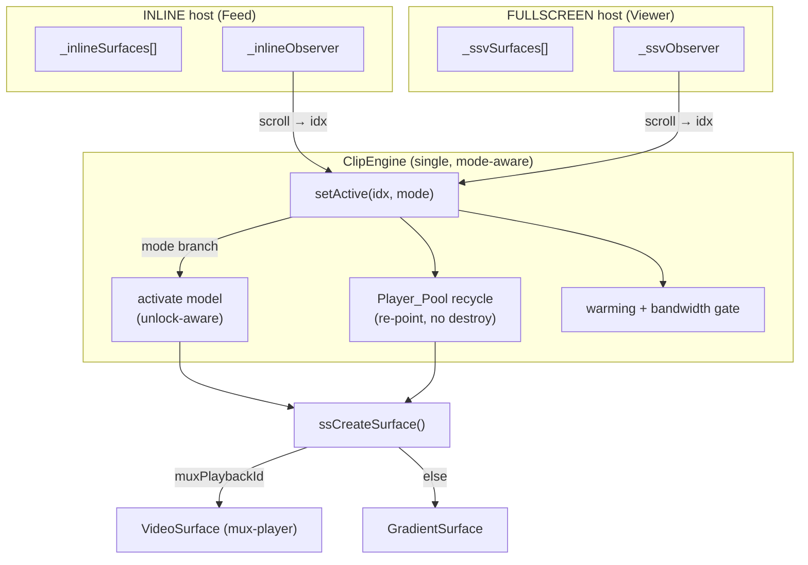
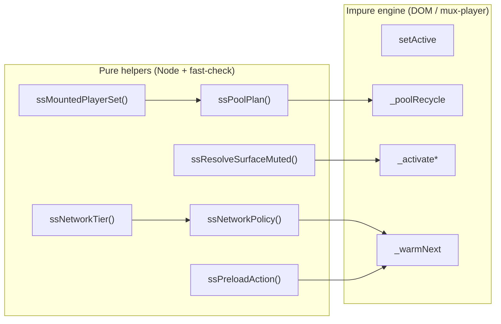

# Design Document — Clip Player Performance

## Overview

This feature upgrades the single shared `Clip_Engine` in `showshak-shared.js` so the
vertical clip player feels TikTok/Reels-class on the launch-market worst case (mid-range
Android on Indian 4G). It is **not** a rewrite. Every change is layered onto the
architecture that already exists: one `ClipEngine` object driving both the inline Feed
(`mountInline`, `_inline*`) and the fullscreen viewer (`ssOpenClip`, `_ssv*`) through the
`MediaSurfaceContract`, with `ssCreateSurface` as the only place that decides surface type.

The work changes four player behaviors and adds the levers to hit measurable smoothness:

1. **Persistent Audio_Unlock** — replace the per-activation `setMuted(true) → play() → unmute`
   dance (`_ssActivateSurface`, ~line 2895) with a session-level unlock. After the first
   gesture, mounted-band surfaces stay *unmuted-but-paused* (per `Mute_Preference`), and
   activation is just *pause prev + play active* with no muted→unmute transition. This is the
   root-cause fix for audio dropping on scroll.
2. **Player recycling pool** — replace destroy-and-recreate pruning (`_ssvPruneSurfaces`,
   inline `pruneInlineSurfaces`) with a fixed pool of mounted `<mux-player>`s that are
   *re-pointed* to new band clips. Fixes scroll-back reload flash and preserves audio-unlock.
3. **Instant first frame** — low `Start_Rendition` config on `<mux-player>`, poster-first
   paint on mount/recycle, and warming the next clip's manifest + first segment.
4. **Network-aware adaptation + bandwidth discipline** — derive a `Network_Tier` from
   `navigator.connection`, map it to `Preload_Depth` and a resolution ceiling, and gate
   off-screen prefetch so the active clip always wins the pipe.

Supporting work: DNS/TLS `Preconnect` hints (already partly present), first-clip warming
during the `Loading_Curtain`, and Mux Data QoE labeling as the objective scoreboard.

All **pure decision logic** (network tier, pool assignment/eviction, preload gating,
window/band math, audio-resolution rule) lands in `showshak-shared.js` and is exported via
`module.exports` for Node + fast-check tests (`node tests/run-all.js`, `tests/_pbt.js`, one
property per file, ≥100 iterations, tagged). Impure engine wiring is covered by the existing
`MediaSurfaceContract` and the no-regression constraint.

### Design assumptions to verify (mux-player capabilities)

These are anchored to the `@mux/mux-player@3` reference but must be confirmed on a real
device before the relevant phase is considered done:

- **Low start rendition**: mux-player v3 exposes `min-resolution` / `max-resolution` /
  `max-auto-resolution` (server- and ABR-side caps), `rendition-order="desc"`, and
  `initial-bandwidth-estimate-kbps` + `initial-estimate-segments` (seed ABR low so the first
  segment is a small/low rendition). There is **no single "start at 360p" attribute**; the
  instant-first-frame lever is the *combination* of a low `initial-bandwidth-estimate-kbps`
  with a `max-auto-resolution` ceiling on slow tiers. **Assumption to verify:** that this
  combination measurably lowers the first rendition without harming steady-state quality.
- **playback-id re-point**: the reference notes a new hls.js + mux-embed instance is created
  *per `playbackId`*. So re-pointing the `playback-id` attribute on an existing element keeps
  the custom element upgraded (no DOM churn, no re-registration) while starting a clean engine
  and a fresh Mux Data view for the new clip. **Assumption to verify:** that re-point is
  reliably faster/cleaner than destroy+recreate and does not leak the old hls instance.
- **Mux Data labeling**: Mux Data is built into mux-player and auto-reports. `env-key` selects
  the environment; `metadata-video-id` / `metadata-video-title` / `metadata-viewer-user-id` /
  `metadata-*` attribute per-clip attribution. **Assumption to verify:** per-clip QoE shows up
  correctly in the dashboard (Req 8.4 gate).

## Architecture

### The single engine, two hosts (unchanged duality)



`setActive(idx, mode)` keeps its existing INLINE-vs-FULLSCREEN branch. Everything new
(activate model, pool recycle, warming, bandwidth gate) is expressed against the
`MediaSurfaceContract` and the per-host state arrays (`_inlineSurfaces`/`_ssvSurfaces`,
`_inlineObserver`/`_ssvObserver`), so it applies identically to both hosts. No new branching
on surface type is introduced outside `ssCreateSurface` (Req 10.1).

### Pure core / impure shell



The shell holds all DOM and `<mux-player>` interaction; it asks the pure helpers *what* to do
(which clips to mount, which to evict, whether to prefetch, whether a surface should be muted)
and then performs the side effects. This keeps the testable decisions free of the DOM
(Req 10.2) while leaving I/O in the engine.

### How the pool, activate, and warming fit together on a scroll

1. The host's IntersectionObserver reports a new active index.
2. `ssMountedPlayerSet(idx, total, SS_MAX_LIVE_PLAYERS)` computes the `Mounted_Band`.
3. `ssPoolPlan(prevAssignment, band)` decides which pooled surfaces to **reuse**, which to
   **re-point** to entering clips, and which to **release** for leaving clips — *no destroy*.
4. `_poolRecycle` performs those re-points (`VideoSurface.repoint(clip)`), painting the poster
   first so the slot is never black.
5. The activate model pauses the previous surface and plays the new active surface; post-unlock
   it does **not** touch muted state.
6. `ssNetworkPolicy(tier)` gives `Preload_Depth`; `ssPreloadAction(state)` decides whether to
   start/pause/resume/cancel the single off-screen warm of the next clip.

## Components and Interfaces

### New pure helpers (exported for Node tests)

```js
/**
 * ssNetworkTier(effectiveType) — classify the connection into a Network_Tier.
 * Input: navigator.connection.effectiveType ('slow-2g'|'2g'|'3g'|'4g') or undefined.
 * Output: 'slow' | 'medium' | 'fast'. Defaults to 'medium' when input is
 * absent/unknown (Req 4.1, 4.5).
 *   'slow-2g','2g'      -> 'slow'
 *   '3g'                -> 'medium'
 *   '4g' (and better)   -> 'fast'
 *   undefined/unknown   -> 'medium'  (safe default, never throws)
 */
function ssNetworkTier(effectiveType) { /* ... */ }

/**
 * ssNetworkPolicy(tier) — map a Network_Tier to the preload depth and resolution
 * ceiling (Req 4.2, 4.3, 4.4, 4.6). Pure; unknown tier falls back to the medium row.
 * Returns { preloadDepth: number, maxResolution: '480p'|'720p'|'1080p' }.
 *   'slow'   -> { preloadDepth: 1, maxResolution: '480p' }
 *   'medium' -> { preloadDepth: 3, maxResolution: '720p' }
 *   'fast'   -> { preloadDepth: 5, maxResolution: '1080p' }
 */
function ssNetworkPolicy(tier) { /* ... */ }

/**
 * ssMountedPlayerSet(activeIdx, totalLoaded, maxLive) — EXISTING. The bounded
 * sliding band of clip indices kept mounted (Req 2.8). Unchanged.
 */

/**
 * ssPoolPlan(prevAssignment, mountedBand, poolSize) — the recycling decision.
 * prevAssignment: { [clipIdx]: slotId } for currently-mounted surfaces.
 * mountedBand:    array of clip indices that SHOULD be mounted now (from
 *                 ssMountedPlayerSet).
 * poolSize:       SS_MAX_LIVE_PLAYERS.
 * Returns {
 *   assignment: { [clipIdx]: slotId },  // band clip -> pool slot after recycle
 *   keep:    [clipIdx],                 // already-mounted clips that stay (reused in place)
 *   repoint: [{ clipIdx, slotId }],     // entering clips assigned a freed/empty slot
 *   release: [clipIdx]                  // leaving clips whose slot is reused (NOT destroyed)
 * }
 * Invariants: |assignment| <= poolSize; every band clip gets exactly one slot;
 * no slot is assigned to two clips; clips already in-band keep their existing slot
 * (Req 2.2, 2.3, 2.6). Pure and Node-testable.
 */
function ssPoolPlan(prevAssignment, mountedBand, poolSize) { /* ... */ }

/**
 * ssPreloadAction(state) — bandwidth-discipline decision (Req 5.1-5.5).
 * state = {
 *   activeReady:   boolean,  // active clip has enough buffer to play w/o rebuffer
 *   inFlight:      number,   // off-screen prefetches currently running
 *   warmed:        number,   // clips already warmed ahead of active
 *   preloadDepth:  number    // from ssNetworkPolicy
 * }
 * Returns one of: 'start' | 'pause' | 'resume' | 'cancel' | 'idle'.
 *   - active not ready          -> 'pause'  (active wins the pipe)
 *   - inFlight > 1              -> 'cancel'  (single in-flight discipline)
 *   - active ready & warmed<depth & inFlight==0 -> 'start'/'resume'
 *   - warmed >= depth           -> 'idle'
 * Pure and Node-testable.
 */
function ssPreloadAction(state) { /* ... */ }

/**
 * ssResolveSurfaceMuted(unlocked, mutePref) — the audio-resolution rule (Req 1.x, 10.2).
 * Pure replacement for the muted side of _ssvResolveMuted's logic.
 *   - before Audio_Unlock -> true  (browser autoplay policy forces muted)
 *   - after  Audio_Unlock -> !!mutePref  (honor persisted intent, no forced mute)
 */
function ssResolveSurfaceMuted(unlocked, mutePref) { /* ... */ }
```

### Changed / new impure engine pieces

```js
// Session-level Audio_Unlock flag (replaces per-clip _inlineAwaitingGesture logic).
let _ssAudioUnlocked = false;            // false until first gesture on a feed-bearing page

/* ssMarkAudioUnlocked() — set once on the first user gesture in EITHER host. After
   this, mounted-band surfaces may play unmuted without re-triggering the autoplay
   policy. Idempotent. Bound by both hosts' first-interaction hooks. (Req 1.1, 2.5) */
function ssMarkAudioUnlocked() { /* sets _ssAudioUnlocked = true once */ }

/* _activatePostUnlock(prevSurface, surface) — the unlock-aware activate (Req 1.3, 1.4):
   pause prev, play active, WITHOUT changing the active surface's muted state. Used
   whenever _ssAudioUnlocked is true. */
function _activatePostUnlock(prevSurface, surface) { /* ... */ }

/* _ssActivateSurface(surface, wantMuted) — EXISTING legacy pre-unlock path. Now only
   used while _ssAudioUnlocked === false (the very first clip, before any gesture):
   setMuted(true) -> play() -> try unmute -> fallback muted. Left intact for the
   pre-unlock case; setActive chooses between this and _activatePostUnlock. */

/* VideoSurface.repoint(clip) — NEW contract-internal method on VideoSurface ONLY.
   Re-points the SAME <mux-player> element to a new clip: sets the poster first
   (poster-first paint, Req 3.2/3.3), then swaps playback-id, resets ended/error
   state, and re-applies the current muted state so Audio_Unlock is preserved
   (Req 2.2, 2.4, 2.5). GradientSurface gets a no-op/rebuild repoint so the engine
   never branches on type. */

/* _poolRecycle(activeIdx, host) — replaces _ssvPruneSurfaces / pruneInlineSurfaces.
   Computes band = ssMountedPlayerSet(...), plan = ssPoolPlan(...), then: keeps reused
   surfaces, repoints entering clips onto released slots, and leaves out-of-band
   surfaces paused-but-mounted only if within pool; never destroy() during normal
   scroll. host = INLINE | FULLSCREEN selects the state arrays/DOM ids. (Req 2.x) */

/* _warmNext(activeIdx, host) — warm the next clip(s) up to ssNetworkPolicy().preloadDepth,
   gated by ssPreloadAction(state). Uses the existing ssWarmClips() manifest/poster
   priming for off-screen, single-in-flight. (Req 3.4, 4.x, 5.x) */
```

### Mux Data + Start_Rendition wiring (in VideoSurface.mount / repoint)

```js
// In VideoSurface.mount and .repoint, set on the <mux-player> element:
el.setAttribute('metadata-video-id', clip.id);          // per-clip QoE attribution (Req 8.3)
el.setAttribute('metadata-video-title', clip.title || clip.creator?.name || '');
if (SS_MUX_ENV_KEY) el.setAttribute('env-key', SS_MUX_ENV_KEY); // env labeling (Req 8.1)
// Start_Rendition / instant first frame (Req 3.1), tier-driven:
var pol = ssNetworkPolicy(ssNetworkTier(_connEffectiveType()));
el.setAttribute('max-auto-resolution', pol.maxResolution);
el.setAttribute('initial-bandwidth-estimate-kbps', SS_START_BW_KBPS[tier]); // seed ABR low
// poster-first (Req 3.2/3.5): slotted  when clip.poster, else gradient bg
```

### Preconnect (Req 6) — feed-bearing pages' `<head>`

`showshak-feed.html`, `showshak-discover.html`, `showshak-watchlist.html`, and
`showshak-profile.html` already carry `preconnect` + `dns-prefetch` for `stream.mux.com` and
`image.mux.com`. This feature audits all feed-bearing pages and adds any missing hints
(notably a `dns-prefetch` for `image.mux.com` to mirror `stream.mux.com`). No JS change.

## Data Models

### Network policy table (pure)

| Network_Tier | effectiveType source        | Preload_Depth | max resolution |
|--------------|-----------------------------|---------------|----------------|
| slow         | `slow-2g`, `2g`             | 1             | 480p           |
| medium       | `3g`, unknown/absent default| 3             | 720p           |
| fast         | `4g`+                       | 5             | 1080p          |

### Pool assignment record

```
PoolPlan {
  assignment : Map<clipIdx, slotId>   // resulting mounted set after recycle
  keep       : clipIdx[]              // reused in place (no work)
  repoint     : { clipIdx, slotId }[] // entering clips → freed slots (re-point playback-id)
  release    : clipIdx[]              // leaving clips (slot reused, surface NOT destroyed)
}
Constraints: assignment.size <= poolSize
             every clip in mountedBand ∈ assignment
             slotIds are unique across assignment
             ∀ c ∈ (prevAssignment ∩ mountedBand): assignment[c] === prevAssignment[c]
```

### Surface lifecycle states

```
unmounted → mounted(paused, poster) → active(playing) → mounted(paused) ⇄ recycled(repointed)
                                                              ↓ (leaves pool only on teardown)
                                                          destroyed
```

Under the recycling pool, a surface only reaches `destroyed` on host teardown
(`_ssvTeardownViewer`, `mountInline` rebuild) — never during a normal scroll.

### Audio_Unlock / Mute model

```
_ssAudioUnlocked : boolean (session, both hosts share via the engine)
Mute_Preference  : ssGetMutePref() (localStorage ss_mute_pref_v1)
effective muted  : ssResolveSurfaceMuted(_ssAudioUnlocked, ssGetMutePref())
Mute_Icon        : driven by the active surface's onMutedChange / isMuted() (real state)
```

## Correctness Properties

*A property is a characteristic or behavior that should hold true across all valid executions
of a system — essentially, a formal statement about what the system should do. Properties
serve as the bridge between human-readable specifications and machine-verifiable correctness
guarantees.*

These properties cover only the **pure decision helpers**. The impure engine behaviors
(activate sequence, re-point side effects, warming I/O), the static `<head>` preconnect markup,
and the perceptual/Mux-Data performance targets are validated by integration tests, smoke
checks, and manual real-device + Mux Data measurement (see Testing Strategy), not by
property-based tests.

### Property 1: Audio-resolution rule honors unlock and preference

*For any* boolean `unlocked` and any value `mutePref`, `ssResolveSurfaceMuted(unlocked, mutePref)`
returns `true` when `unlocked` is false (autoplay policy forces muted) and returns
`Boolean(mutePref)` when `unlocked` is true — so once Audio_Unlock is granted a sound-on
preference never resolves to muted, which is what lets activation skip the muted→unmuted
transition and keeps audio continuous across scroll.

**Validates: Requirements 1.4, 1.5, 9.5**

### Property 2: Network tier classification is total

*For any* input value (a valid `effectiveType` string, `undefined`, or arbitrary garbage),
`ssNetworkTier(input)` returns exactly one of `'slow' | 'medium' | 'fast'`, never throws, maps
`'slow-2g'`/`'2g'` → `'slow'`, `'3g'` → `'medium'`, `'4g'` → `'fast'`, and returns the default
`'medium'` for absent/unknown inputs.

**Validates: Requirements 4.1, 4.5**

### Property 3: Network policy is monotonic in tier

*For any* tier, `ssNetworkPolicy(tier)` returns a `preloadDepth >= 1` and a `maxResolution` from
the allowed set, with `preloadDepth` strictly increasing across `slow < medium < fast`
(slow = 1) and `maxResolution` non-decreasing across the same order, and an unknown tier falls
back to the medium row.

**Validates: Requirements 4.2, 4.3, 4.4, 4.6**

### Property 4: Preload gate always prioritizes the active clip

*For any* `state = { activeReady, inFlight, warmed, preloadDepth }`, `ssPreloadAction(state)`
returns one of `'start' | 'pause' | 'resume' | 'cancel' | 'idle'` such that: when `activeReady`
is false the result is `'pause'` regardless of every other field (active wins the pipe); when
`activeReady` is true and `inFlight > 1` the result is `'cancel'` (single in-flight discipline);
the result is `'start'` or `'resume'` only when `activeReady` is true, `inFlight === 0`, and
`warmed < preloadDepth`; and the result is never `'start'`/`'resume'` once `warmed >= preloadDepth`.

**Validates: Requirements 5.1, 5.2, 5.3, 5.4, 5.5**

### Property 5: Pool plan recycles within bound, covers the band, and is stable

*For any* `prevAssignment` (clipIdx → slotId), any `mountedBand` (the target indices), and any
`poolSize >= 1`, the result of `ssPoolPlan(prevAssignment, mountedBand, poolSize)` satisfies all
of: (a) `assignment` has at most `poolSize` entries; (b) every index in `mountedBand` appears in
`assignment` exactly once; (c) no slotId is shared by two clips; (d) every clip present in both
`prevAssignment` and `mountedBand` keeps its original slot (stability — no needless re-point of a
clip that is still in band); and (e) the slots freed by `release` (clips leaving the band) are
exactly the slots made available to `repoint` (clips entering the band), so no slot is leaked or
conjured — recycling, never destroy-and-recreate.

**Validates: Requirements 2.1, 2.2, 2.3, 2.6, 9.6**

### Property 6: Mounted band is bounded, contiguous, and contains the active clip

*For any* `activeIdx`, `totalLoaded`, and `maxLive`, `ssMountedPlayerSet(activeIdx, totalLoaded, maxLive)`
returns a sorted array of valid in-range indices whose length is at most `min(maxLive, totalLoaded)`,
whose indices are contiguous, and which contains `activeIdx` whenever `activeIdx` is a valid index
into the loaded set (and returns empty for out-of-range/empty inputs).

**Validates: Requirements 2.8**

## Error Handling

- **Autoplay rejection after unlock** — Even post-`Audio_Unlock`, an individual `play()` can be
  rejected (e.g. element re-pointed mid-gesture-expiry). `_activatePostUnlock` catches the
  rejected promise and retries once; if it still fails it falls back to a muted play so the
  video keeps moving, and `onMutedChange` repaints the icon to the real muted state (Req 1.8).
  The session unlock flag is **not** cleared by a single rejection.
- **Player error / failed manifest** — `VideoSurface.handleError` (existing) keeps the poster
  visible and synthesizes an `ended` after a short grace so the engine can advance; on re-point
  the error state is reset. A pooled surface that errors is re-pointable, not destroyed.
- **Missing Network Information API** — `navigator.connection` (or `effectiveType`) absent →
  `ssNetworkTier(undefined)` returns `'medium'`; `_connEffectiveType()` swallows access errors
  and returns `undefined`. No throw, default policy applied (Req 4.5).
- **Missing poster** — `VideoSurface` paints the clip's gradient (`clip.bg`) as the slot
  background when `clip.poster` is absent, so the slot is never black (Req 3.5). Re-point applies
  the same fallback for the new clip.
- **Re-point race** — If a scroll re-points a slot again before the previous re-point settles,
  the latest `playback-id` wins; `ssPoolPlan` is recomputed from current band each time, so the
  assignment is always consistent with the latest active index (idempotent recompute).
- **Pool larger than loaded set** — `ssMountedPlayerSet` caps the band at `totalLoaded`;
  `ssPoolPlan` assigns only band clips, so extra pool slots simply stay idle (no over-mount).
- **Gradient clips in the pool** — `ssCreateSurface` still returns a `GradientSurface` for
  clips without `muxPlaybackId`; its `repoint` rebuilds the gradient node. The engine treats it
  through the same contract, so the pool logic does not branch on type (Req 10.1).

## Testing Strategy

### Dual approach

- **Property tests (fast-check, Node)** cover the pure decision helpers — the heart of this
  feature's logic. One property per file under `tests/prop-*.test.js`, each requiring
  `./_pbt.js` (`installDomStub()` before requiring `../showshak-shared.js`), running
  `numRuns: ITER` (≥100; suite default 200), exiting non-zero on failure, and tagged:

  ```
  // Feature: clip-player-performance, Property <n>
  // **Validates: Requirements X.Y**
  ```

  | Property | Helper | Test file |
  |----------|--------|-----------|
  | 1 | `ssResolveSurfaceMuted` | `tests/prop-resolve-muted.test.js` |
  | 2 | `ssNetworkTier` | `tests/prop-network-tier.test.js` |
  | 3 | `ssNetworkPolicy` | `tests/prop-network-policy.test.js` |
  | 4 | `ssPreloadAction` | `tests/prop-preload-action.test.js` |
  | 5 | `ssPoolPlan` | `tests/prop-pool-plan.test.js` |
  | 6 | `ssMountedPlayerSet` | `tests/prop-mounted-set.test.js` (re-anchored; helper already exists) |

  These run via the existing `node tests/run-all.js` discovery (`*.test.js`, own process,
  non-zero on failure). Each new helper must be added to the `module.exports` block (and the
  `window.*` block) next to the existing `ssMountedPlayerSet` exports.

- **Unit / integration tests** cover the impure engine and configuration:
  - `_activatePostUnlock` calls `pause`/`play` and never `setMuted` on the active surface
    (Req 1.3, 1.4), with a stub surface.
  - `VideoSurface.repoint(clip)` sets the poster before swapping `playback-id`, re-applies the
    resolved muted state, and resets ended/error (Req 2.2, 2.5, 3.2).
  - `_poolRecycle` mounts/re-points exactly the planned set and destroys nothing during scroll
    (Req 2.x), using stub surfaces against `ssPoolPlan`.
  - Surface contract conformance for both `VideoSurface` and `GradientSurface` (Req 10.4).
  - Missing-poster fallback paints gradient (Req 3.5); missing-connection default tier (Req 4.5).

- **Smoke checks (one-time)** — feed-bearing pages carry `dns-prefetch` + `preconnect` for
  `stream.mux.com` and `image.mux.com` in `<head>` before media loads (Req 6.x); Mux Data
  tracking is enabled (`disable-tracking` absent) and `env-key` set (Req 8.1).

- **Manual + Mux Data verification (acceptance gates, not code)** — the perceptual targets are
  measured, not unit-tested:
  - TTFF < 800ms wifi / < 1500ms 4G, Rebuffer_Ratio < 1% (Req 9.1, 9.2, 9.4) — Mux Data dashboard.
  - Scroll_To_Play < 150ms on a pre-warmed clip, audio continuity on scroll, instant scroll-back
    with no re-download flash (Req 9.3, 9.5, 9.6) — manual real-device 4G run.
  - Per-clip QoE attribution visible via `metadata-video-id` and dashboard access confirmed
    (Req 8.3, 8.4).

### PBT applicability note

PBT is applied **only** to the pure helpers (network tier/policy, pool plan, preload gate,
mounted band, audio-resolution rule), which have large input spaces and universal invariants.
It is deliberately **not** applied to mux-player runtime behavior, Mux Data reporting, static
HTML hints, or perceptual timing — those are external/infrastructural and are covered by
integration tests, smoke checks, and Mux Data measurement per the requirements.

## Phased Rollout

Each phase is independently shippable and reversible, and the Feed is never left broken
(Req 10.5, 10.6). The full existing test suite (`node tests/run-all.js`) must pass at the end
of every phase.

1. **Instrument baseline** — Enable/label Mux Data (`env-key`, `metadata-*`), confirm dashboard
   access, audit `<head>` preconnect/dns-prefetch on all feed-bearing pages. Capture baseline
   TTFF/rebuffer. (Req 6, 8) — pure config/markup, zero engine risk.
2. **Audio-unlock** — Add `_ssAudioUnlocked` + `ssMarkAudioUnlocked` (bound in both hosts'
   first-interaction hooks), `ssResolveSurfaceMuted`, and `_activatePostUnlock`; route
   `setActive` to the post-unlock path once unlocked, keeping `_ssActivateSurface` for the
   pre-unlock first clip. Ship Property 1. (Req 1, 9.5)
3. **Recycling pool** — Add `ssPoolPlan` + `VideoSurface.repoint`, replace `_ssvPruneSurfaces`
   and `pruneInlineSurfaces` with `_poolRecycle` (re-point, no destroy on scroll). Ship
   Properties 5 and 6. (Req 2, 9.6)
4. **Instant-start stack** — Low Start_Rendition config (`max-auto-resolution` +
   `initial-bandwidth-estimate-kbps`), poster-first paint on mount/recycle, first-clip warming
   during the Loading_Curtain. (Req 3, 7)
5. **Network-aware + bandwidth discipline** — Add `ssNetworkTier`, `ssNetworkPolicy`,
   `ssPreloadAction`, and `_warmNext` gated by them (single in-flight, active-priority). Ship
   Properties 2, 3, 4. (Req 4, 5)
6. **Measure** — Real-device 4G run + Mux Data review against the Req 9 targets.
7. **Decide MP4** — Only if the 4G measurement still falls short, reconsider the deferred 360p
   MP4 add-on (out of scope for this feature; explicitly a separate decision).
