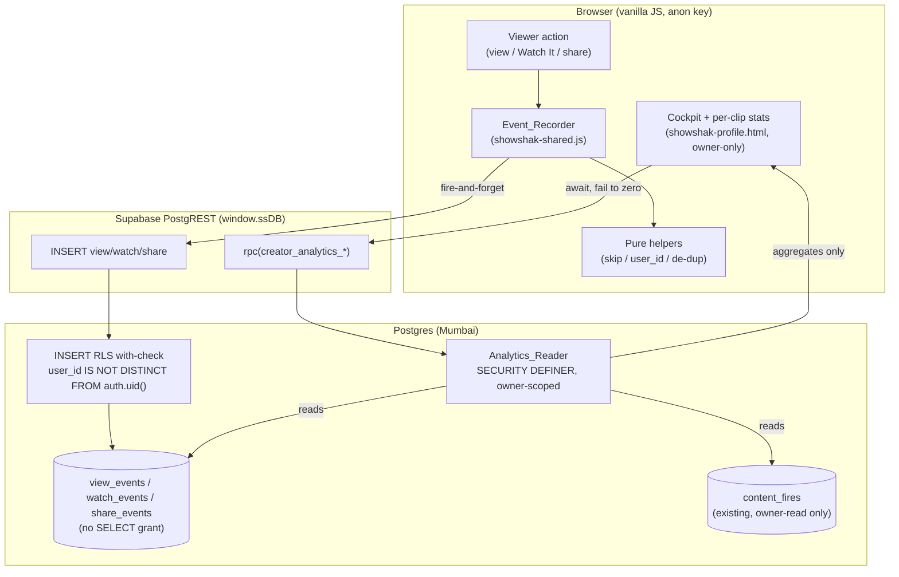

# Design Document

## Overview

ShowShak's curator "cockpit" promises real impact numbers — Fires received, Watch It taps,
Reach, and a weekly trend — but renders zeros for real accounts today. Two gaps cause this:

1. **Nothing writes engagement events.** `view_events`, `watch_events`, and `share_events`
   exist (migration `0001`) but no client code ever inserts into them. A grep of
   `showshak-shared.js` confirms zero references to those tables.
2. **Nothing reads real aggregates.** `renderCockpit()` / `renderAnalytics()` in
   `showshak-profile.html` hard-code `0` for signed-in owners because no owner-scoped read
   path exists.

This feature closes both gaps **additively**, with no new tables and no changes to existing
rows:

- A client-side **Event_Recorder** (new pure helpers + thin fire-and-forget wrappers in
  `showshak-shared.js`) that writes one event row per captured action, with per-session view
  de-dup and a mock-clip skip.
- A database-side **Analytics_Reader** (new `SECURITY DEFINER` functions in migration `0019`)
  that returns owner-scoped aggregates — never raw rows — applying the Self_Activity collapse
  and per-user fire counting at read time.
- New API **grants + anti-spoofing RLS** on the three event tables (insert only; no select),
  added in the same migration.
- **Cockpit wiring** in `showshak-profile.html` that calls the reader, shows real totals,
  follower count, a 7-day trend, and per-clip stats — owner-only, failing to zero without
  blocking the page.

The design is deliberately constrained by the project's posture: **no build step** (the browser
loads `showshak-shared.js` directly and talks to Supabase via the anon key on `window.ssDB`),
**manual migrations** (the founder pastes `0019` into the Supabase SQL editor), and
**vanilla JS** (pure helpers live in `showshak-shared.js` and are exported under the existing
`module.exports` block so Node `fast-check` tests can require them).

Per Requirement 12, v1 computes every metric by **aggregating event rows on read**. The
`analytics_daily` rollup is explicitly **deferred** and appears in this design only as the
documented future scale path — it is not built here.

### Goals

- Capture views, Watch It taps, and shares from the browser, non-blocking and fail-silent.
- Surface owner-only aggregates in the cockpit (totals, followers, 7-day trend, per-clip).
- Keep raw event rows unreadable by `anon`/`authenticated`; only owner-scoped functions return
  aggregates.
- Reuse the existing Fire capture (`content_fires` + `sync_fires_count`) unchanged.

### Non-Goals

- The nightly `analytics_daily` Rollup job (deferred — see Requirement 12.3).
- Any new event tables, schema changes to existing tables, or backfill of historical data.
- Public-facing analytics (the public profile keeps showing only followers + clip count).
- Changing Fire capture or the `sync_fires_count` trigger.

## Architecture

The feature spans three layers that already exist in ShowShak: the vanilla-JS browser layer,
the Supabase PostgREST API (anon key), and Postgres with RLS + `SECURITY DEFINER` functions.



### Key architectural decisions

| Decision | Rationale |
|---|---|
| **On-read aggregation (no rollup)** | Req 12. At ~15 curators / few hundred clips, counting event rows on read is accurate and cheap. The `analytics_daily` rollup is the documented scale path. |
| **Pure helpers mirror the SQL counting rules** | The Self_Activity collapse, de-dup, skip, and user_id resolution are extracted as pure JS functions exported for `fast-check`. The SQL reader implements the *same* rules; the JS helpers are the testable specification (model-based testing). |
| **`SECURITY DEFINER` reader, owner-scoped via `auth.uid()`** | Mirrors `sync_fires_count` / `find_or_create_title`. The function bypasses RLS to read raw events but only ever returns aggregates for the caller's own clips — raw rows never leave the DB. |
| **Insert-only grants + `with check` RLS; no SELECT grant** | Req 5/6. The browser can write events (guarded against spoofing) but cannot read any raw event row. |
| **`user_id IS NOT DISTINCT FROM auth.uid()`** | One expression captures the full anti-spoof rule: signed-in must equal `auth.uid()`, guest must be null, anything else rejected. |
| **Fire-and-forget writes** | Req 13. Inserts are not awaited on the user's action path; failures are swallowed so playback / navigation / share never break. |

## Components and Interfaces

### Event_Recorder (client-side, `showshak-shared.js`)

The Event_Recorder is split into **pure helpers** (no DOM, no network — exported for Node
property tests) and **thin impure wrappers** (do the actual fire-and-forget insert). This
mirrors the existing curator-upload-v2 pattern.

#### Pure helpers (exported under `module.exports`)

```js
// Mock-clip skip decision (Req 1.6, 2.6, 3.5). Only persisted content rows
// have uuid ids; mock/prototype clips use small integers. Reuses the same
// uuid test already used by _ssDbFire/_ssIsUuid.
function ssIsRecordableClipId(clipId) // -> boolean

// Insert-payload user_id resolution (Req 1.2/1.3, 2.3/2.4, 3.2/3.3, 5.2/5.3).
// Signed-in user object -> its id; guest (null/!id) -> null. Never throws.
function ssResolveEventUserId(currentUser) // -> string | null

// Per-session view de-dup decision (Req 1.5). Pure: given the set of clip ids
// already viewed this session and a candidate clip id, returns whether a new
// View_Event should be recorded. Does NOT mutate; the caller marks on true.
function ssShouldRecordView(viewedSet, clipId) // -> boolean

// Build the insert payloads (Req 1.1, 2.1/2.2, 3.1). Pure object builders so
// the shape (content_id, user_id, optional title/platform/region) is testable.
function ssBuildViewEvent(clipId, userId)               // -> { content_id, user_id }
function ssBuildWatchEvent(clipId, userId, opts)        // -> { content_id, user_id, title_id?, platform_id?, region? }
function ssBuildShareEvent(clipId, userId)              // -> { content_id, user_id }
```

`ssBuildWatchEvent` includes `title_id` / `platform_id` / `region` only when the Watch It
selection resolved them (Req 2.2); absent values are omitted from the payload so the DB
defaults/nulls apply.

#### Impure wrappers (browser-only, fire-and-forget)

```js
// Each: resolve user via ssCurrentUser(), skip if !ssIsRecordableClipId,
// build payload, then window.ssDB.from(<table>).insert(payload) WITHOUT await
// on the caller's path. Errors are swallowed (Req 1.4, 2.5, 3.4, 13.1, 13.2).
function ssRecordView(clipId)                 // also applies session de-dup
function ssRecordWatch(clipId, opts)          // no de-dup, no self-collapse (Req 2.7)
function ssRecordShare(clipId)
```

Session de-dup state is a module-level `Set` (`_ssViewedThisSession`) keyed by clip id, reset
naturally on page load (a "playback session" per the requirement). `ssRecordView` consults
`ssShouldRecordView`, inserts only on `true`, and adds the id to the set.

**Reach = genuine attention (view dwell threshold).** A view is recorded only after a clip has
been the ACTIVE (playing) clip for `SS_VIEW_DWELL_MS = 2000` (2 seconds), not the instant it is
opened/scrolled to — so scroll-bys never inflate Reach. The dwell is implemented as a single
module-level timer (`_ssViewDwellTimer`) re-armed on every active-clip change (covering both the
inline Feed and the fullscreen viewer via the shared engine active-clip path) and cancelled when
the active clip changes, the viewer tears down, or the inline Feed is rebuilt. This is a faithful
definition of the requirements' "existing view model" (Req 1.1) and composes with the per-session
de-dup above. The 2-second value is the agreed default and is the one knob to tune Reach.

**Wiring points (existing functions in `showshak-shared.js`):**

| Action | Existing hook | Added call |
|---|---|---|
| View | engine active-clip path (`ClipEngine.setActive` / `_inlineSetActive`), after a dwell | `ssRecordView(activeClip.id)` |
| Watch It | `ssHandleWatchNow(platform, showTitle)` and the feed's bespoke handler | `ssRecordWatch(clip.id, { ... })` |
| Share | `ssShare(show)` | `ssRecordShare(show.id)` |

These wrappers no-op cleanly for guests on mock clips and for the prototype surfaces, so the
demo keeps working.

### Analytics_Reader (database, migration `0019`)

Three owner-scoped `SECURITY DEFINER` functions, granted to `authenticated` only. Each scopes
to `content.creator_id = auth.uid()` and returns aggregates only.

```sql
-- Cockpit totals (Req 7.2, 8.1, 8.2)
creator_analytics_totals()
  -> TABLE(fires_received bigint, watch_count bigint, reach bigint, share_count bigint)

-- 7-day trend, zero-filled (Req 9)
creator_analytics_weekly()
  -> TABLE(day date, views bigint, watch_its bigint, shares bigint, fires bigint)

-- Per-clip stats (Req 10)
creator_analytics_per_clip()
  -> TABLE(content_id uuid, fires bigint, views bigint, watch_its bigint)
```

Called from the browser via PostgREST RPC, e.g.:

```js
const { data, error } = await window.ssDB.rpc('creator_analytics_totals');
```

### Cockpit (client-side, `showshak-profile.html`)

`renderCockpit()`, `renderAnalytics()`, and the per-clip grid are extended to call the reader
for a signed-in owner (`isSignedInOwn()`), replacing the hard-coded zeros. A new async
`fetchOwnAnalytics()` (alongside the existing `fetchOwnFollowers()`) calls the three RPCs,
caches the results on `PROFILE`, and re-renders. Follower count continues to come from the
existing `follows` count query (Req 8.3). On any error it leaves the metrics at zero and never
throws, so the rest of the profile renders (Req 8.5).

The cockpit stays gated behind `isOwner()` / `isSignedInOwn()` exactly as today, so the public
and non-owner faces never see these numbers (Req 11).

## Data Models

### Existing tables (unchanged, read by the reader)

- `view_events(id, user_id nullable, content_id, watch_ms, created_at)`
- `watch_events(id, user_id nullable, content_id, title_id, platform_id, region, created_at, meta)`
- `share_events(id, user_id nullable, content_id, created_at)`
- `content_fires(user_id, content_id, created_at, deleted_at)` — PK `(user_id, content_id)`
- `content(id, creator_id, deleted_at, status, fires_count, ...)`
- `follows(follower_id, creator_id, deleted_at)`

Indexes already present and used by the reader (Req 13.3): `idx_watch_content`,
`idx_view_content` on `(content_id, created_at)`, and `idx_content_creator` on
`(creator_id, created_at desc)`.

### Counting rules (the heart of the reader)

Let `C` be a clip with owner `creator_id`. For the metrics:

- **Reach (views)** = Σ over the curator's clips of
  `count(views where user_id IS DISTINCT FROM creator_id)` (each non-owner view, including
  repeats and guests, counted separately — Req 1.7) `+ (1 if ≥1 self-view exists for C else 0)`
  (all self-views collapse to one — Req 1.8/1.9, 7.6).
- **Share total** = same shape as Reach: non-owner shares counted individually; all self-shares
  for a clip collapse to one (Req 3.6/3.7, 7.6).
- **Watch It total** = `count(all watch_events)` — no de-dup, no self-collapse; owner taps and
  repeats all count (Req 2.7/2.8, 7.7).
- **Fires_Received** = `count(content_fires)` for the curator's clips. The PK `(user_id,
  content_id)` already guarantees at most one fire per user per clip, including the owner's own
  fire (Req 4.1/4.4, 7.7).

`IS DISTINCT FROM` is used deliberately: a guest view (`user_id = null`) is never equal to a
non-null `creator_id`, so guests correctly count as non-owners.

### Migration `0019` — exact additive SQL

```sql
-- ═══════════════════════════════════════════════════════════════
-- 0019_creator_analytics.sql
-- SHOWSHAK — CREATOR ANALYTICS  (creator-analytics feature)
-- ───────────────────────────────────────────────────────────────
-- ADDITIVE ONLY. No new tables, no data changes. This migration:
--   1. Grants INSERT (not SELECT) on the three event tables to the
--      anon + authenticated API roles, so the browser can record
--      events but can never read raw event rows.
--   2. Enables RLS on those tables with anti-spoofing WITH CHECK
--      insert policies: a signed-in user_id must equal auth.uid(),
--      a guest user_id must be null, anything else is rejected.
--   3. Adds owner-scoped SECURITY DEFINER reader functions that
--      return ONLY aggregates for the caller's own clips, applying
--      the Self_Activity collapse + per-user fire counting on read.
--
-- Security posture mirrors public.sync_fires_count (0008) and
-- public.find_or_create_title (0016): SECURITY DEFINER + locked
-- search_path + EXECUTE granted to authenticated.
--
-- Idempotent. Run: Supabase SQL Editor → paste → Run.
-- ═══════════════════════════════════════════════════════════════

-- Make sure the API roles can use the schema at all (idempotent).
grant usage on schema public to anon, authenticated;

-- ── 1. INSERT grants (NO select grant — Req 5.1, 6.1) ──
grant insert on table view_events  to anon, authenticated;
grant insert on table watch_events to anon, authenticated;
grant insert on table share_events to anon, authenticated;

-- ── 2. Anti-spoofing INSERT RLS (Req 5.2–5.5) ──
-- `user_id IS NOT DISTINCT FROM auth.uid()` captures the whole rule:
--   • authenticated: auth.uid() is the caller → user_id must equal it
--   • anon (guest):  auth.uid() is null       → user_id must be null
--   • anything else (forging another id, or a guest sending an id) → rejected
-- No SELECT/UPDATE/DELETE policy is added, so with RLS enabled and no
-- select grant, raw rows are unreadable by anon/authenticated (Req 6.3).

alter table view_events  enable row level security;
alter table watch_events enable row level security;
alter table share_events enable row level security;

drop policy if exists view_events_insert_guarded on view_events;
create policy view_events_insert_guarded on view_events
  for insert to anon, authenticated
  with check (user_id is not distinct from auth.uid());

drop policy if exists watch_events_insert_guarded on watch_events;
create policy watch_events_insert_guarded on watch_events
  for insert to anon, authenticated
  with check (user_id is not distinct from auth.uid());

drop policy if exists share_events_insert_guarded on share_events;
create policy share_events_insert_guarded on share_events
  for insert to anon, authenticated
  with check (user_id is not distinct from auth.uid());

-- ── 3. Owner-scoped aggregate readers (Req 7, 12.1) ──
-- SECURITY DEFINER lets these read the raw event tables (which the
-- caller's role cannot), but they only ever RETURN aggregates for the
-- caller's own clips. STABLE: no writes, safe to run in a read txn.

-- 3a. Cockpit totals (Req 7.2, 8.1, 8.2)
create or replace function public.creator_analytics_totals()
returns table (
  fires_received bigint,
  watch_count    bigint,
  reach          bigint,
  share_count    bigint
)
language sql
security definer
set search_path = public
stable
as $$
  with my_clips as (
    select id, creator_id
    from content
    where creator_id = auth.uid()
      and deleted_at is null
  )
  select
    -- Fires: one row per (user, clip) already, so count(*) = at most one
    -- per user per clip, owner's own fire included (Req 4.4, 7.7).
    (select count(*) from content_fires cf
       join my_clips c on c.id = cf.content_id
      where cf.deleted_at is null)::bigint,
    -- Watch Its: every tap, no collapse (Req 2.8, 7.7).
    (select count(*) from watch_events we
       join my_clips c on c.id = we.content_id)::bigint,
    -- Reach: non-owner views counted each + 1 per clip with any self-view
    -- (Req 1.7–1.9, 7.6).
    ( (select count(*) from view_events ve
         join my_clips c on c.id = ve.content_id
        where ve.user_id is distinct from c.creator_id)
      + (select count(distinct c.id) from view_events ve
           join my_clips c on c.id = ve.content_id
          where ve.user_id = c.creator_id) )::bigint,
    -- Shares: same collapse shape as Reach (Req 3.6–3.7, 7.6).
    ( (select count(*) from share_events se
         join my_clips c on c.id = se.content_id
        where se.user_id is distinct from c.creator_id)
      + (select count(distinct c.id) from share_events se
           join my_clips c on c.id = se.content_id
          where se.user_id = c.creator_id) )::bigint;
$$;

-- 3b. Weekly 7-day trend, zero-filled (Req 9)
create or replace function public.creator_analytics_weekly()
returns table (
  day       date,
  views     bigint,
  watch_its bigint,
  shares    bigint,
  fires     bigint
)
language sql
security definer
set search_path = public
stable
as $$
  with my_clips as (
    select id, creator_id
    from content
    where creator_id = auth.uid()
      and deleted_at is null
  ),
  days as (                                   -- last 7 calendar days (Req 9.1, 13.4)
    select (current_date - g)::date as day
    from generate_series(0, 6) as g
  ),
  -- Views: non-owner per (day) + 1 per (clip, day) with any self-view (Req 9.5)
  v_nonself as (
    select ve.created_at::date as day, count(*) as n
    from view_events ve join my_clips c on c.id = ve.content_id
    where ve.user_id is distinct from c.creator_id
      and ve.created_at >= current_date - 6
    group by 1
  ),
  v_self as (
    select ve.created_at::date as day, count(distinct c.id) as n
    from view_events ve join my_clips c on c.id = ve.content_id
    where ve.user_id = c.creator_id
      and ve.created_at >= current_date - 6
    group by 1
  ),
  -- Shares: same collapse shape (Req 9.5)
  s_nonself as (
    select se.created_at::date as day, count(*) as n
    from share_events se join my_clips c on c.id = se.content_id
    where se.user_id is distinct from c.creator_id
      and se.created_at >= current_date - 6
    group by 1
  ),
  s_self as (
    select se.created_at::date as day, count(distinct c.id) as n
    from share_events se join my_clips c on c.id = se.content_id
    where se.user_id = c.creator_id
      and se.created_at >= current_date - 6
    group by 1
  ),
  -- Watch Its: every tap (Req 9.5)
  w_all as (
    select we.created_at::date as day, count(*) as n
    from watch_events we join my_clips c on c.id = we.content_id
    where we.created_at >= current_date - 6
    group by 1
  ),
  -- Fires: at most one per (user, clip); bucket by created_at day
  f_all as (
    select cf.created_at::date as day, count(*) as n
    from content_fires cf join my_clips c on c.id = cf.content_id
    where cf.deleted_at is null
      and cf.created_at >= current_date - 6
    group by 1
  )
  select
    d.day,
    (coalesce(vn.n, 0) + coalesce(vs.n, 0))::bigint as views,
    coalesce(w.n, 0)::bigint                        as watch_its,
    (coalesce(sn.n, 0) + coalesce(ss.n, 0))::bigint as shares,
    coalesce(f.n, 0)::bigint                        as fires
  from days d
  left join v_nonself vn on vn.day = d.day
  left join v_self    vs on vs.day = d.day
  left join s_nonself sn on sn.day = d.day
  left join s_self    ss on ss.day = d.day
  left join w_all     w  on w.day  = d.day
  left join f_all     f  on f.day  = d.day
  order by d.day;
$$;

-- 3c. Per-clip stats (Req 10)
create or replace function public.creator_analytics_per_clip()
returns table (
  content_id uuid,
  fires      bigint,
  views      bigint,
  watch_its  bigint
)
language sql
security definer
set search_path = public
stable
as $$
  with my_clips as (
    select id, creator_id
    from content
    where creator_id = auth.uid()
      and deleted_at is null
  )
  select
    c.id,
    (select count(*) from content_fires cf
      where cf.content_id = c.id and cf.deleted_at is null)::bigint,
    ( (select count(*) from view_events ve
         where ve.content_id = c.id and ve.user_id is distinct from c.creator_id)
      + (case when exists (select 1 from view_events ve
                            where ve.content_id = c.id and ve.user_id = c.creator_id)
              then 1 else 0 end) )::bigint,
    (select count(*) from watch_events we
      where we.content_id = c.id)::bigint
  from my_clips c;
$$;

-- ── EXECUTE grants: authenticated only (Req 7.5). Guests have no cockpit. ──
grant execute on function public.creator_analytics_totals()   to authenticated;
grant execute on function public.creator_analytics_weekly()   to authenticated;
grant execute on function public.creator_analytics_per_clip() to authenticated;

-- Reload PostgREST so the new grants + RPCs are live immediately.
notify pgrst, 'reload schema';

-- ═══════════════════════════════════════════════════════════════
-- DONE. The browser can now record view/watch/share events (guarded),
-- never read raw rows, and read owner-scoped aggregates via
-- rpc('creator_analytics_totals' | 'creator_analytics_weekly' |
-- 'creator_analytics_per_clip').
-- ═══════════════════════════════════════════════════════════════
```

### Deferred: the `analytics_daily` Rollup (future scale path)

Per Req 12.3 the nightly rollup is **not** built in v1. When read latency on the on-read
aggregation eventually hurts (thousands of clips / millions of events), a Supabase scheduled
Edge Function would populate `analytics_daily` (which already exists from `0001`) by counting
the same event tables with the same collapse rules, and the reader functions would switch to
reading the rollup for historical days while still aggregating "today" live. The counting rules
defined here are the contract that rollup must preserve.

## Correctness Properties

*A property is a characteristic or behavior that should hold true across all valid executions
of a system — essentially, a formal statement about what the system should do. Properties serve
as the bridge between human-readable specifications and machine-verifiable correctness
guarantees.*

The properties below target the **pure helpers** in `showshak-shared.js`. The Self_Activity
collapse, watch no-collapse, fire counting, and owner-scoping helpers are the executable
specification of the SQL Analytics_Reader: the JS helper and the SQL implement the *same*
counting rules, so property-testing the helper (with `fast-check`, ≥100 iterations) validates
the counting contract that migration `0019` must honor. Each property is implemented by a
single property-based test, tagged `Feature: creator-analytics, Property <n>`. DB-only
guarantees (grants, RLS reads, `SECURITY DEFINER` posture, index usage) are validated by the
integration/smoke tests in the Testing Strategy, not by property tests.

### Property 1: Mock/prototype clips are never recorded

*For any* clip id, `ssIsRecordableClipId(id)` returns `true` if and only if the id is a
persisted `content` row id (36-char uuid form), and `false` for prototype integer ids, null,
undefined, and malformed strings — so the Event_Recorder records exactly the persisted clips
and skips the rest.

**Validates: Requirements 1.6, 2.6, 3.5, 12.4**

### Property 2: Insert user_id resolves to the viewer or null

*For any* current-user value, `ssResolveEventUserId(user)` returns the user's id when a
signed-in user object with an id is present, and `null` for a guest (null/undefined/object
without an id) — never any other value.

**Validates: Requirements 1.2, 1.3, 2.3, 2.4, 3.2, 3.3, 5.2, 5.3**

### Property 3: At most one View_Event per clip per session

*For any* sequence of view attempts within a session, `ssShouldRecordView(viewedSet, clipId)`
returns `true` the first time a clip id is seen and `false` thereafter (idempotent once
marked), so each clip produces at most one recorded View_Event per playback session while
distinct clips are each recordable.

**Validates: Requirements 1.5, 12.4**

### Property 4: Event payloads carry the clip and resolved viewer, and only resolved Watch fields

*For any* clip id, resolved user id, and Watch It selection, the payload builders always include
`content_id` (the clip) and the resolved `user_id`; and `ssBuildWatchEvent` includes
`title_id`, `platform_id`, and `region` exactly when they are provided and omits each that is
not, never inventing values.

**Validates: Requirements 1.1, 2.1, 2.2, 3.1**

### Property 5: Self_Activity collapse for views and shares

*For any* clip with an owning `creator_id` and any multiset of view (or share) events, the
aggregate counts every event whose `user_id` differs from `creator_id` individually (including
guests and repeats by the same viewer) and counts all of the owner's own events together as
exactly one when at least one exists, and zero when none exists.

**Validates: Requirements 1.7, 1.8, 1.9, 3.6, 3.7, 7.6, 10.4**

### Property 6: Watch It taps count every event with no collapse

*For any* clip and any multiset of Watch_Events, the watch aggregate equals the total number of
events — no per-session de-dup and no self-collapse — so owner taps and repeated taps by the
same viewer are each counted.

**Validates: Requirements 2.7, 2.8, 7.7, 10.4**

### Property 7: Fires count at most one per user per clip

*For any* clip and any set of fire records, the fire aggregate equals the number of distinct
users who fired that clip (at most one per user, owner included), regardless of duplicate
records for the same user.

**Validates: Requirements 4.1, 4.4, 7.7, 10.4**

### Property 8: Aggregates are scoped to the caller's own clips

*For any* set of clips with mixed owners and any caller id, the reader-scoping helper includes a
clip's events in the result if and only if that clip's `creator_id` equals the caller, so events
on clips the caller does not own never contribute to the caller's totals.

**Validates: Requirements 7.1, 7.4, 10.2, 11.1**

### Property 9: Insert-payload acceptance mirrors the anti-spoofing rule

*For any* viewer identity (a signed-in id or guest) and any proposed payload `user_id`, the
acceptance model `ssEventInsertAccepted(viewerId, payloadUserId)` accepts the insert if and only
if the payload `user_id` is not distinct from the viewer's identity (signed-in → equals their
id, guest → null), and rejects every other value — matching the `with check` RLS policy.

**Validates: Requirements 5.2, 5.3, 5.4**

### Property 10: Weekly trend is a 7-day, zero-filled bucketing of the same rules

*For any* set of events with timestamps, the weekly trend helper returns exactly one entry for
each of the last 7 calendar days (no day omitted, missing days are zero), buckets each event
into its day, and applies the same per-clip-per-day counting rules as the totals (views/shares
collapse owner activity to one, watch counts every tap, fires count at most one per user).

**Validates: Requirements 9.1, 9.2, 9.3, 9.5, 13.4**

## Error Handling

The error philosophy follows ShowShak's existing fire-and-forget DB helpers (`_ssDbFire`,
`_ssDbFollow`): the viewer's experience is never blocked or interrupted by analytics.

### Capture (Event_Recorder)

- **Fire-and-forget (Req 13.1):** `ssRecordView/Watch/Share` build the payload synchronously,
  then call `window.ssDB.from(...).insert(...)` without `await` on the action path. Playback,
  Watch It navigation, and share complete regardless of the insert's outcome.
- **Silent failure (Req 1.4, 2.5, 3.4, 13.2):** the insert promise's rejection is caught and
  swallowed (a `console.warn` at most, matching existing helpers). No toast, no thrown error.
- **Skips, not errors (Req 1.6, 2.6, 3.5):** a non-recordable clip id (mock/prototype) or a
  missing `window.ssDB` causes the recorder to return early without attempting a write — a
  no-op, not an error.
- **De-dup (Req 1.5):** a repeat view within the session is a deliberate skip, not a failure.

### Read (Cockpit)

- **Fail to zero, never block (Req 8.5):** `fetchOwnAnalytics()` wraps each RPC in
  `try/catch`. On error (network, RLS, RPC missing) it leaves the affected metric at its
  initialized `0` and the rest of the profile renders normally. This mirrors the existing
  `fetchOwnFollowers()` pattern.
- **Empty results (Req 8.4, 10.3):** a curator with no events gets zero-count rows (totals) or
  an empty per-clip set; the cockpit renders zeros, not blanks or errors.
- **Owner gating (Req 11.2, 11.3):** the reader is only called for `isSignedInOwn()`. The RPCs
  themselves are owner-scoped via `auth.uid()`, so even a crafted call returns only the
  caller's own aggregates (Req 7.1, 11.1).

### Database

- **Anti-spoof rejection (Req 5.4):** a forged `user_id` is rejected by the `with check` policy
  as a normal insert failure, which the fire-and-forget wrapper swallows — a spoof attempt
  silently records nothing.
- **`SECURITY DEFINER` safety (Req 7.5):** functions are `STABLE` with a locked
  `search_path = public`, do not write, and return only aggregates, so they cannot leak raw
  rows or be hijacked via search-path.

## Testing Strategy

A dual approach: **property tests** for the pure counting/decision logic, and
**example/integration/smoke tests** for I/O, RLS, and UI wiring.

### Property-based tests (pure helpers)

- **Library:** `fast-check` (existing dev dependency), plain-Node runner, one property per
  file under `tests/prop-*.test.js`, following `tests/_pbt.js` conventions (install the DOM
  stub before requiring `showshak-shared.js`).
- **Iterations:** `{ numRuns: ITER }` with `ITER >= 100` (existing suite uses 200).
- **Tagging:** each file carries `// Feature: creator-analytics, Property <n>` plus the
  `// **Validates: Requirements X.Y**` line.
- **Coverage:** Properties 1–10 above → ten files, e.g.:
  - `prop-recordable-clip.test.js` (P1)
  - `prop-event-userid.test.js` (P2)
  - `prop-view-session-dedup.test.js` (P3)
  - `prop-event-payload.test.js` (P4)
  - `prop-selfactivity-collapse.test.js` (P5)
  - `prop-watch-count.test.js` (P6)
  - `prop-fire-count.test.js` (P7)
  - `prop-owner-scope.test.js` (P8)
  - `prop-insert-acceptance.test.js` (P9)
  - `prop-weekly-trend.test.js` (P10)
- The collapse/watch/fire/scope/weekly helpers (P5–P8, P10) are the executable model of the SQL
  reader; their property tests are the authoritative spec the `0019` functions must satisfy.

### Example-based unit tests

- Recorder fire-and-forget error handling (Req 1.4, 2.5, 3.4, 13.1, 13.2): stub
  `window.ssDB.from().insert()` to reject and assert the wrapper resolves without throwing and
  the action continues.
- Cockpit fail-to-zero (Req 8.5): stub `rpc` to reject and assert metrics show `0` and the
  profile still renders.
- Per-clip and totals result shape (Req 8.1, 8.2, 10.1): given reader output, assert the
  rendered cockpit/grid values.
- Clip-level fire total uses `content.fires_count` cache where appropriate (Req 4.3).

### Integration tests (real Supabase, 1–3 examples each)

- **Anti-spoofing RLS (Req 5.2–5.4):** as a guest, insert with `user_id = null` (accepted) and
  with a non-null id (rejected); as a signed-in user, insert with own id (accepted) and with a
  different id (rejected).
- **No raw reads (Req 6.1, 6.3):** as `anon` and as `authenticated`, `select` from each event
  table returns no rows.
- **Owner-scoped reader (Req 7.1, 7.4, 11.1):** seed two curators' clips + events; verify each
  curator's RPC returns only their own aggregates and excludes the other's clips.
- **Reader correctness end-to-end (Req 7.6, 7.7, 9, 10):** seed a known event mix (owner +
  non-owner views/shares, repeated watches, owner fire) and assert the totals, weekly trend,
  and per-clip results match the collapse/no-collapse/fire rules verified by the property
  tests. The reusable existing harness `showshak-rls-check.html` is a good home for these.

### Smoke tests (one-time config checks)

- Migration `0019` applies cleanly and is idempotent (re-runnable).
- `insert` granted (not `select`) on the three tables to `anon` + `authenticated` (Req 5.1,
  6.1); RLS enabled on all three (Req 5.5).
- The three functions exist as `SECURITY DEFINER` with `search_path = public` and `execute`
  granted to `authenticated` only (Req 7.5).
- Reader derives the owning curator via the `content_id → content.creator_id` join with no
  denormalized `creator_id` on events (Req 2.9).
- No analytics code path writes `content_fires` (Req 4.2); `content_fires` owner-read RLS is
  unchanged (Req 6.2, 6.4); `analytics_daily` is untouched and the nightly rollup is not built
  (Req 12.2, 12.3).
- Reads rely on existing `(content_id, created_at)` and `(creator_id, created_at)` indexes
  (Req 13.3) — verify via `explain` on the reader queries.
