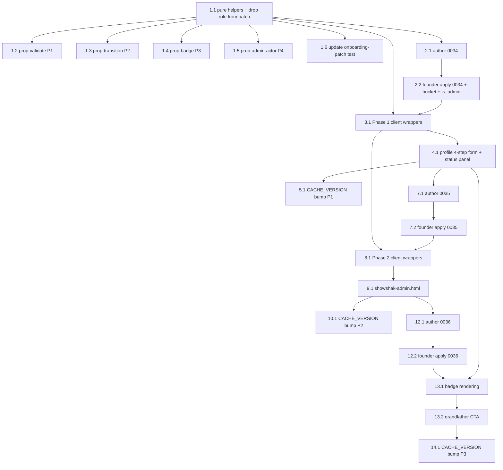

# Implementation Plan

## Overview

Built in the design's **three dependency-ordered phases** so the live feed and existing curators
never break. **The feature is inert until each phase's migration is applied**: the client wrappers
fail soft, the profile surface degrades to the old CTA, and no `role`/`verified`/`content` behavior
changes until the founder runs the SQL. Each phase is independently shippable and verifiable at its
checkpoint.

- **Phase 1 — Apply (no role flip).** Migration `0034` (application table + `users.is_admin` +
  `ss_is_admin()` refine + `ss_submit_curator_application`), the 4-step "Become a Curator" form that
  replaces the instant `bcActivate` role-flip, and the pending/status panel on the profile.
  Submitting creates a `pending` row and does **not** change `role`.
- **Phase 2 — Decide.** Migration `0035` (append-only `curator_application_log` + approve/reject/
  verify `SECURITY DEFINER` RPCs), the admin console `showshak-admin.html`. This is where the
  privileged `role`/`verified` flip and the audit trail live.
- **Phase 3 — Badges, grandfather, publish gate.** Migration `0036` (publish-gate RLS on `content`
  + dropping the `0020` auto-promote trigger), two-badge rendering across profile/feed/cards, and
  grandfathering treatment.

Conventions (matching `dmca-moderation-scaffolding`, the closest analog):

- **The FOUR pure decision helpers come first and are the executable spec.** They are added to
  `showshak-shared.js`, **dual-exported** (`window.*` + `module.exports`), DOM-free, and never throw.
  Each of the design's **four correctness properties** gets its own `tests/prop-curator-*.test.js`
  `fast-check` file (`installDomStub()` before `require('../showshak-shared.js')`, `{ numRuns: ITER }`,
  tagged `// Feature: curator-application-approval, Property <n>` + `**Validates: Requirements X.Y**`),
  auto-discovered by `tests/run-all.js`. They MUST be written and **green early** — run
  `node tests/run-all.js` after every `showshak-shared.js` change; the suite MUST stay green at
  every checkpoint.
- **The JS layer is UI/UX only; the database is the security boundary.** Pure helpers decide UI and
  are the spec the SQL re-validation must honor — they are NEVER the enforcement point. Every
  `role`/`verified` flip runs through an admin-only `SECURITY DEFINER` RPC gated by `ss_is_admin()`;
  RLS denies the underlying tables to ordinary callers.
- **Migrations are founder-applied.** The agent authors each `.sql` file; the founder applies it in
  the Supabase SQL editor. These sub-tasks are flagged **[founder-run]**. Migrations start at `0034`
  (`0030` is RESERVED for DMCA Phase 2) and are **additive + idempotent** (`add column if not
  exists`, `create table if not exists`, drop-and-recreate of functions/triggers/policies).
- **Other founder-only ops are flagged explicitly:** applying each migration, the one-time
  `is_admin` SQL line, creating the private `review-clips` Storage bucket + its policies, and every
  `sw.js` `CACHE_VERSION` bump deploy.
- Vanilla HTML/CSS/JS, no build step. Sacred rules preserved (curators-not-influencers,
  hide-the-scoreboard, RLS-not-UI). The player/feed/CDN pipeline is untouched.

## Tasks

### PHASE 1 — Apply (no role flip); shippable and inert until `0034` is applied

- [x] 1. Pure decision helpers + property tests (`showshak-shared.js`) — the executable spec
  - [x] 1.1 Add the FOUR pure helpers to `showshak-shared.js`, dual-exported (`window.*` +
    `module.exports`), beside the existing `ss*` helpers, each pure/DOM-free/never-throwing and
    returning a safe value on null/partial/malformed input, exactly per the design's function
    contracts:
    - `ssValidateCuratorApplication(payload) -> { ok, missing }` — stable key order
      `['applicant_info','genres','social_link','terms']`; well-formed IFF applicant identity present
      AND `1 <= genres.length <= 6` AND `social_link` trims to length >= 1 AND `termsAccepted === true`
      (strict); `reference_clip` optional (never affects `ok`); `ok === (missing.length === 0)`;
      null/non-object → all four keys missing.
    - `ssCuratorAppTransition(from, to) -> boolean` — `true` only for `('pending','approved')` and
      `('pending','rejected')`; `false` for everything else; total over all inputs.
    - `ssResolveBadge({ role, verified }) -> 'none'|'curator'|'verified'` — `verified===true` →
      `'verified'` (overrides); else `role==='curator'` → `'curator'`; else `'none'`.
    - `ssIsAdminActor({ is_admin }) -> boolean` — `true` IFF `is_admin === true` (strict); else `false`.
    - Also modify `ssBuildOnboardingPatch` so it **no longer includes the `role` key** (retain only
      handle/bio/genres/avatar fields) — the application flow, not onboarding, is now the only path
      to curator status.
    - _Files: showshak-shared.js_
    - _Requirements: 1.5, 2.6, 5.3, 8.6, 13.5, 13.6, 15.5_

  - [x] 1.2 Write the property test for application validator well-formedness
    - `tests/prop-curator-app-validate.test.js`: generators randomize applicant identity present/
      absent, 0/1..6/7 genres, whitespace-only/empty/valid `social_link`, non-strict-true
      `termsAccepted`, and reference-clip present vs absent; independent oracle asserts
      `ok === (missing.length === 0)`, `missing` lists exactly the failing keys in fixed order, the
      reference clip never changes the result, and the input is never mutated / never throws.
    - **Property 1: Application validator well-formedness**
    - **Validates: Requirements 1.4, 2.1, 2.2, 2.3, 2.4, 2.5, 2.6**
    - _Files: tests/prop-curator-app-validate.test.js_

  - [x] 1.3 Write the property test for the application state machine
    - `tests/prop-curator-app-transition.test.js`: arbitrary `(from, to)` pairs incl. valid statuses,
      unknown strings, self-loops, and null/undefined; assert `true` iff the pair is
      `('pending','approved')` or `('pending','rejected')`, `false` for every other pair (terminal
      origins, `'pending'->'pending'`, unknown), deterministically and without throwing.
    - **Property 2: Application state machine totality and correctness**
    - **Validates: Requirements 8.2, 8.3, 8.4, 8.5, 8.6**
    - _Files: tests/prop-curator-app-transition.test.js_

  - [x] 1.4 Write the property test for badge resolution
    - `tests/prop-curator-badge.test.js`: random `{ role, verified }` incl. malformed/missing fields
      and non-strict-true `verified`; assert exactly one of `{ 'none','curator','verified' }` returns,
      `'verified'` whenever `verified===true` (overriding curator), else `'curator'` when
      `role==='curator'`, else `'none'`; deterministic, never throws.
    - **Property 3: Badge resolution**
    - **Validates: Requirements 15.1, 15.2, 15.3, 15.4, 15.5**
    - _Files: tests/prop-curator-badge.test.js_

  - [x] 1.5 Write the property test for the admin authorizer
    - `tests/prop-curator-admin-actor.test.js`: actor values incl. `{is_admin:true}`, `{is_admin:'true'}`,
      `{is_admin:1}`, absent/`null`/`undefined`/non-object; assert `true` iff `is_admin` is strictly
      boolean `true`, `false` for every other value; deterministic, never throws.
    - **Property 4: Admin authorizer**
    - **Validates: Requirements 13.2, 13.5, 13.6**
    - _Files: tests/prop-curator-admin-actor.test.js_

  - [x]* 1.6 Update the existing onboarding-patch property test for the dropped `role` key
    - `tests/prop-onboarding-patch.test.js`: adjust the oracle and explicit cases so the expected
      patch no longer contains `role` (the helper now writes only handle/bio/genres/avatar),
      keeping the suite green after the 1.1 change.
    - _Files: tests/prop-onboarding-patch.test.js_
    - _Requirements: 1.5, 5.3_

- [ ] 2. **[founder-run]** Migration `0034` — application table + `is_admin` + `ss_is_admin()` refine + submit RPC + private bucket
  - [x] 2.1 Author `supabase/migrations/0034_curator_application.sql` (additive + idempotent):
    `alter table public.users add column if not exists is_admin boolean not null default false`;
    `create table if not exists curator_application` (uuid PK, `applicant_id` ref `users(id)`,
    `status` default `'pending'` with `check (status in ('pending','approved','rejected'))`,
    `applicant_info`/`curator_info` jsonb, `genres text[]`, `social_link text not null`,
    nullable `reference_clip_path text` (a `review-clips` Storage path — never a `content.id` or Mux
    id), `terms_version text not null`, standard timestamps + `meta`) with the applicant/status
    indexes; the drop-and-recreate `ss_is_admin()` refinement (`SECURITY DEFINER`,
    `set search_path = public`, `stable`) that returns true for `service_role` OR the caller's
    `users.is_admin`; the `curator_application` RLS (enable RLS; `curapp_read_own` owner-select;
    `curapp_admin_read` via `ss_is_admin()`; NO insert/update/delete policy for normal roles); and
    the `ss_submit_curator_application(payload jsonb)` `SECURITY DEFINER` RPC that re-validates in
    SQL mirroring `ssValidateCuratorApplication`, inserts exactly ONE row
    (`applicant_id = auth.uid()`, `status='pending'`, `terms_version`, nullable
    `reference_clip_path`), leaves `users.role` UNCHANGED, returns `{ application_id, status }`,
    grants execute to `authenticated`, and ends with `notify pgrst, 'reload schema';`.
    - _Files: supabase/migrations/0034_curator_application.sql_
    - _Requirements: 1.3, 1.5, 1.6, 2.1, 2.3, 2.4, 2.5, 6.2, 6.4, 13.1, 13.3, 13.4, 19.1, 19.3, 19.4_

  - [ ] 2.2 **[founder-run]** Founder applies `0034` and provisions Storage + admin bootstrap in
    Supabase: apply `0034_curator_application.sql` in the SQL editor; create the **private**
    `review-clips` Storage bucket (`public = false`) with the applicant-own-prefix INSERT policy
    (`(storage.foldername(name))[1] = auth.uid()::text`) and the `ss_is_admin()` admin-read SELECT
    policy (no applicant read-back); and run the one-time admin line
    `update public.users set is_admin = true where username = '<founder-handle>';`. Until this runs,
    the Phase 1 client stays inert (wrappers fail soft, profile shows the legacy CTA).
    - _Files: (founder-applied — no repo file change beyond the authored `0034` SQL)_
    - _Requirements: 3.1, 3.2, 3.3, 3.5, 13.1, 19.1, 19.4_

- [x] 3. Phase 1 client RPC-wrapper helpers (`showshak-shared.js`, window-only, NOT exported)
  - [x] 3.1 Add the impure wrappers beside the existing `0029`-style RPC helpers (guard
    `window.ssDB` / `window.ssCurrentUser`, fail soft, never throw):
    `ssSubmitCuratorApplication(payload)` — client `ssValidateCuratorApplication` gate → when a
    Reference_Clip is supplied, upload it to `review-clips/<auth.uid()>/<uuid>.<ext>` via the Storage
    client → `rpc('ss_submit_curator_application', { payload })` returning `{ok}` / `{missing}`; and
    `ssMyLatestApplication()` — select the most-recent own `curator_application` row
    (`order by created_at desc limit 1`, own-row RLS). Both degrade to a safe null/`{missing}` when
    unauthenticated or pre-migration.
    - _Files: showshak-shared.js_
    - _Requirements: 1.3, 1.4, 3.1, 6.2, 6.4_

- [x] 4. Profile Phase 1 surface — 4-step form + confirmation + status panel (`showshak-profile.html`)
  - [x] 4.1 Replace the instant `bcActivate` role-flip with the 4-step Application_Form and wire the
    status panel: Step 1 applicant info; Step 2 curator info + 1–6 genres; Step 3 `Social_Link`
    (primary) + optional `Reference_Clip`; Step 4 accept `Curator_Terms` (record its version). On
    submit call `ssSubmitCuratorApplication`; on invalid payload show which inputs are missing and
    create no row; on success show a calm **confirmation card** stating the application was received,
    that each curator is personally reviewed, and an approx-24h timeframe — and NOT claiming `role`
    changed. Drive the surface from `ssMyLatestApplication()`: `pending` → "under review" status
    panel (no CTA); `rejected` → status panel with a **Reapply** affordance (permits a new
    application); `approved` or a curator account → CTA gone (owner face renders). No application →
    show the "Become a Curator" CTA. The instant role-flip no longer exists anywhere in this flow.
    - _Files: showshak-profile.html_
    - _Requirements: 1.1, 1.2, 1.4, 4.1, 4.2, 4.3, 5.1, 5.3, 6.1, 6.2, 6.3, 6.4, 7.1, 7.3, 7.4_

- [x] 5. **[founder-run]** Bump `sw.js` `CACHE_VERSION` for the Phase 1 profile change
  - [x] 5.1 Bump `CACHE_VERSION` (currently `'v66'` → `'v67'`) so the installed PWA picks up the
    updated `showshak-profile.html`. **[founder-run]:** the founder deploys so users receive the new
    service worker / cache.
    - _Files: sw.js_
    - _Requirements: 19.5_

- [ ] 6. Phase 1 checkpoint — suite green + founder DB verification
  - [ ] 6.1 Run `node tests/run-all.js`; the full suite (existing + the four new `prop-curator-*`
    files + the updated `prop-onboarding-patch`) MUST be green. Run `node --check` on changed HTML/JS.
    Ensure all tests pass, ask the user if questions arise.
    - **[founder-run]** after applying `0034`: confirm a well-formed `ss_submit_curator_application`
      inserts exactly one `pending` row with `applicant_id = auth.uid()` and leaves `users.role`
      unchanged; a malformed payload inserts nothing; a non-owner/non-admin `select` on
      `curator_application` returns zero rows; a reference-clip upload lands in the private
      `review-clips` bucket and is not readable by its owner.
    - At this checkpoint an application is **received and pending; no role has flipped.** Phase 1 is
      independently shippable. Confirm before starting Phase 2.
    - _Requirements: 1.3, 1.5, 3.1, 3.5, 5.3, 6.2, 13.4_

### PHASE 2 — Decide (privileged flip + append-only audit); after Phase 1 checkpoint

- [ ] 7. **[founder-run]** Migration `0035` — append-only audit table + decision RPCs
  - [x] 7.1 Author `supabase/migrations/0035_curator_application_log.sql` (additive + idempotent),
    modeled on `0029 moderation_log`: `create table if not exists curator_application_log`
    (uuid PK, `action_type` with `check (action_type in ('approved','rejected','verified','unverified'))`,
    plain-uuid `application_id`/`applicant_id`/`actor_id` with **no FK**, `occurred_at timestamptz
    default clock_timestamp()`, `detail jsonb`, `created_at`; **no `updated_at`/`deleted_at`**) with
    its two indexes; enable RLS with `curlog_admin_read` (`ss_is_admin()`); the
    `curator_application_log_immutable()` trigger fn + `BEFORE UPDATE`/`BEFORE DELETE` triggers that
    raise for ALL roles incl. `service_role` (append-only); and the `SECURITY DEFINER`
    (`set search_path = public`) RPCs, each authorizing via `ss_is_admin()` (non-admin → no-op),
    checking preconditions, and performing mutation + ONE audit append **in one transaction**:
    - `ss_approve_application(app_id uuid)` — pending-only (guarded by
      `ssCuratorAppTransition('pending','approved')`): set the applicant's `users.role='curator'`
      (that one row only), set `status='approved'`, append one `'approved'` log row.
    - `ss_reject_application(app_id uuid)` — pending-only: set `status='rejected'`, leave `role`
      unchanged, append one `'rejected'` log row; prior rejected rows retained.
    - `ss_set_curator_verified(user_id uuid, verified boolean)` — only when target `role='curator'`:
      set `users.verified`, append one `'verified'`/`'unverified'` log row.
    - `ss_admin_reference_clip_url(app_id uuid)` — `ss_is_admin()`-gated; returns a short-lived
      **signed URL** for the private object, else `null` (never a public URL).
    End with `notify pgrst, 'reload schema';`.
    - _Files: supabase/migrations/0035_curator_application_log.sql_
    - _Requirements: 3.3, 10.1, 10.2, 10.4, 10.5, 11.1, 11.2, 11.3, 11.4, 12.1, 12.2, 12.3, 12.4, 13.1, 13.2, 14.1, 14.2, 14.3, 14.4, 14.5, 19.1, 19.3_

  - [ ] 7.2 **[founder-run]** Founder applies `0035_curator_application_log.sql` in the Supabase SQL
    editor. Until this runs, the Phase 2 client (admin console + wrappers) stays inert.
    - _Files: (founder-applied — no repo file change beyond the authored `0035` SQL)_
    - _Requirements: 19.1_

- [x] 8. Phase 2 client RPC-wrapper helpers (`showshak-shared.js`, window-only, NOT exported)
  - [x] 8.1 Add the impure admin wrappers (guard `window.ssDB` / `window.ssCurrentUser`, fail soft,
    never throw): `ssAdminListApplications(status)` → select `curator_application` by status (admin
    RLS); `ssAdminReferenceClipUrl(app_id)` → `rpc('ss_admin_reference_clip_url', …)` returning a
    signed URL or null; `ssApproveApplication(appId)` → `rpc('ss_approve_application', …)`;
    `ssRejectApplication(appId)` → `rpc('ss_reject_application', …)`; `ssSetCuratorVerified(userId,
    on)` → `rpc('ss_set_curator_verified', …)`.
    - _Files: showshak-shared.js_
    - _Requirements: 3.3, 9.1, 9.2, 10.1, 11.1, 12.1, 12.2_

- [x] 9. Admin review console — `showshak-admin.html` (NEW page, gated to `is_admin`)
  - [x] 9.1 Create `showshak-admin.html`, gated to `is_admin` (non-admins are redirected / shown an
    empty state; RLS guarantees zero rows regardless). Render a **New/Pending** list (each row shows
    captured applicant info + `Social_Link` + the review-only `Reference_Clip` via
    `ssAdminReferenceClipUrl`, with **Approve**/**Reject**), a **Rejected** record group (historical,
    read-only), and a **Curators** list (`role='curator'`) each with a **Make-Verified** toggle
    reflecting current `verified`. Actions call `ssApproveApplication` / `ssRejectApplication` /
    `ssSetCuratorVerified`. The clip is shown only here, only via signed URL, never as a public URL.
    - _Files: showshak-admin.html_
    - _Requirements: 3.3, 3.4, 9.1, 9.2, 9.3, 9.4, 10.3, 12.1, 12.2_

- [x] 10. **[founder-run]** Bump `sw.js` `CACHE_VERSION` for the Phase 2 admin surface
  - [x] 10.1 Add `showshak-admin.html` to the `sw.js` precache list and bump `CACHE_VERSION`
    (`'v67'` → `'v68'`). **[founder-run]:** the founder deploys so users receive the new service
    worker.
    - _Files: sw.js_
    - _Requirements: 19.5_

- [ ] 11. Phase 2 checkpoint — suite green + founder DB verification
  - [ ] 11.1 Run `node tests/run-all.js`; the full suite MUST be green (Phase 2 adds no pure helpers,
    so the four `prop-curator-*` files remain the coverage). Run `node --check` on changed HTML/JS.
    Ensure all tests pass, ask the user if questions arise.
    - **[founder-run]** after applying `0035`, walk the console end-to-end: approve a pending
      application (applicant's `role` flips to `curator`, `status='approved'`, exactly one audit row)
      or reject (status only, `role` unchanged, one audit row); toggle Make-Verified on a curator;
      confirm a non-admin caller and a non-pending target are no-ops; confirm `UPDATE`/`DELETE` on
      `curator_application_log` raises for every role incl. service; confirm a non-admin `select` on
      the log returns zero rows.
    - _Requirements: 10.1, 10.4, 11.1, 11.3, 12.1, 12.3, 13.2, 13.4, 14.2_

### PHASE 3 — Badges, grandfathering, publish gate; after Phase 2 checkpoint

- [ ] 12. **[founder-run]** Migration `0036` — publish-gate RLS + drop the `0020` auto-promote trigger
  - [x] 12.1 Author `supabase/migrations/0036_curator_publish_gate.sql` (additive + idempotent):
    drop-and-recreate the `content` insert policy `content_insert_own` so a live `content` row may be
    created only when `creator_id = auth.uid()` AND the author's `users.role = 'curator'`; and
    `drop trigger if exists on_content_promote_curator on public.content` so publishing no longer
    self-promotes. A `User_Role` account (incl. one with a pending/rejected application) is rejected
    under RLS; a grandfathered curator (`role` already `'curator'`) passes unchanged with no
    application row (grandfathering needs no data migration). End with `notify pgrst, 'reload schema';`.
    - _Files: supabase/migrations/0036_curator_publish_gate.sql_
    - _Requirements: 17.1, 17.2, 17.3, 18.1, 18.2, 18.3, 18.4, 19.1, 19.3, 19.4_

  - [ ] 12.2 **[founder-run]** Founder applies `0036_curator_publish_gate.sql` in the Supabase SQL
    editor. Until this runs, publishing behaves as before (feed unaffected).
    - _Files: (founder-applied — no repo file change beyond the authored `0036` SQL)_
    - _Requirements: 19.1_

- [x] 13. Two-badge rendering + grandfathering treatment
  - [x] 13.1 Wire `ssResolveBadge({ role, verified })` into every badge surface, rendering only the
    resolved value (`none`/`curator`/`verified`) and never a count: the profile hero pill (reusing
    the existing "VERIFIED CURATOR" surface), the feed clip overlay, and clip cards on Discover,
    Watchlist, and profile.
    - _Files: showshak-profile.html, showshak-feed.html, showshak-discover.html, showshak-watchlist.html_
    - _Requirements: 15.1, 15.2, 15.3, 16.1, 16.2, 16.3, 16.4_

  - [x] 13.2 Grandfathering CTA suppression on the profile: an account whose `role` is already
    `'curator'` (with no application row) never sees the "Become a Curator" entry point and renders
    the owner face + curator/verified badge directly — treated as already approved, never prompted.
    - _Files: showshak-profile.html_
    - _Requirements: 17.1, 17.2, 17.4_

- [x] 14. **[founder-run]** Bump `sw.js` `CACHE_VERSION` for the Phase 3 surfaces
  - [x] 14.1 Bump `CACHE_VERSION` (`'v68'` → `'v69'`) so the installed PWA picks up the badge-render
    changes across profile/feed/Discover/Watchlist. **[founder-run]:** the founder deploys.
    - _Files: sw.js_
    - _Requirements: 19.5_

- [ ] 15. Phase 3 checkpoint — suite green + founder DB verification
  - [ ] 15.1 Run `node tests/run-all.js`; the full suite MUST be green. Run `node --check` on changed
    HTML/JS. Ensure all tests pass, ask the user if questions arise.
    - **[founder-run]** after applying `0036`: confirm a `User_Role` account (incl. one with a
      pending/rejected application) cannot insert a live `content` row (RLS rejects); an approved or
      grandfathered curator can; posting a clip no longer promotes the author (the `0020` trigger is
      gone); and badges render on profile/feed/cards with no count exposed.
    - _Requirements: 17.3, 18.1, 18.2, 18.4, 16.4_

## Notes

- **Each phase is inert until its migration is applied.** The client wrappers fail soft
  (guard `window.ssDB`/`window.ssCurrentUser`, return safe values), the profile degrades to the
  legacy CTA, and no `role`/`verified`/`content` behavior changes until the founder runs the SQL —
  so the live feed and existing curators keep working throughout.
- **The FOUR pure helpers and their property tests come first** (task 1) and are the executable spec
  the SQL re-validation must honor. `node tests/run-all.js` must be green before any wiring and at
  every checkpoint; the four `prop-curator-*` files are auto-discovered by the harness.
- **Founder-only ops are flagged [founder-run]:** applying `0034`/`0035`/`0036` (tasks 2.2, 7.2,
  12.2), the one-time `is_admin` SQL line and the private `review-clips` bucket + its Storage
  policies (task 2.2), and every `CACHE_VERSION` bump deploy (tasks 5, 10, 14). The agent authors
  all files; the founder applies/deploys/verifies.
- **Migrations are additive + idempotent** (`add column if not exists`, `create table if not
  exists`, drop-and-recreate of functions/triggers/policies); numbering starts at `0034` and never
  reuses `0030`. The audit log is append-only (no `updated_at`/`deleted_at`, no FKs) so it outlives
  what it describes.
- **The database is the security boundary** — every `role`/`verified` flip runs through an
  admin-only `SECURITY DEFINER` RPC gated by `ss_is_admin()`; RLS denies direct table access; the
  reference clip is review-only in a private bucket, never a `content` row or public Mux id. The JS
  helpers are UI/UX only.
- Sub-tasks marked `*` are optional. The four property tests are NOT optional — they are the
  executable spec and must be green early.

## Task Dependency Graph



```json
{
  "waves": [
    { "id": 0, "tasks": ["1.1"] },
    { "id": 1, "tasks": ["1.2", "1.3", "1.4", "1.5", "1.6", "2.1"] },
    { "id": 2, "tasks": ["2.2", "3.1"] },
    { "id": 3, "tasks": ["4.1"] },
    { "id": 4, "tasks": ["5.1", "7.1"] },
    { "id": 5, "tasks": ["7.2", "8.1"] },
    { "id": 6, "tasks": ["9.1"] },
    { "id": 7, "tasks": ["10.1", "12.1"] },
    { "id": 8, "tasks": ["12.2", "13.1"] },
    { "id": 9, "tasks": ["13.2"] },
    { "id": 10, "tasks": ["14.1"] }
  ]
}
```

## Workflow Complete

This planning workflow is complete — requirements, design, and this task plan are the artifacts.
No implementation has been done. To begin, open
`.kiro/specs/curator-application-approval/tasks.md` and click **Start task** next to a task item
(begin with task 1.1 in Phase 1).
