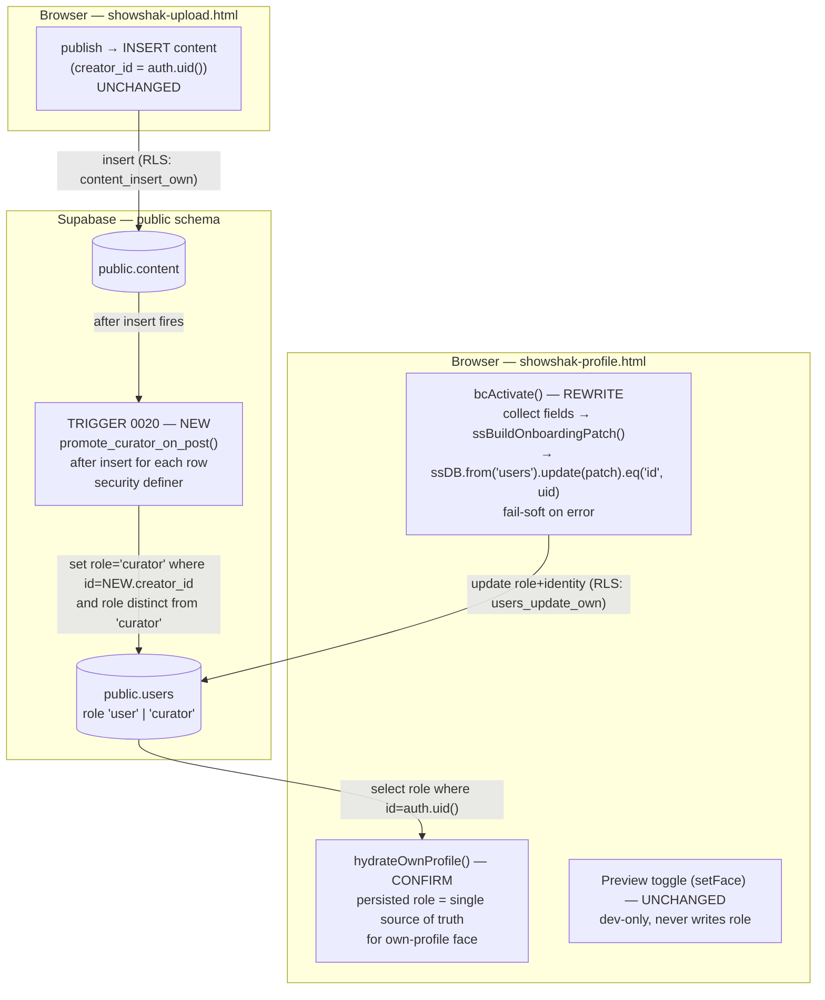

# Design Document

## Overview

**Curator role persistence** closes a root data-integrity defect: a user's curator status is
never written to `public.users.role`. Two paths *should* make someone a curator, and today
neither persists it.

- **Onboarding completion** in `showshak-profile.html` (`bcActivate`) only mutates the in-memory
  `PROFILE` object and sets `face = 'owner'`. It never touches the database. On reload,
  `hydrateOwnProfile()` reads the still-`'user'` row and the curator drops back to the user face.
- **Clip publish** in `showshak-upload.html` inserts a `content` row with
  `creator_id = auth.uid()` (under the `content_insert_own` RLS policy from `0012`) but never
  promotes the author's role.

Verified against the live database, every real human account that posted live clips
(`gpiyush791` = 4 live clips, `media_mike` = 3, `piyush791`, `simran`) still carries
`role = 'user'`; only seeded demo curators carry `role = 'curator'`. This broke the shipped
`public-curator-profile` feature, whose eligibility gate keys on `role = 'curator'` (it survives
today only via a defense-in-depth fallback: *role is curator OR the account has live clips*).

The founder's product rule is the social convention **"you post, you're a creator."** This design
makes both paths persist `role = 'curator'`, and does so without touching the healthy read path:

1. **Onboarding write (client).** Rewrite `bcActivate` to persist `role = 'curator'` plus the
   chosen identity fields in a single `users` update scoped to `auth.uid()`, mirroring the proven
   `saveEditProfile()` pattern (including avatar-upload-to-Storage). Fail soft: on error, surface a
   toast and do **not** flip to the owner face or claim success.
2. **DB-level promotion (trigger).** Author migration `0020_promote_curator_on_post.sql`: a
   `security definer` function fired `after insert for each row on public.content` that promotes the
   author's `users.role` to `'curator'` when it is distinct from `'curator'`. This mirrors the
   `handle_new_user` pattern in `0003` so the client can never skip promotion.
3. **Backfill (founder-run SQL).** A one-time idempotent `UPDATE` promoting existing accounts that
   already posted a qualifying live clip, plus a documented reversal statement.
4. **Routing confirmation (client).** Formalize that `hydrateOwnProfile()`'s persisted-role read is
   the single source of truth for the own-profile face, and that the page never resolves the user
   face before the role read completes. The "Preview as" toggle stays dev-only and never writes role.

### What this design explicitly does NOT do

- **No new read grants and no new RLS read policies.** `0003` already grants `select` on `users`
  to `anon`/`authenticated` with policy `users_read (deleted_at is null)`; `0002` already grants
  public reads of live `content`. Guests can already read another user's row by username and their
  live clips (verified end to end).
- **No new write policy.** `users_update_own (id = auth.uid())` and `users_insert_own
  (id = auth.uid())` already exist, so the client can update its own `role` under existing RLS.
- **No drop/rename/retype/constraint** of any existing table or column. Migration `0020` is purely
  additive (a `create or replace function` + a `drop trigger if exists` / `create trigger`).
- **No analytics changes, no sign-up trigger changes, no Preview_Toggle removal.**

## Architecture

Three layers change; the read/data layer does not.



### Where each change lives

| Change | Location | Type |
| --- | --- | --- |
| Promotion trigger + function | `supabase/migrations/0020_promote_curator_on_post.sql` | New additive migration (founder-applied) |
| One-time backfill + reversal | `0020`-adjacent founder-run SQL (documented in the migration file as a commented, run-once block, or run loose in the SQL editor) | Founder-run SQL |
| Onboarding persistence | `bcActivate()` in `showshak-profile.html` | Client rewrite |
| Pure patch builder | `ssBuildOnboardingPatch()` in `showshak-shared.js` (exported for tests) | New pure helper |
| Routing confirmation | `hydrateOwnProfile()` + boot IIFE in `showshak-profile.html` | Confirm/harden existing |

### Why the publish promotion is a DB trigger (not client code)

Mirrors the reasoning already documented in `0003_auth_user_trigger.sql`: a trigger runs for
**every** insert path uniformly and cannot be skipped or raced by the browser. `showshak-upload.html`
already inserts the `content` row; adding promotion there would be one more client path that can be
forgotten or bypassed. The trigger is the single source of truth for the "you post, you're a creator"
rule. It writes `users` (not `content`), so there is no recursion.

### Manual migration model

Migrations are applied **manually by the founder** in the Supabase SQL editor (next number is
`0020`; highest existing is `0019`). The deliverable here is the **authored** SQL; applying it is a
founder-run step, consistent with `supabase/SCHEMA_CHANGE_PROCESS.md`. Every statement is idempotent
and self-standing so the file is safely re-runnable.

## Components and Interfaces

### 1. Onboarding persistence — `bcActivate()` rewrite (Profile_Client)

Today `bcActivate()` is synchronous and DB-free. It becomes `async` and persists before flipping the
face. It reuses the exact pattern proven in `saveEditProfile()`: collect fields, optionally upload a
data-URL avatar to the `avatars` Storage bucket, build an allowlist patch, then
`window.ssDB.from('users').update(patch).eq('id', user.id)`.

#### The patch shape (built by `ssBuildOnboardingPatch`)

The patch always sets `role`; identity fields are included **only when present** so empties never
overwrite existing values (R1.6). Example resolved patch:

```js
// All four identity fields present:
{ role: 'curator', username: 'gpiyush791', bio: 'I review thrillers',
  genres: ['Thriller', 'Drama'], avatar_url: 'https://…/avatars/<uid>/<ts>.jpg' }

// Only a bio was entered, no handle/genres/photo:
{ role: 'curator', bio: 'I review thrillers' }

// Nothing entered beyond agreeing:
{ role: 'curator' }
```

Field rules (map to R1.1–R1.6):

| Patch key | Source | Inclusion rule |
| --- | --- | --- |
| `role` | constant | **Always** `'curator'` (R1.1) |
| `username` | `#bc-handle` | Include iff value is non-empty after `trim()`; strip a leading display-only `@` (R1.2) |
| `bio` | `#bc-bio` | Include iff non-empty after `trim()` (R1.3) |
| `genres` | `bcGenres` | Include iff array length is 1–6 (R1.4) |
| `avatar_url` | uploaded Storage public URL | Include iff a photo was chosen *and* upload succeeded (R1.5) |

`ssBuildOnboardingPatch` is the **pure, extractable** part (no DOM, no network) and is the unit of
property testing. Its contract mirrors the existing `ssBuildEditPatch`:

```
ssBuildOnboardingPatch(input) -> patch
  input = {
    handle?: string,        // raw value from the handle field (may include leading '@', whitespace)
    bio?: string,           // raw bio value
    genres?: string[],      // selected specialties
    avatarUrl?: string|null // resolved Storage URL (string) when an upload succeeded; null/undefined otherwise
  }
  Guarantees:
    - patch.role === 'curator' for every input (including {} / null / undefined)
    - patch.username included only when handle.trim() (sans leading '@') is non-empty; value has no leading '@' and no surrounding whitespace
    - patch.bio included only when bio.trim() is non-empty; value is the trimmed bio
    - patch.genres included only when genres is an array of length 1..6; value is a copy
    - patch.avatar_url included only when avatarUrl is a non-empty string
    - no key is ever present with an empty/blank value (no overwrite-with-empty)
    - patch contains ONLY keys from the allowlist {role, username, bio, genres, avatar_url}
```

The avatar upload itself stays impure inside `bcActivate` (it touches Storage and `fetch`), exactly
as in `saveEditProfile()`. The resolved public URL is passed *into* `ssBuildOnboardingPatch` as
`avatarUrl`, keeping the builder pure and testable.

#### `bcActivate()` control flow (R1, R2, R7, R9)

```
async function bcActivate():
  user = ssCurrentUser()
  collect handle, bio, genres, photo from the onboarding fields
  if user and window.ssDB:
      try:
          avatarUrl = undefined
          if a new data-URL photo was chosen:
              upload to ssDB.storage 'avatars' (same path/contentType as saveEditProfile)
              on upload error: surface it; leave avatarUrl undefined (do NOT block role persist)
              on success: avatarUrl = public URL
          patch = ssBuildOnboardingPatch({ handle, bio, genres, avatarUrl })
          { error } = await ssDB.from('users').update(patch).eq('id', user.id)   // R1.7 scope
          if error: throw error
      catch (e):
          console.error(...)                 // R2.2 no unhandled error
          ssToast('Couldn’t activate curator — please try again')   // R2.1 failure indication
          leave page interactive; DO NOT closeBecomeCurator(), DO NOT set face='owner'  // R2.1
          return
  // success path (or no-backend demo fallback)
  apply identity to in-memory PROFILE for instant feedback
  closeBecomeCurator()
  face = 'owner'; activeTab = 'create'        // R1.8 flip to owner only after success
  renderAll(); switchTab('create')
  ssToast('🔥 Welcome, curator! Post your first clip.')   // R2.3 success indication
```

Notes:
- **R2.1 / R1.8:** the face flips to `'owner'` only *after* a non-error update. On error the function
  returns early, the modal stays open, and the page is interactive for a re-attempt (R2.2).
- **R9.2:** re-running onboarding when already a curator sends `role: 'curator'` again — a no-op at the
  DB level (idempotent), no demotion, no error surfaced for the unchanged value.
- **R9.3:** the update is scoped `.eq('id', user.id)`; under `users_update_own` a client cannot write
  another user's row.
- **R7.2 / R7.3:** `bcActivate` is the only role-writing client path; `setFace`/the Preview toggle
  issue no `users` writes.

### 2. Promotion trigger — `0020_promote_curator_on_post.sql` (Promotion_Trigger)

A `security definer` function, `set search_path = public`, fired `after insert for each row on
public.content`. It promotes the author when their role is *distinct from* `'curator'` (R3.2, R3.4,
R3.5, R4.3). Writing `users` (never `content`) means no recursion (R4.1). The function does not raise,
so the insert always persists (R4.2, R4.4). Full authored SQL:

```sql
-- ═══════════════════════════════════════════════════════════════
-- 0020_promote_curator_on_post.sql
-- SHOWSHAK — "YOU POST, YOU'RE A CREATOR" (publish-time role promotion)
-- ───────────────────────────────────────────────────────────────
-- When a content row is inserted, promote its author to 'curator' if
-- they are not one already. Mirrors the 0003 handle_new_user pattern:
-- security definer + set search_path = public + create-or-replace fn +
-- drop-trigger-if-exists / create-trigger. Additive and re-runnable.
--
-- WHY A TRIGGER (not client code): it fires for EVERY content insert
-- uniformly and cannot be skipped or raced by the browser. It writes
-- public.users (NOT public.content), so there is no recursion. It never
-- demotes and never aborts the insert.
--
-- Run: Supabase → SQL Editor → paste → Run.
-- ═══════════════════════════════════════════════════════════════

create or replace function public.promote_curator_on_post()
returns trigger
language plpgsql
security definer                 -- runs with owner rights, so it can write users
set search_path = public
as $$
begin
  -- Promote only the AUTHOR of the inserted row, and only when their
  -- role is not already 'curator'. `is distinct from` makes this a no-op
  -- for existing curators and tolerates NULL role. Never sets 'user'.
  update public.users
     set role = 'curator'
   where id = new.creator_id
     and role is distinct from 'curator';

  -- Always return NEW so the content insert persists regardless of
  -- whether any users row matched (e.g. no matching author row).
  return new;
end;
$$;

drop trigger if exists on_content_promote_curator on public.content;
create trigger on_content_promote_curator
  after insert on public.content
  for each row execute function public.promote_curator_on_post();

-- Reload PostgREST so nothing is stale after apply (idempotent, harmless).
notify pgrst, 'reload schema';

-- ═══════════════════════════════════════════════════════════════
-- DONE. Any content insert now promotes its author to 'curator' unless
-- they already are one. Existing curators are untouched; guests (no
-- creator_id match) are never promoted; the insert always succeeds.
-- ═══════════════════════════════════════════════════════════════
```

Requirements mapping:
- **R3.1** — `after insert … for each row on public.content`.
- **R3.2** — promotes `role` to `'curator'` for the author's row.
- **R3.3** — `security definer`, `set search_path = public`, mirroring `handle_new_user`.
- **R3.4 / R3.5** — `role is distinct from 'curator'` makes existing curators a no-op and the trigger
  only ever sets `'curator'`, never `'user'`.
- **R3.6** — `create or replace function` + `drop trigger if exists` / `create trigger`: re-applying
  yields identical definitions and drops/renames/retypes/constrains nothing.
- **R4.1** — one `for each row` execution, at most one matching `users` update, zero `content` writes.
- **R4.2** — no matching author row → zero `users` updates, and `return new` lets the insert persist.
- **R4.3** — `where id = new.creator_id` modifies at most the single author row, no other row, no
  `content`.
- **R4.4 / R9.1** — `return new` always persists the insert; a guest insert is blocked upstream by the
  `content_insert_own` RLS check (`creator_id = auth.uid()`), so there is no guest `creator_id` to
  promote.

### 3. Backfill + reversal — founder-run SQL (Backfill_Statement)

A one-time, idempotent promotion of existing accounts that already posted a qualifying live clip
(live, non-deleted), keyed on `creator_id`. Guarded by `role = 'user'` so re-running converges to the
same end state (R5.4) and curators are never touched (R5.2) or demoted (R5.3).

```sql
-- ── BACKFILL (run once, founder-approved) ──────────────────────────
-- Promote every account that already published a qualifying live clip.
-- Idempotent: the role='user' guard means a second run changes nothing.
update public.users u
   set role = 'curator'
 where u.role = 'user'
   and exists (
     select 1
       from public.content c
      where c.creator_id = u.id
        and c.status = 'live'
        and c.deleted_at is null
   );
```

```sql
-- ── REVERSAL (documented; run only to undo the backfill) ───────────
-- Sets role back to 'user' for accounts matching the SAME selection
-- (at least one live, non-deleted clip). Touches no other row. NOTE:
-- this also affects accounts later promoted by the publish trigger,
-- which by definition match the same "has posted" criterion.
update public.users u
   set role = 'user'
 where u.role = 'curator'
   and exists (
     select 1
       from public.content c
      where c.creator_id = u.id
        and c.status = 'live'
        and c.deleted_at is null
   );
```

Requirements mapping: **R5.1** (selection: own live, non-deleted clip), **R5.2** (`role = 'user'`
guard leaves curators unchanged), **R5.3** (only sets `'curator'`), **R5.4** (idempotent via the
guard), **R5.5** (reversal uses the identical selection and alters no other row), **R5.6** (accounts
with no qualifying clip are not selected, so their role is unchanged).

### 4. Profile routing by role (Profile_Client routing — R6, R7)

`hydrateOwnProfile()` already reads the real `users` row (`select … role …`) `where id = auth.uid()`
and sets `face = 'owner'` when `role === 'curator'` (unless a deep-link `face`/`creator` param is
set). The boot IIFE `await`s `hydrateOwnProfile()` *before* `renderAll()`. This design formalizes that
contract and removes the pre-read user-face flash:

- **Single source of truth (R6.1, R6.2, R7.1):** the persisted `role` read in `hydrateOwnProfile()` is
  the only input that decides the own-profile face. A `'curator'` row resolves `face = 'owner'`; a
  `'user'` row resolves `face = 'user'`.
- **No premature user face (R6.5):** the boot sequence must not present the *resolved* own-profile
  face until the role read completes. Because the boot IIFE `await`s `hydrateOwnProfile()` before the
  first `renderAll()`, the first painted own-profile face already reflects the persisted role. For a
  signed-in user whose role is not yet known, the page must not commit to the user face as the
  resolved face. (The existing logged-out mock is unaffected: it is the demo fallback, not the
  resolved own-profile face for a known signed-in user.)
- **Reload after onboarding (R6.3):** on the next load, `hydrateOwnProfile()` reads `role = 'curator'`
  and lands on the owner face purely from persisted state.
- **Never user face for a curator (R6.4):** while persisted `role = 'curator'`, the own profile never
  renders the user face.
- **Fail-soft role read (R6.6):** the read is wrapped in `try/catch` and keeps the existing demo
  fallback on failure; it must not promote a non-curator to the owner face on error (the owner face is
  set only inside the `role === 'curator'` branch).
- **Preview toggle is inert for state (R7.2–R7.5):** `setFace`/the Preview toggle only re-render; they
  issue no `users` write and do not change persisted role. After reload the face is decided by
  persisted `role`, not the prior toggle selection.

### 5. Consistency with `public-curator-profile` (R8)

No code change is required in `public-curator-profile`; persisting `role` simply *satisfies* its
existing gate. This design records the contract:

- **R8.1:** once `role = 'curator'` persists, a guest viewing that account resolves it as an eligible
  curator directly from `role`.
- **R8.2:** the existing defense-in-depth fallback stays in place — eligible when
  `role = 'curator'` **OR** at least one live, non-deleted clip — until a separate change revisits it.
- **R8.3:** an account still `role = 'user'` but with a live clip still resolves via the fallback
  (covers the window before backfill/trigger has promoted them).

## Data Models

No new tables, columns, types, or constraints are introduced. This feature persists into the
**existing** schema; the relevant shapes are documented here for reference.

### `public.users` (existing — written by this feature)

| Column | Type | Role in this feature |
| --- | --- | --- |
| `id` | uuid (PK, = `auth.uid()`) | Update scope key; trigger match key (`= content.creator_id`) |
| `role` | text `'user' \| 'curator'`, default `'user'` | The persisted field this feature finally writes (onboarding + trigger + backfill) |
| `username` | text | Onboarding patch: handle without leading `@`, when provided |
| `name` | text | Read for hero identity (not written by onboarding here) |
| `bio` | text | Onboarding patch, when provided |
| `genres` | text[] | Onboarding patch, when 1–6 selected |
| `avatar_url` | text | Onboarding patch, when a photo uploaded successfully |
| `deleted_at` | timestamptz | Existing read gate (`users_read`); unchanged |

### `public.content` (existing — read by the trigger only)

| Column | Type | Role in this feature |
| --- | --- | --- |
| `creator_id` | uuid (= author's `users.id`) | Trigger promotes `users` row WHERE `id = NEW.creator_id`; backfill/eligibility key |
| `status` | text `draft \| processing \| live \| removed` | Backfill/fallback selection requires `status = 'live'` |
| `deleted_at` | timestamptz | Backfill/fallback selection requires `deleted_at is null` |

### Onboarding patch (transient, client-built)

The only "new" data shape is the transient patch produced by `ssBuildOnboardingPatch` and sent to
`users.update(...)`. It is an allowlisted partial of the `users` row:
`{ role: 'curator', username?, bio?, genres?, avatar_url? }` — keys present only when their source
value is non-empty/valid (see Components and Interfaces). It is never stored as-is; it is the update
delta.

## Correctness Properties

*A property is a characteristic or behavior that should hold true across all valid executions of a
system — essentially, a formal statement about what the system should do. Properties serve as the
bridge between human-readable specifications and machine-verifiable correctness guarantees.*

PBT applies to exactly one extractable unit here: the pure onboarding patch builder
`ssBuildOnboardingPatch`. Its behavior varies meaningfully across inputs (present/absent/blank
fields, genre-count bounds, leading `@`, surrounding whitespace), it tests *our* logic, and 100+
iterations cheaply explore edge cases. The trigger and backfill are SQL with no Node-testable
surface; they are verified by founder-run SQL checks and an anon-key integration check (see Testing
Strategy), not by fast-check.

### Property 1: Onboarding patch always persists the curator role

*For any* onboarding input (including empty, null, or partially filled), the patch produced by
`ssBuildOnboardingPatch` has `role === 'curator'`.

**Validates: Requirements 1.1, 9.2**

### Property 2: Onboarding patch omits empty identity fields and never overwrites with blanks

*For any* onboarding input, the patch includes `username` only when the handle is non-empty after
trimming (with any leading `@` removed), includes `bio` only when non-empty after trimming, includes
`genres` only when 1–6 specialties were selected, and includes `avatar_url` only when a non-empty
URL string was provided; for every field that has no provided value the corresponding key is absent
from the patch.

**Validates: Requirements 1.2, 1.3, 1.4, 1.5, 1.6**

### Property 3: Onboarding patch keys are confined to the self-update allowlist

*For any* onboarding input, every key in the produced patch is one of `{role, username, bio, genres,
avatar_url}` — never any other column — so the single self-scoped `users` update writes only
permitted identity fields.

**Validates: Requirements 1.1, 7.2, 7.3**

## Error Handling

**Onboarding write (fail-soft, R2):**
- The `update` is wrapped in `try/catch`. On a returned `error` or a thrown exception, `bcActivate`
  logs to `console.error`, shows a failure toast ("Couldn’t activate curator — please try again"),
  does **not** close the onboarding modal, does **not** set `face = 'owner'`, and returns — leaving
  the page interactive for a re-attempt (R2.1, R2.2). Success shows the welcome toast (R2.3).
- **Avatar upload failure is non-fatal to role persistence.** Mirroring `saveEditProfile`, a failed
  Storage upload is surfaced (console + toast wording) but leaves `avatar_url` out of the patch
  (`undefined`) so curator activation still persists. This honors R1.6 (don't overwrite with empty)
  and avoids blocking the core promotion on a misconfigured bucket.

**Role read (fail-soft, R6.6):** `hydrateOwnProfile`'s `select` stays inside `try/catch`; on failure
the page keeps its existing fallback and never promotes a non-curator to the owner face (owner face is
set only within the `role === 'curator'` branch).

**Trigger (never aborts insert, R4.2/R4.4):** `promote_curator_on_post` performs a guarded `update`
and `return new`. A missing author row simply matches zero rows; the insert always persists. No
exception path is introduced.

**RLS rejection (R9.3):** a cross-user `update` (id ≠ `auth.uid()`) is rejected by the existing
`users_update_own` policy and changes no row; the client treats the empty/`error` result as a no-op
failure under the same fail-soft handling.

## Testing Strategy

**Dual approach.** Property tests cover the universal behavior of the pure patch builder; SQL checks
and an integration check cover the trigger/backfill (which have no Node-testable surface).

### Property-based tests (fast-check, Node)

- New file `tests/prop-onboarding-patch.test.js`, following the existing `tests/` conventions
  (`installDomStub()` from `tests/_pbt.js`, then `require('../showshak-shared.js')`, plain Node
  runner, `numRuns = ITER ≥ 100`).
- Export `ssBuildOnboardingPatch` from `showshak-shared.js` in the consolidated `module.exports`
  block (alongside `ssBuildEditPatch`).
- Implement Properties 1–3 as single property tests each, tagged:
  `// Feature: curator-role-persistence, Property <n>: <text>`.
- Generators: optional/blank/whitespace strings for `handle` and `bio`; handles with and without a
  leading `@`; genre arrays spanning lengths 0–8 (to exercise the 1–6 inclusion bound); `avatarUrl`
  drawn from non-empty strings, `''`, `null`, and `undefined`.
- Include 2–3 concrete examples (all-fields, bio-only, nothing-entered) as in the existing tests.

### SQL verification of the trigger (founder-run, R3, R4, R9)

Run in the Supabase SQL editor against a scratch/seed account after applying `0020`:
1. **Promotes a `user`:** insert a `content` row for a `role = 'user'` account → that user's role is
   now `'curator'`; **no other** `users` row changed.
2. **No-op for existing curator (R3.4):** insert another clip for that account → role stays
   `'curator'`.
3. **No matching author (R4.2):** insert with a `creator_id` having no `users` row (service-role
   context) → insert persists, zero `users` updates.
4. **Never demotes (R3.5):** confirm no path sets `'user'`.
5. **Definition stability (R3.6):** re-run the whole `0020` file → completes without error; function
   and trigger definitions are identical (`pg_get_functiondef` / `pg_get_triggerdef` unchanged).

### SQL verification of the backfill (founder-run, R5)

1. Run the backfill → every account with a live, non-deleted clip and `role = 'user'` becomes
   `'curator'`; accounts with no qualifying clip are unchanged (R5.1, R5.6).
2. Re-run → zero rows changed (idempotent, R5.4); existing curators untouched (R5.2).
3. Run the documented reversal → matching accounts return to `'user'`, no other row altered (R5.5).

### Integration check (anon key, Node — R8)

A small anon-key script (mirroring the verifiers under `data/`) confirms the end-to-end consequence:
after an account is promoted (by trigger or backfill), requesting its public profile by username
resolves it as an eligible curator from persisted `role` (R8.1) — not merely via the live-clip
fallback. This uses the public anon key only and reads `users`/`content` through the already-granted
public read path; it adds no new grant or policy.

### Out of scope for PBT (and why)

- **The trigger and backfill SQL** are declarative DB behavior with no pure input/output surface in
  Node — verified by the SQL checks above (1–3 representative cases each), not fast-check.
- **The `bcActivate` DOM/Storage/network orchestration** is impure I/O; only its extracted pure core
  (`ssBuildOnboardingPatch`) is property-tested. The orchestration is covered by the fail-soft control
  flow and the integration check.
