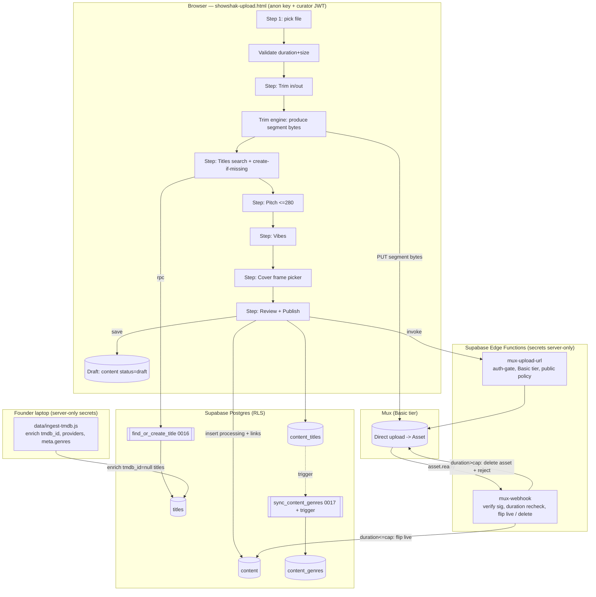

# Design Document — Curator Upload v2

## Overview

Curator Upload v2 turns the existing five‑step prototype (`showshak-upload.html`) into a
real publishing pipeline. The prototype already uploads bytes straight to Mux, inserts a
`content` row in `status='processing'`, and lets the `mux-webhook` flip it to `live`. The
gap it closes is everything *around* the video: it links to a **mock** catalog, so it writes
`title_id=null` / `platform_id=null` and no genres, which breaks **Watch It** and **Discover**
for uploaded clips.

v2 fixes this and adds the founder‑prioritised capabilities, while preserving ShowShak's core
guarantees (title hidden until Watch It, auth‑gated uploads, additive + RLS‑safe schema,
secrets confined to Edge Functions/scripts, browser never calls TMDB):

1. **Real titles** — search the live `titles` table; create‑if‑missing via the existing
   `find_or_create_title` RPC (migration 0016, already applied), `tmdb_id=null` so the local
   `data/ingest-tmdb.js` enriches it later.
2. **Multiple titles per clip** — link via `content_titles` (migration 0014, applied);
   `content.title_id` stays as the primary (sort_no 0) for backward compatibility.
3. **Auto‑genres** — derive `content_genres` as the de‑duplicated union of the linked titles'
   genres, via a `SECURITY DEFINER` function + trigger (new migration 0017).
4. **Duration + size limits** — 90 s `Duration_Cap`, ~300 MB `File_Size_Cap`, enforced
   client‑side *before* minting the Mux upload **and** re‑checked in `mux-webhook` (delete the
   asset if over).
5. **Pitch rules** — no minimum, **maximum 280 characters** (the resolved Open Decision), with
   a soft sweet‑spot hint.
6. **Clip Trim** — in/out points; only the trimmed segment is uploaded (client‑side stream‑copy
   trim).
7. **Cover picker** — pick a frame; stored as a Mux thumbnail reference + cover time in `meta`.
8. **Drafts** — `status='draft'` rows (no new column), owner‑private via RLS (migration 0015,
   applied).
9. **Edit‑after‑post** — owner edits Pitch / Titles / vibes / Cover; video bytes immutable;
   editing titles re‑derives genres.

### Working principles applied

- **Build for today, structure for tomorrow.** Every change is additive: new join rows, new
  functions, new `meta` keys — no table/column is dropped, renamed, or retyped.
- **Counts/derivations are not the source of truth.** `content_genres` is *derived* from linked
  titles; re‑running the derivation is idempotent and always reflects the current links.
- **Security lives in the database.** Writes are scoped by RLS to `creator_id = auth.uid()`;
  catalog writes (titles, genres) go through `SECURITY DEFINER` functions, never raw client
  INSERT on shared tables.
- **No build step.** All UI is vanilla JS in `showshak-upload.html` + helpers in
  `showshak-shared.js`. The trim engine loads from a CDN ESM module at runtime; nothing is
  bundled.
- **Verify against the DB.** Schema changes ship with a re‑runnable `data/_verify_*.js` check
  (service role), and RLS is verified in‑browser with the anon key.

## Architecture



### Pipeline phases

1. **Select & validate** (client). Read `file.size` and the source duration from a hidden
   `<video>`'s `loadedmetadata`. Reject over‑cap files before any Mux call (Req 4.1–4.3).
2. **Trim** (client). Curator sets In/Out; the UI shows the live segment duration and blocks
   if `> 90 s` (Req 7). If the segment equals the full source, no re‑processing happens
   (Req 7.6).
3. **Titles** (client + DB). Search `titles` (public SELECT); selecting links it, "create new"
   calls `find_or_create_title` (Req 1, 2).
4. **Compose** (client). Pitch (≤280), vibes, cover frame.
5. **Publish** (client → Edge → Mux → DB). Mint upload URL (auth‑gated), PUT only the trimmed
   bytes, insert `content` (`processing`) with `title_id` = primary, write `content_titles`
   for all links (trigger derives genres), store cover + vibes in `meta`.
6. **Finalize** (Edge). `mux-webhook` verifies signature, re‑checks duration, flips to `live`
   (or deletes the asset and marks not‑live if over cap).
7. **Edit‑after‑post / Drafts** (client + DB). Owner UPDATE on `content`, re‑write
   `content_titles` (trigger re‑derives genres). Video/asset immutable.

## Components and Interfaces

### Frontend — `showshak-upload.html`

The five‑step flow grows to accommodate trim and cover. Recommended step model
(progress bar adapts to the count; `TOTAL_STEPS` is data‑driven):

| Step | Name | Key change vs prototype |
|------|------|--------------------------|
| 1 | Clip | After file pick: **validate size/duration**, then **Trim** (in/out, live segment duration). |
| 2 | Titles | Real `titles` search; **multi‑select**; **create‑if‑missing**; at least one required. |
| 3 | Pitch | **≤280 chars** counter; no minimum; soft sweet‑spot hint. |
| 4 | Vibes | Unchanged (1–3 moods, stored in `meta.vibes`). |
| 5 | Cover | **Frame picker** (scrub a timeline; default = first frame). |
| 6 | Review & Publish | Lists all linked titles; publish or **Save draft**. |

The flow is also entered in **edit mode** (`?edit=<contentId>`) and **resume‑draft mode**
(`?draft=<contentId>`); both hydrate the `draft` object from the DB row (see Drafts /
Edit‑after‑post).

### Pure helpers (new, in `showshak-shared.js`, Node‑testable)

These contain all the logic worth property‑testing. They are pure (no DOM, no network) and
exported under the existing `module.exports` block so `tests/` can require them.

```js
// Pitch ─ Req 5
ssValidatePitch(text)                 // -> { ok, length, overMax, inSweetSpot }
                                      //    PITCH_MAX = 280; SWEET_MIN/SWEET_MAX soft hint

// Trim ─ Req 7
ssTrimDuration(inSec, outSec)          // -> outSec - inSec  (>=0; NaN-safe)
ssValidateTrim(inSec, outSec, srcDur)  // -> { ok, reason, durationSec }
                                       //    requires out>in and (out-in) <= DURATION_CAP(90)
ssIsFullSourceTrim(inSec, outSec, srcDur) // -> true when segment == whole source (Req 7.6)

// Duration/size ─ Req 4
ssValidateMediaFile(sizeBytes, durationSec) // -> { ok, reason }
                                            //    DURATION_CAP=90s, FILE_SIZE_CAP≈300MB

// Genres union ─ Req 3
ssGenreUnion(titlesGenreLists)         // -> de-duplicated, order-stable array of genre names

// Cover ─ Req 8
ssCoverThumbUrl(playbackId, timeSec)   // -> image.mux.com/<pid>/thumbnail.jpg?time=N
ssParseCoverTime(thumbUrl)             // -> N (round-trips with ssCoverThumbUrl)

// Multi-title Watch It ─ Req 2.4 / 2.5 (extends existing resolver)
ssResolveWatchOptionsForTitles(titles, region, subs) // -> [{ title, ...ssResolveWatchOptions }]

// Drafts ─ Req 9
ssDraftToRow(draft)                    // draft state -> content row patch (+ meta)
ssRowToDraft(row, links)               // content row + content_titles -> draft state (round-trip)
```

### Trim engine (client)

**Decision: client‑side stream‑copy trim using `ffmpeg.wasm`, loaded on demand from a CDN ESM
module; only the trimmed segment bytes are PUT to Mux.** The full source is uploaded unchanged
only when the curator does not trim (Req 7.6).

Interface:

```js
// Returns a Blob containing ONLY the [inSec,outSec] segment, same container/codecs as source.
async function ssTrimToBlob(file, inSec, outSec, onProgress) // -> Blob
// Internally: ffmpeg -ss <in> -to <out> -i <file> -c copy <out.mp4>  (no re-encode)
```

**Why stream‑copy in the browser (and not the alternatives):**

- **Requirement 7.5 is explicit:** *upload only the trimmed segment*. Uploading the full file
  and clipping at Mux (asset‑level `input` slicing) would transfer the entire source over a
  bandwidth‑constrained, India‑egress path — wasteful and contrary to 7.5. Rejected.
- **MediaRecorder + canvas/`captureStream`** re‑encodes in real time: a 90 s clip takes ~90 s,
  drops to WebM/VP8/9, loses quality, and makes synchronized audio fiddly. Rejected as the
  primary path on quality + UX grounds.
- **WebCodecs + manual MP4 muxing** gives no‑reencode trimming but is complex and uneven across
  browsers without a build step. Rejected as primary.
- **`ffmpeg.wasm` with `-c copy`** performs a true stream copy: near‑instant, **no quality
  loss**, output is a normal MP4/MOV that the existing `ssPutWithProgress` PUTs to Mux exactly
  as today. It loads as an ESM module from a CDN at runtime, so it respects the no‑build‑step
  constraint. This is the recommended approach.

**Tradeoffs / mitigations (stated honestly):**

- *Wasm download (~10–25 MB) + memory.* Lazy‑load the engine **only when the curator actually
  trims**; an untrimmed upload (Req 7.6) never loads it. Keystone files are ≤300 MB; reading a
  large source into the wasm FS is the main memory cost, bounded by the `File_Size_Cap`.
- *Stream‑copy cuts on keyframes.* `-c copy` can only cut on GOP boundaries, so the actual In
  point may snap to the nearest preceding keyframe (sub‑second). This is acceptable for a
  recommendation clip and avoids re‑encode. If frame‑exact trimming is ever required it becomes
  a future re‑encode option; **out of scope** here.
- *Engine fails to load / unsupported.* Degrade gracefully: surface a clear message and allow
  publishing the **untrimmed** source if it already passes the 90 s cap; otherwise block with
  the over‑limit message (consistent with Req 4/7). No silent full‑file upload of an over‑cap
  source.

The webhook duration re‑check (Req 4.5/4.6) is the server‑side backstop: even if a client trim
misbehaves, an over‑cap asset is deleted and never goes live.

### Cover / frame picker (client)

The cover is a **timestamp into the published clip**, rendered as a Mux on‑demand thumbnail.
At publish time the playback id does not exist yet, so:

- The curator scrubs a timeline over the **local** trimmed video to choose `coverTime` (seconds
  from the clip start). Default = `0` (first frame) when untouched (Req 8.3).
- `content.meta.cover_time = coverTime` is stored at insert.
- When `mux-webhook` sets `mux_playback_id`, it builds `thumbnail_url` using the stored
  `cover_time` if present: `image.mux.com/<pid>/thumbnail.jpg?time=<cover_time>` (Req 8.2). If
  absent it uses the default thumbnail (current behaviour).
- Edit‑after‑post can change `cover_time` *and* `thumbnail_url` directly (playback id already
  known), via the pure `ssCoverThumbUrl` helper (Req 10.2).

The feed/profile already render `clip.poster = thumbnail_url` (Req 8.4) — no read‑path change.

### Edge Functions

**`mux-upload-url`** — add the Basic tier and explicit public policy to the direct‑upload
request (Req 4.4). In `_shared/mux.ts › createDirectUpload`:

```ts
body: {
  new_asset_settings: {
    playback_policy: ["public"],
    video_quality: "basic",          // Req 4.4 — Mux "Basic" tier
  },
  cors_origin: corsOrigin,
}
```

Auth gate is unchanged (still rejects guests — Req 6.3/6.4).

**`mux-webhook`** — add the duration backstop (Req 4.5/4.6). On `video.asset.ready`, before
flipping live:

```ts
const durationSec = asset.duration ? Math.round(asset.duration) : null;
if (durationSec !== null && durationSec > DURATION_CAP /* 90 */) {
  await muxFetch(`/video/v1/assets/${assetId}`, { method: "DELETE" }); // remove the asset
  await db.from("content")
    .update({ status: "removed", deleted_at: new Date().toISOString(),
              meta: /* merge */ { rejected_reason: "over_duration_cap" } })
    .eq("meta->>mux_upload_id", uploadId).eq("status", "processing");
  return new Response(JSON.stringify({ rejected: "over_duration_cap" }), { status: 200 });
}
// else: existing flip-to-live, applying meta.cover_time to thumbnail_url
```

The function remains idempotent (only touches rows still `processing`) and continues to ACK
with 200 so Mux does not retry a handled event.

### Database functions

**`find_or_create_title(p_name, p_year)`** — already shipped (0016). Browser calls
`rpc('find_or_create_title', { p_name, p_year })` for "create new title"; dedup is
case‑insensitive name (+year). New rows get `tmdb_id=null`, `meta.source='curator'`.

**`sync_content_genres(p_content_id)`** — new (0017), `SECURITY DEFINER`, mirrors the
`sync_fires_count` / `find_or_create_title` security posture (locked `search_path`, granted to
`authenticated`). It rebuilds `content_genres` for one clip as the de‑duplicated union of the
genres of all titles linked in `content_titles`:

```text
1. Gather genre names from every linked title's meta->'genres' (jsonb array of names).
2. Resolve each name to genres.id (case-insensitive); create the genre row if missing.
3. DELETE existing content_genres for the clip, INSERT the union (no duplicates).
```

A trigger on `content_titles` (AFTER INSERT/DELETE, per statement) calls it so genres always
follow the links — including edit‑after‑post (Req 3.1–3.4, 10.4). Titles with no genre data
contribute nothing and never block (Req 3.3).

### TMDB ingest enhancement (`data/ingest-tmdb.js`)

Auto‑genres needs the titles to *carry* genres. Today the ingest writes `tmdb_id`, `providers`,
`cached_at`, `meta.media_type` — **not genres**. v2 extends step 3 to also store the TMDB genre
**names** on `titles.meta.genres` (a jsonb array; additive, no new column):

```js
meta: { ...(t.meta||{}), media_type: mediaType, genres: genreNamesFromTmdb }
```

`sync_content_genres` reads exactly this key. Curator‑created titles (`tmdb_id=null`) have no
genres until the next ingest run, which is fine (Req 3.3 — publish is never blocked on genres).

## Data Models

### Existing tables (unchanged, used by v2)

- **`content`** — the clip. v2 uses: `title_id` (primary title, sort_no 0), `description`
  (Pitch), `status` (`draft|processing|live|removed`), `thumbnail_url`, `duration_sec`,
  `mux_*`, `deleted_at`, and `meta`.
- **`titles`** — `id, tmdb_id, name, year, providers (jsonb by region), meta`. v2 reads
  `meta.genres`.
- **`genres` / `content_genres`** — fixed‑ish catalog + clip↔genre join (derived in v2).
- **`platforms`** — curator fallback platform for Watch It when a title has no providers.

### `content.meta` keys (conventions, additive — no new columns)

| Key | Type | Purpose | Req |
|-----|------|---------|-----|
| `mux_upload_id` | string | match the webhook to the row | existing |
| `vibes` | string[] | selected moods mirror | existing |
| `cover_time` | number | seconds into clip for the cover thumbnail | 8.2 |
| `trim` | `{in,out,src}` | audit of the trim the curator applied | 7 |
| `rejected_reason` | string | set by webhook when an asset is rejected | 4.6 |
| `source`(on titles) | string | `'curator'` for create‑if‑missing titles | 1.3 |

### `content_titles` (migration 0014, applied)

`(content_id, title_id, sort_no, created_at)`, PK `(content_id, title_id)`. `sort_no=0` is the
primary (mirrors `content.title_id`); extras follow in curator order. RLS: public read for live
clips, owner insert/delete (matches `stack_items`).

### New migration — `0017_sync_content_genres.sql`

`SECURITY DEFINER` function `public.sync_content_genres(uuid)` + an `AFTER INSERT OR DELETE`
trigger on `content_titles`. Additive (a function + trigger + execute grant), idempotent
(`create or replace`, `drop trigger if exists`). Follows `supabase/SCHEMA_CHANGE_PROCESS.md`.

### Draft model (Req 9 — no new column)

A draft is a `content` row with `status='draft'`:

| Draft field | Stored in |
|-------------|-----------|
| video / Mux asset | `mux_*` once uploaded (or none if not yet uploaded) |
| trim points | `meta.trim = {in,out,src}` |
| linked titles | `content_titles` + `title_id` (primary) |
| pitch | `description` |
| vibes/moods | `meta.vibes` |
| cover | `meta.cover_time` |

Owner‑private via the `content_select_own` / `content_update_own` policies (0015) and the
public live‑only read policy that hides drafts from everyone else (Req 9.2/9.3/9.7). Discard =
soft delete (`deleted_at`, an UPDATE — Req 9.6). Publish = `status` → `processing` then the
normal Mux finalize (Req 9.5).

### Edit‑after‑post model (Req 10)

Owner UPDATE on `content` (Mutable_Metadata: `description`, `title_id`, `meta.vibes`,
`thumbnail_url`/`meta.cover_time`) + INSERT/DELETE on `content_titles` to change links (trigger
re‑derives genres). The `mux_asset_id` / `mux_playback_id` / `url` / bytes are **never** written
by the edit path — Immutable_Asset (Req 10.3). RLS scopes every write to the owner (Req 10.1).

## Correctness Properties

*A property is a characteristic or behavior that should hold true across all valid executions
of a system — essentially, a formal statement about what the system should do. Properties serve
as the bridge between human‑readable specifications and machine‑verifiable correctness
guarantees.*

These properties target the **pure helpers** described above (no DOM, no network), which is
exactly what the project's existing `tests/` property tests cover. Infrastructure, RLS,
Edge‑Function wiring, and UI behaviours are validated by integration/example tests (see Testing
Strategy), not property tests. The prework was de‑duplicated so each property below provides
unique validation value.

### Property 1: Pitch validation honours no‑minimum and the 280 maximum

*For any* string `p`, `ssValidatePitch(p).ok` is true **iff** `1 ≤ p.length ≤ 280`;
`overMax` is true **iff** `p.length > 280`; and the soft `inSweetSpot` flag never changes `ok`
(a pitch outside the sweet spot but within the maximum is still publishable).

**Validates: Requirements 5.1, 5.2, 5.3, 10.5**

### Property 2: Trim validation requires Out > In and a segment within the cap

*For any* numbers `inSec`, `outSec`, `srcDur`, `ssValidateTrim(inSec, outSec, srcDur)` reports
`ok` **iff** `outSec > inSec` and `(outSec − inSec) ≤ 90`, and when `ok`, its reported
`durationSec` equals `ssTrimDuration(inSec, outSec) = outSec − inSec ≥ 0`. The function is
NaN/Infinity‑safe (never throws, never reports `ok` on non‑finite input).

**Validates: Requirements 7.2, 7.3, 7.4**

### Property 3: Untrimmed selection is detected as the full source

*For any* `inSec`, `outSec`, `srcDur`, `ssIsFullSourceTrim(inSec, outSec, srcDur)` is true
**iff** `inSec = 0` and `outSec = srcDur`; whenever it is true the published segment equals the
whole source, still subject to the same 90 s cap as a trimmed segment.

**Validates: Requirements 7.6**

### Property 4: Media‑file validation gates on both duration and size

*For any* `sizeBytes` and `durationSec`, `ssValidateMediaFile(sizeBytes, durationSec).ok` is
true **iff** `durationSec ≤ 90` **and** `sizeBytes ≤ FILE_SIZE_CAP (≈300 MB)`; a failure
reports which cap was exceeded, and `ok` is the precondition the UI uses before minting a Mux
upload (and the same duration bound the webhook re‑applies).

**Validates: Requirements 4.1, 4.2, 4.3, 4.5, 4.7**

### Property 5: Genre derivation is the de‑duplicated, order‑stable, empty‑safe union

*For any* list of per‑title genre name lists (including empty or missing lists),
`ssGenreUnion(lists)` contains each distinct genre name exactly once, preserves first‑seen
order, contributes nothing for titles with no genres (never throws), and is idempotent
(`ssGenreUnion([u]) = u` for an already‑unioned `u`).

**Validates: Requirements 3.1, 3.2, 3.3, 10.4**

### Property 6: Multi‑title Watch It resolves each title independently

*For any* list of linked titles, a region, and a subscription set,
`ssResolveWatchOptionsForTitles(titles, region, subs)` returns exactly one entry per title in
order, and each entry's resolution equals `ssResolveWatchOptions(title, region, subs)` for that
title alone — including the curator‑platform fallback when a title has no providers for the
region.

**Validates: Requirements 1.4, 2.4, 2.5, 6.2**

### Property 7: Title linking produces one ordered row per selected title and gates publish

*For any* set of distinct selected titles, the produced `content_titles` rows are exactly one
per title with `sort_no` values `0..n−1` (the primary title at `sort_no 0`, matching
`content.title_id`); and `ssCanPublish(draft)` is true **iff** at least one title is linked, in
which case the publish row's `title_id` is non‑null.

**Validates: Requirements 1.2, 1.5, 2.2, 2.3**

### Property 8: Cover thumbnail URL round‑trips with its parser

*For any* playback id `pid` and non‑negative time `t`,
`ssParseCoverTime(ssCoverThumbUrl(pid, t)) = t`, and the URL has the form
`image.mux.com/<pid>/thumbnail.jpg?time=<t>`; when no cover time is supplied the default cover
URL carries no `time` parameter.

**Validates: Requirements 8.2, 8.3**

### Property 9: Draft state round‑trips through persistence

*For any* draft state `d` (selected video reference, trim points, linked titles, pitch within
the maximum, vibes, cover time), `ssRowToDraft(ssDraftToRow(d), ssDraftToLinks(d)) = d`. In
particular the pitch survives as `description` and the cover time survives in `meta`.

**Validates: Requirements 5.4, 9.1, 9.4**

### Property 10: Edit patch only ever touches Mutable_Metadata

*For any* edit input, the patch produced by the edit path contains only mutable keys
(`description`, `title_id`, `meta.vibes`, `thumbnail_url` / `meta.cover_time`) and **never**
contains `mux_asset_id`, `mux_playback_id`, `url`, or any video‑bytes field — guaranteeing the
Immutable_Asset cannot be swapped through an edit.

**Validates: Requirements 10.2, 10.3**

## Error Handling

The pipeline fails **closed and early**, always preferring to retain the curator's work over
producing a half‑published clip.

| Stage | Failure | Handling | Req |
|-------|---------|----------|-----|
| File select | Over duration/size cap | Reject in UI with the specific limit message; **never** mint a Mux upload. | 4.2, 4.3 |
| Trim | `out ≤ in` or segment > 90 s | Block "proceed" with the over‑limit message; keep the curator on the trim step. | 7.2, 7.4 |
| Trim engine | ffmpeg.wasm fails to load / unsupported | Show a clear message; allow publishing the untrimmed source **only if** it already passes the 90 s cap; otherwise block. Never silently upload an over‑cap source. | 7, 4 |
| Title create | `find_or_create_title` RPC error | Abort publish **before** minting; retain all draft selections; show a failure toast. | 1.6 |
| Mint upload | Edge function unreachable / non‑2xx | Restore the publish button; toast "Upload couldn't start"; no `content` row inserted. | 6.3, 6.4 |
| Byte upload | PUT to Mux fails mid‑transfer | Toast "Upload failed"; no `content` row inserted. | — |
| Insert/link | `content` or `content_titles` insert error | Toast "Couldn't save your clip"; no success state; the trigger never runs on a failed insert. | 1.6 |
| Webhook | Bad/missing Mux signature | 401, modify nothing. | 6.x |
| Webhook | Mux duration > 90 s | Delete the Mux asset; set `status='removed'` + `meta.rejected_reason`; never goes live. | 4.6 |
| Genres | Linked title has no genres | Union contributes nothing; publish proceeds. | 3.3 |
| Auth | Guest attempts upload | Client guard + Edge 401; nothing minted or inserted. | 6.3 |

All write paths are scoped by RLS to `creator_id = auth.uid()`, so even a forged client request
cannot insert/edit/delete another curator's clip, links, or draft.

## Testing Strategy

The project has **no build step** and uses two existing harnesses, which v2 extends rather than
replaces:

1. **Node property + unit tests** (`tests/*.test.js`, no framework, plain `node`, exit non‑zero
   on failure) — the home for the 10 correctness properties above (all target pure helpers in
   `showshak-shared.js`). A minimal DOM/window stub is already established in
   `tests/pure-helpers.test.js`; new tests reuse it.
2. **Deno tests** for Edge Functions (`supabase/functions/**/*.test.ts`) — for wiring and
   security behaviour that does not vary with input.
3. **Structural DB checks** (`data/_verify_upload_v2.js`, service role, re‑runnable) — for
   migrations, extended to cover `0017` (function + trigger exist and derive genres).
4. **In‑browser RLS checks** (anon key) — for owner‑scoping that the service role bypasses.

### Property‑based tests (when PBT applies — it does here)

- **Library:** `fast-check` for JS, loaded as a dev dependency under `tests/` (the only place a
  package is needed; production code stays dependency‑free and unbundled). It integrates with
  the plain‑Node runner the repo already uses.
- **Iterations:** each property test runs **≥ 100** generated cases (the existing tests use
  `ITER = 200`; new property tests match or exceed 100).
- **Tagging:** each test is tagged with a comment in the form
  **`Feature: curator-upload-v2, Property <n>: <property text>`**, and implements a **single**
  design property per test (Properties 1–10 → ten property tests).
- Generators deliberately include the edge cases called out in prework: empty/whitespace
  pitches and the 280 boundary; `out ≤ in`, zero‑length, and exactly‑90 s segments;
  full‑source `in=0,out=src`; non‑finite durations; titles with empty/missing `meta.genres`;
  titles with and without region providers; missing cover times.

### Unit / example tests (specific scenarios, kept lean)

- Title create‑if‑missing dedup (calling `find_or_create_title` twice with the same name → one
  id, `tmdb_id=null`).
- Publish abort paths (Req 1.6): RPC failure and insert failure leave the draft intact and mint
  nothing.
- Draft publish (Req 9.5), discard/soft‑delete (Req 9.6), and the hidden‑title feed/body
  projection (Req 6.1, 10.6).
- Cover default behaviour (Req 8.3/8.4) via the existing `ssMapContentRowsToClips` poster
  mapping.

### Deno Edge‑Function tests (integration, 1–3 examples each)

- `mux-upload-url`: rejects missing/invalid JWT with 401 and makes no Mux call (Req 6.3/6.4);
  the direct‑upload body requests `video_quality: "basic"` + `playback_policy: ["public"]`
  (Req 4.4).
- `mux-webhook`: a `video.asset.ready` with `duration > 90` triggers an asset DELETE and a
  not‑live status; a within‑cap asset flips to `live` and applies `meta.cover_time` to the
  thumbnail URL (Req 4.5/4.6, 8.2). Signature verification continues to use the existing
  `verify-signature.test.ts` precedent.

### Structural + RLS verification

- Extend `data/_verify_upload_v2.js` to assert `0017`'s function/trigger exist and that
  inserting `content_titles` for a TMDB‑backed title yields the expected `content_genres` union
  (and that re‑linking re‑derives idempotently).
- In‑browser anon checks: a non‑owner cannot read another curator's draft, cannot insert/delete
  another curator's `content_titles`, and cannot UPDATE another curator's clip — confirming the
  0014/0015 policies hold under the anon/authenticated role.

### Why not PBT for the rest

Trimming byte‑exactness (Req 7.5) depends on the ffmpeg.wasm codec engine and Mux ingest, so it
is validated by integration/manual checks, not a Node property. Schema/RLS posture (Req 2.1,
2.6, 6.5–6.7, 9.7) is structural and security‑oriented. Edge‑Function configuration (Req 4.4)
and external side effects (Req 4.6, 6.3) are deterministic and don't benefit from 100 iterations
— they get focused integration examples instead.
