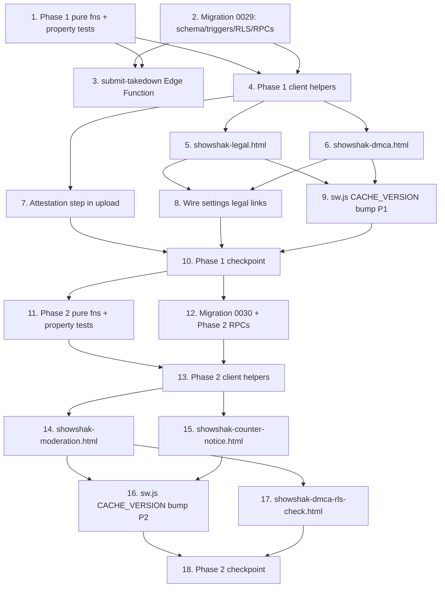

# Implementation Plan

## Overview

Built in two dependency-ordered phases that match the design; **Phase 1 (Posture & Intake)
ships and is verifiable on its own** — at its checkpoint a takedown is *received and logged*
but nothing is removed yet. Phase 2 (Workflow & Compliance) activates expeditious removal,
counter-notice/reinstatement, repeat-infringer termination, and the grievance SLA clocks.

Conventions (matching `stack-sharing` and `watch-it-curator-availability`):

- All pure decision logic lives in `showshak-shared.js`, **dual-exported** (`window.*` +
  `module.exports`), DOM-free, never throws. Each of the **seven correctness properties** gets
  its own `tests/prop-dmca-*.test.js` fast-check file (`installDomStub()` before
  `require('../showshak-shared.js')`, `{ numRuns: ITER }`, tagged
  `// Feature: dmca-moderation-scaffolding, Property <n>` + `**Validates: Requirements X.Y**`),
  auto-discovered by `tests/run-all.js`. Run `node tests/run-all.js` after every
  `showshak-shared.js` change; the suite MUST stay green at every checkpoint (Non-Regression 3).
- **Pure functions and their property tests are written BEFORE the impure wiring that depends
  on them.** The JS layer drives UI/UX and feeds server re-validation; it is NEVER the security
  boundary — the database (RLS + `SECURITY DEFINER` RPCs + triggers) is.
- **Migrations are founder-applied** in the Supabase SQL editor and are flagged
  **[founder-run]** — the agent authors the `.sql` file; the founder applies it. New migrations
  start at `0029` (Phase 1) and `0030` (Phase 2). Frontend code is written backward-safe where
  feasible (a surface degrades gracefully if its migration isn't applied yet).
- **Edge Functions** live in `supabase/functions/*` (Deno) and are deployed by the founder
  (`supabase functions deploy <name> --no-verify-jwt`) — flagged as a founder sub-step.
- Vanilla HTML/CSS/JS, no build step. **Sacred rules preserved** (title-blind, hide-the-
  scoreboard, RLS-not-UI); the player/feed/CDN/MP4 are untouched. All legal prose is placeholder
  copy carrying the visible marker **"counsel review required."**

## Tasks

### PHASE 1 — Posture & Intake (shippable alone)

- [x] 1. Phase 1 pure functions + property tests (`showshak-shared.js`)
  - [x] 1.1 Add `ssAttestationComplete`, `ssDmcaNoticeWellFormed`, `ssContentPubliclyVisible` to
    `showshak-shared.js`, dual-exported (`window.*` + `module.exports`), beside the existing
    `ss*` helpers. Each is pure, DOM-free, and returns a safe value rather than throwing on
    null/partial/malformed input, exactly per the design's function contracts (well-formedness
    keys `work_identification | target | complainant_name | complainant_email | good_faith |
    accuracy_authority | signature`; email `/^[^@\s]+@[^@\s]+\.[^@\s]+$/`; visibility true iff
    `status==='live'` and `deleted_at` unset).
    - _Files: showshak-shared.js_
    - _Requirements: 1.8, 3.6, 4.9_

  - [x] 1.2 Write the property test for attestation completeness
    - `tests/prop-dmca-attestation.test.js`: generators randomize presence/absence of each
      field, empty/whitespace strings, unparseable `accepted_at`, and versions above/below
      `requiredVersion`; assert `true` iff non-empty accepting user id + valid timestamp + both
      versions recorded and `>= requiredVersion`, else `false`; assert never throws.
    - **Property 1: Attestation completeness**
    - **Validates: Requirements 1.8**
    - _Files: tests/prop-dmca-attestation.test.js_

  - [x] 1.3 Write the property test for DMCA notice well-formedness
    - `tests/prop-dmca-notice.test.js`: generate well-formed notices and each-element-broken
      variants (whitespace-only, over-bound strings, malformed emails, clip-id vs URL target);
      assert `ok === (missing.length === 0)`, `missing` lists exactly the failing element keys,
      and the input object is not mutated (no side effects).
    - **Property 2: DMCA notice well-formedness**
    - **Validates: Requirements 3.2, 3.4, 3.6**
    - _Files: tests/prop-dmca-notice.test.js_

  - [x] 1.4 Write the property test for the public-visibility predicate
    - `tests/prop-dmca-visibility.test.js`: random `status` ∈ `{processing,live,removed,draft}` ×
      `deleted_at` set/unset × arbitrary `viewerId`; assert `true` iff `status==='live'` and
      `deleted_at` unset, `false` otherwise (explicitly false for `removed` or `deleted_at` set).
    - **Property 4: Public visibility predicate**
    - **Validates: Requirements 4.9**
    - _Files: tests/prop-dmca-visibility.test.js_

- [x] 2. **[founder-run]** Migration `0029` — Phase 1 schema, triggers, RLS, RPCs
  - [x] 2.1 Create `supabase/migrations/0029_dmca_intake_posture.sql` with the four new tables
    per the design: `attestations` (clip_id/curator_id refs **without** `on delete cascade` —
    retained forever), `policy_versions` (`unique(doc,version)` + partial unique index
    `uq_policy_current`), `complaints` (closed 7-state CHECK, non-account complainant free-text
    fields, `received_at`, counter-notice columns, `escalation_at`, unique `confirmation_ref`
    default), and append-only `moderation_log` (recognized `action_type` CHECK set; **no**
    `updated_at`/`deleted_at`; `occurred_at` default `clock_timestamp()`); plus all listed
    indexes.
    - _Files: supabase/migrations/0029_dmca_intake_posture.sql_
    - _Requirements: 1.3, 1.7, 2.4, 2.6, 3.5, 4.11, 6.6, 7.2, 8.1, 8.7_

  - [x] 2.2 In the same file add the database-level triggers and the admin helper:
    `moderation_log_immutable()` + `BEFORE UPDATE`/`BEFORE DELETE` triggers that hard-reject for
    **all** roles incl. service (append-only); `content_requires_attestation()` +
    `BEFORE UPDATE` trigger on `content` that raises on a `*→'live'` flip when no `attestations`
    row exists for the clip; and the `ss_is_admin()` `SECURITY DEFINER` helper (service-role/
    admin only).
    - _Files: supabase/migrations/0029_dmca_intake_posture.sql_
    - _Requirements: 8.4, 8.5, 8.6, 10.3, 10.5_

  - [x] 2.3 In the same file enable RLS and add the policies: `attestations` owner-read only;
    `policy_versions` world-read (`deleted_at is null`), service-only write; `complaints`
    admin-read only via `ss_is_admin()` (no anon/authenticated select → zero rows); `moderation_log`
    admin-read only. Confirm (do **not** rebuild) the existing `read_live_content` policy already
    hides `removed`/soft-deleted clips from anon/non-privileged reads.
    - _Files: supabase/migrations/0029_dmca_intake_posture.sql_
    - _Requirements: 2.6, 4.8, 8.4, 9.2, 9.3_

  - [x] 2.4 In the same file add the Phase 1 `SECURITY DEFINER` RPCs:
    `ss_submit_complaint(payload jsonb)` (anon-execute; re-validate well-formedness in SQL,
    insert `complaints` `state='received'` + `received_at=now()`, append `moderation_log
    'received'` in the same transaction, return only `{confirmation_ref}`);
    `ss_record_attestation(p_clip_id, p_tos_version, p_attestation_version)` (authenticated;
    insert one `attestations` row, `curator_id=auth.uid()`, `accepted_at=now()`; failure → no
    row + error); `ss_get_policy_version(p_doc, p_version)` (return exact stored
    `body`/`version`/`effective_date`; error when `(doc,version)` not found — never substitute).
    End with `notify pgrst, 'reload schema';`.
    - **[founder-run]** the founder applies `0029` in the Supabase SQL editor. Code in tasks 4–8
      is written backward-safe where feasible until it is applied.
    - _Files: supabase/migrations/0029_dmca_intake_posture.sql_
    - _Requirements: 1.3, 1.4, 2.7, 2.8, 3.3, 3.5, 7.2, 8.1_

- [x] 3. `submit-takedown` Edge Function (public intake endpoint)
  - [x] 3.1 Create `supabase/functions/submit-takedown/index.ts` (Deno, anon-allowed, CORS-open
    like the existing functions): re-run `ssDmcaNoticeWellFormed` server-side; on `ok` call the
    `ss_submit_complaint` RPC and return `{confirmation_ref}`; otherwise return `{missing[]}`
    naming each failing element. Apply basic size caps / rate-limiting like the other functions.
    Mirror the `_shared/cors.ts` pattern; add an `index.test.ts` for the validate-then-call path.
    - **[founder-run]** the founder deploys with
      `supabase functions deploy submit-takedown --no-verify-jwt`.
    - _Files: supabase/functions/submit-takedown/index.ts, supabase/functions/submit-takedown/index.test.ts_
    - _Requirements: 3.1, 3.3, 3.4_

- [x] 4. Phase 1 client RPC-wrapper helpers (`showshak-shared.js`, window-only)
  - [x] 4.1 Add the impure wrappers beside the existing `_ssDb*`/RPC helpers (NOT in the pure
    export block): `ssRecordAttestation(clipId, tosVersion, attestationVersion)` →
    `rpc('ss_record_attestation', …)` (surfaces "attestation could not be saved" on failure);
    `ssSubmitTakedown(notice)` → client-side `ssDmcaNoticeWellFormed` gate then POST to the
    `submit-takedown` function, returning `{confirmation_ref}` or `{missing}`;
    `ssLoadPolicyVersion(doc, ver)` → `rpc('ss_get_policy_version', …)`, surfacing the
    "version unavailable" error (Req 2.8). All fail-soft, never throw.
    - _Files: showshak-shared.js_
    - _Requirements: 1.4, 2.7, 2.8, 3.1, 3.3, 3.4_

- [x] 5. Policy surfaces — `showshak-legal.html` (four addressable docs)
  - [x] 5.1 Create `showshak-legal.html?doc=tos|privacy|copyright|community`: one page rendering
    four independently addressable policy docs, each loading its current version via
    `ssLoadPolicyVersion` and showing a visible **version identifier + effective date** and the
    **"counsel review required"** marker. The Copyright/DMCA doc links to the intake form
    (`showshak-dmca.html`) and renders the Grievance-Officer block (name, designation, contact —
    placeholder copy). The Community/Repeat-Infringer doc states `threshold`/`windowDays` as
    placeholder copy (these values live ONLY here). Title-blind and scoreboard-safe — no
    fires/Watch-It/title exposure.
    - _Files: showshak-legal.html_
    - _Requirements: 2.1, 2.4, 2.5, 2.9, 2.10, 6.5, 7.1, 10.4_

- [x] 6. Public takedown intake — `showshak-dmca.html`
  - [x] 6.1 Create `showshak-dmca.html`, servable to anyone with no login. Capture all Req 3.2
    elements (work identification, target clip id **or** URL, complainant name, email,
    good-faith affirmation, accuracy/penalty-of-perjury affirmation, electronic signature) with
    client-side `ssDmcaNoticeWellFormed` gating; submit via `ssSubmitTakedown`; on success show
    the unique `confirmation_ref`; on failure name each missing/invalid element. Never asks for
    or renders a pre-Watch-It clip title.
    - _Files: showshak-dmca.html_
    - _Requirements: 3.1, 3.2, 3.5, 3.7, 3.8_

- [x] 7. Attestation step in the upload publish flow (`showshak-upload.html`)
  - [x] 7.1 Inject a required attestation + indemnity affirmation step into the `publish()` flow:
    a checkbox/affirmation (placeholder copy marked "counsel review required") that blocks
    publish until affirmatively accepted; on accept, call `ssRecordAttestation` and only proceed
    to insert/advance the `content` row when the attestation row is recorded. On record failure,
    leave the clip in its current status and surface the "attestation could not be saved" error.
    Honor neutral-host guardrails: no copy naming/recommending a specific copyrighted work; no
    system-supplied copyrighted-media picker.
    - _Files: showshak-upload.html_
    - _Requirements: 1.1, 1.2, 1.6, 10.2, 10.3_

- [x] 8. Wire the dead legal links in `showshak-settings.html`
  - [x] 8.1 Replace the four dead `ssToast(...)` placeholder links — "Terms of Service",
    "Privacy Policy", "DMCA / report content", and the footer Terms/Privacy/DMCA — with real
    navigation to the corresponding surfaces: ToS/Privacy/Copyright → `showshak-legal.html?doc=…`,
    and "DMCA / report content" → `showshak-dmca.html`. No toast in place of navigation.
    - _Files: showshak-settings.html_
    - _Requirements: 2.1, 2.2, 2.3, 3.8_

- [x] 9. **[founder-run]** Bump `sw.js` CACHE_VERSION for the Phase 1 surfaces
  - [x] 9.1 Add the new Phase 1 surfaces (`showshak-legal.html`, `showshak-dmca.html`) to the
    `sw.js` precache list and bump `CACHE_VERSION` (currently `'v28'` → `'v29'`) so the installed
    PWA picks up the new pages. **[founder-run]**: the founder deploys so users receive the new
    service worker / cache.
    - _Files: sw.js_
    - _Requirements: 2.1, 3.1_

- [x] 10. Phase 1 checkpoint — suite green + founder DB verification
  - [x] 10.1 Run `node tests/run-all.js`; the full suite (existing + the three new
    `prop-dmca-*` Phase 1 files) MUST be green. Run `node --check` on changed HTML/JS; HTML
    diagnostics clean. Ensure all tests pass, ask the user if questions arise.
    - **[founder-run]** after applying `0029`, the founder verifies in the SQL editor: a
      `processing→live` flip with no `attestations` row raises (gate trigger, Req 10.3); any
      `UPDATE`/`DELETE` on `moderation_log` raises for every role incl. service (immutability,
      Req 8.4–8.6); `complaints`/`moderation_log` return zero rows to anon/authenticated
      (Req 9.2/9.3); an anonymous `ss_submit_complaint` of a well-formed notice creates a
      `received` row + `received` log entry and returns only `confirmation_ref`.
    - At this checkpoint the takedown is **received and logged; nothing is removed yet.** Phase 1
      is independently shippable. Confirm before starting Phase 2.
    - _Requirements: 3.5, 8.1, 8.4, 8.5, 8.6, 9.2, 9.3, 10.3_

### PHASE 2 — Workflow & Compliance (after Phase 1)

- [ ] 11. Phase 2 pure functions + property tests (`showshak-shared.js`)
  - [~] 11.1 Add `ssComplaintTransition` (+ the `SS_COMPLAINT_INVALID = '__invalid__'` sentinel),
    `ssReinstatementDue`, `ssRepeatInfringerDecision`, and `ssAckClockState` (+ the
    `SS_ACK_SLA_HOURS = 36` constant) to `showshak-shared.js`, dual-exported. Total functions
    over all inputs, never throw; semantics exactly per the design (six permitted forward
    transitions only; inclusive day-window bounds; non-voided strikes within `[now-windowDays,
    now]` inclusive; three-way ack state with the strict 36h boundary and fail-safe `breached`
    on unparseable `receivedAt`).
    - _Files: showshak-shared.js_
    - _Requirements: 4.2, 4.3, 4.4, 5.7, 6.3, 7.3_

  - [~] 11.2 Write the property test for the complaint state machine
    - `tests/prop-dmca-transition.test.js`: arbitrary `state`/`event` strings including the seven
      valid states and six valid events; assert the documented next state for exactly the six
      permitted pairs and `SS_COMPLAINT_INVALID` for all others; assert the sentinel ≠ any valid
      state and every non-invalid output is a member of the closed state set.
    - **Property 3: Complaint state machine**
    - **Validates: Requirements 4.1, 4.2, 4.3, 4.4**
    - _Files: tests/prop-dmca-transition.test.js_

  - [~] 11.3 Write the property test for the reinstatement window
    - `tests/prop-dmca-reinstatement.test.js`: random `counterFiledAt`/`now`/`minDays`/`maxDays`
      incl. negative elapsed, null/unparseable `counterFiledAt`, and `minDays > maxDays`; assert
      `true` iff `minDays <= elapsedDays <= maxDays` (inclusive both bounds), else `false`.
    - **Property 5: Reinstatement window**
    - **Validates: Requirements 5.7**
    - _Files: tests/prop-dmca-reinstatement.test.js_

  - [~] 11.4 Write the property test for the repeat-infringer decision
    - `tests/prop-dmca-repeat-infringer.test.js`: strike arrays with random timestamps + `voided`
      flags, random `threshold`/`windowDays`/`now`; assert `true` iff the count of non-voided
      strikes within `[now-windowDays, now]` inclusive `>= threshold`; assert voided and
      out-of-window strikes are never counted; empty/non-array → `0`.
    - **Property 6: Repeat-infringer decision**
    - **Validates: Requirements 6.2, 6.3**
    - _Files: tests/prop-dmca-repeat-infringer.test.js_

  - [~] 11.5 Write the property test for the acknowledgement-SLA clock state
    - `tests/prop-dmca-ack-clock.test.js`: random `receivedAt`/`ackedAt`/`now`; assert exactly
      one of `acknowledged` (ackedAt non-null) / `breached` (ackedAt null and elapsed strictly
      > 36h) / `pending_within_sla` (ackedAt null and elapsed <= 36h); assert the strict 36h
      boundary and three-way totality; unparseable `receivedAt` with null `ackedAt` → `breached`.
    - **Property 7: Acknowledgement-SLA clock state**
    - **Validates: Requirements 7.3**
    - _Files: tests/prop-dmca-ack-clock.test.js_

- [ ] 12. **[founder-run]** Migration `0030` — account-termination markers + Phase 2 RPCs
  - [~] 12.1 Create `supabase/migrations/0030_dmca_termination_workflow.sql`: additive
    `alter table users add column if not exists infringer_terminated_at timestamptz;` and
    `infringer_suspended_at timestamptz;` (the applied OUTCOME; the decision/count stay derived
    from `moderation_log`; `threshold`/`windowDays` are NOT columns and NOT hardcoded here).
    - _Files: supabase/migrations/0030_dmca_termination_workflow.sql_
    - _Requirements: 6.4, 6.5_

  - [~] 12.2 In the same file add the Phase 2 `SECURITY DEFINER` RPCs:
    `ss_moderate_complaint(p_id, p_event)` (admin-gated; load state →
    `ssComplaintTransition` re-validated in SQL → INVALID = error + no change; else append the
    matching `moderation_log` entry **before** mutating; on `action` set
    `content.status='removed'` + append `strike_recorded`; on `reinstate` set
    `content.status='live'` + append `strike_voided`; on `acknowledge` set `acked_at`; all
    atomic — if the log append fails the transition rolls back);
    `ss_file_counter_notice(p_id, p_statement, p_contact, p_signature)` (owner-gated; allowed
    only when `state='actioned'`; validate the three field bounds; reject duplicate when already
    `counter_received`; on success transition to `counter_received` + record `counter_filed_at` +
    audit); `ss_terminate_curator(p_curator_id)` (admin-gated; recompute non-voided strikes from
    `moderation_log`, run `ssRepeatInfringerDecision` with policy `threshold`/`windowDays`; on
    `true` set `users.infringer_terminated_at` + append `account_terminated`; on failure leave
    account unchanged + append `termination_failed` + return an error naming the curator). End
    with `notify pgrst, 'reload schema';`.
    - **[founder-run]** the founder applies `0030` in the Supabase SQL editor.
    - _Requirements: 4.7, 4.10, 5.1, 5.2, 5.3, 5.4, 5.5, 5.6, 6.1, 6.2, 6.7, 6.8, 6.9, 7.4, 9.5, 9.6, 9.7, 9.8_

- [ ] 13. Phase 2 client RPC-wrapper + SLA helpers (`showshak-shared.js`, window-only)
  - [~] 13.1 Add the impure wrappers beside the existing RPC helpers:
    `ssModerateComplaint(id, event)` → `rpc('ss_moderate_complaint', …)` (maps INVALID → error
    toast, Req 9.6); `ssFileCounterNotice(id, fields)` → `rpc('ss_file_counter_notice', …)`;
    and the pure-derived SLA display helpers `ssAckRemainingMinutes(receivedAt, now)`
    (whole minutes to the 36h ack SLA) and `ssResolutionRemainingHours(receivedAt, now)`
    (whole hours to the 15-day resolution SLA), driven alongside `ssAckClockState`. All
    fail-soft, never throw.
    - _Files: showshak-shared.js_
    - _Requirements: 5.1, 5.2, 7.5, 7.6, 9.5, 9.6_

- [ ] 14. Admin moderation review surface — `showshak-moderation.html`
  - [~] 14.1 Create `showshak-moderation.html`, **RLS-gated to service-role/admin** (the gate is
    the DB — non-admins get zero rows, not hidden UI). List each complaint with its current
    state, `received_at`, ack SLA clock, and resolution SLA clock (via `ssAckClockState`,
    `ssAckRemainingMinutes`, `ssResolutionRemainingHours`). Expose exactly five per-complaint
    actions — acknowledge, move to review, action (remove), reject, record reinstatement — each
    routed through `ssModerateComplaint`. Visually flag complaints whose ack clock is breached/
    near-breach (Req 7.7) and unresolved >15 days (Req 7.8). Title-blind, scoreboard-safe.
    - _Files: showshak-moderation.html_
    - _Requirements: 7.5, 7.6, 7.7, 7.8, 9.1, 9.2, 9.3, 9.4, 9.5, 9.9_

- [ ] 15. Counter-notice surface — `showshak-counter-notice.html`
  - [~] 15.1 Create `showshak-counter-notice.html?complaint=<id>`, owner-gated, actionable only
    when the complaint is `actioned`. Capture the three bounded fields (statement 1–5,000,
    contact 1–500, signature 1–200) with client-side bound validation; submit via
    `ssFileCounterNotice`; render statutory/counter-notice copy as placeholder marked "counsel
    review required". On wrong-state/duplicate/malformed submission, surface the specific error.
    - _Files: showshak-counter-notice.html_
    - _Requirements: 5.1, 5.2, 5.3, 5.4, 5.10_

- [ ] 16. **[founder-run]** Bump `sw.js` CACHE_VERSION for the Phase 2 surfaces
  - [~] 16.1 Add `showshak-moderation.html` and `showshak-counter-notice.html` to the `sw.js`
    precache list and bump `CACHE_VERSION` (`'v29'` → `'v30'`) so the installed PWA picks up the
    new pages. **[founder-run]**: the founder deploys so users receive the new service worker.
    - _Files: sw.js_
    - _Requirements: 9.1_

- [ ] 17. Manual DB/RLS check page — `showshak-dmca-rls-check.html`
  - [~] 17.1 Create `showshak-dmca-rls-check.html` (mirroring `showshak-rls-check.html`) that,
    run as anon and as a normal authenticated user, asserts and reports: a `removed` clip returns
    zero rows from `content` (Req 4.8); `complaints` and `moderation_log` return zero rows to a
    non-admin (Req 9.2/9.3); a direct `UPDATE`/`DELETE` on `moderation_log` raises for every role
    (Req 8.4–8.6); and a `processing→live` flip with no attestation row raises (Req 10.3).
    - **[founder-run]** the founder runs this page on-device (as anon and as a normal user) after
      applying `0029`/`0030` and confirms every check passes.
    - _Files: showshak-dmca-rls-check.html_
    - _Requirements: 4.8, 8.4, 8.5, 8.6, 9.2, 9.3, 10.3_

- [ ] 18. Phase 2 checkpoint — suite green
  - [~] 18.1 Run `node tests/run-all.js`; the full suite (existing + all seven `prop-dmca-*`
    files) MUST be green. Run `node --check` on changed HTML/JS; HTML diagnostics clean. Ensure
    all tests pass, ask the user if questions arise.
    - **[founder-run]** after applying `0030`, the founder walks an end-to-end queue in
      `showshak-moderation.html`: acknowledge → review → action (clip disappears everywhere via
      RLS, strike recorded) or reject; files a counter-notice, records reinstatement (clip
      returns, strike voided); and confirms the SLA clocks and breach flags render.
    - _Requirements: 4.7, 4.8, 4.10, 5.5, 6.1, 6.2, 9.7, 9.8_

## Notes

- **Phase 1 is independently shippable.** At task 10 the takedown is received and logged but
  nothing is removed; Phase 2 (tasks 11–18) activates removal, counter-notice/reinstatement,
  repeat-infringer termination, and the grievance SLA clocks.
- **Migrations are founder-run** (tasks 2, 12) in the Supabase SQL editor; **Edge Function
  deploy is founder-run** (task 3, `--no-verify-jwt`); **CACHE_VERSION bumps are founder-run**
  deploys (tasks 9, 16); **on-device RLS/DB verification is founder-run** (tasks 10, 17, 18).
  The agent authors all files; the founder applies/deploys/verifies.
- **Pure functions and their property tests come first** (tasks 1, 11) and are the spec the
  SQL/Deno re-validation must honor — the database (RLS + `SECURITY DEFINER` RPCs + triggers) is
  the security boundary, never the JS. Removal is an RLS guarantee (`content.status='removed'`
  → zero rows), never UI-only.
- **Suite stays green at every checkpoint** (Non-Regression 3): run `node tests/run-all.js` after
  every `showshak-shared.js` change and at both phase checkpoints. The seven `prop-dmca-*` files
  are auto-discovered by `tests/run-all.js`.
- **All legal copy is placeholder** marked "counsel review required"; `threshold`/`windowDays`
  live only in the Community policy surface. The player, feed, CDN/MP4 pipeline, and the existing
  `reports` table are untouched; sacred rules (title-blind, hide-the-scoreboard, RLS-not-UI) hold
  throughout.

## Task Dependency Graph



Critical path: (1+2) → 3/4 → (5,6,7) → 8/9 → 10 → (11+12) → 13 → (14,15) → 16/17 → 18.
Tasks 1 and 2 are independent and can run in parallel; tasks 5/6/7 are independent once 4
(and 2) land. Phase 2 is gated on the Phase 1 checkpoint (task 10).

```json
{
  "waves": [
    { "wave": 1, "tasks": ["1", "2"] },
    { "wave": 2, "tasks": ["3", "4"] },
    { "wave": 3, "tasks": ["5", "6", "7"] },
    { "wave": 4, "tasks": ["8", "9"] },
    { "wave": 5, "tasks": ["10"] },
    { "wave": 6, "tasks": ["11", "12"] },
    { "wave": 7, "tasks": ["13"] },
    { "wave": 8, "tasks": ["14", "15"] },
    { "wave": 9, "tasks": ["16", "17"] },
    { "wave": 10, "tasks": ["18"] }
  ]
}
```

## Workflow Complete

This planning workflow is complete — requirements, design, and this task plan are the
artifacts. No implementation has been done. To begin, open
`.kiro/specs/dmca-moderation-scaffolding/tasks.md` and click **Start task** next to a task
item (begin with task 1 in Phase 1).
