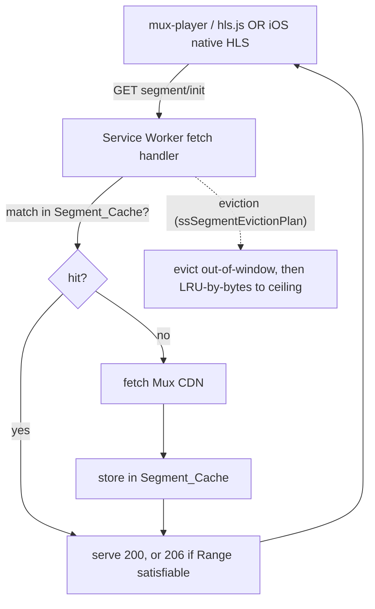
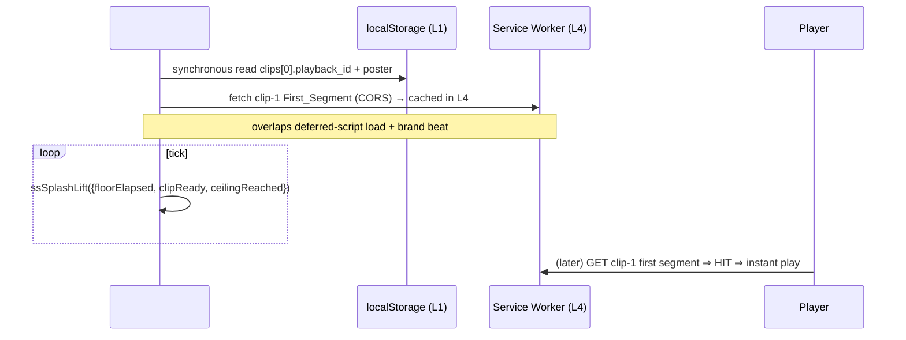

# Design Document

## Overview

The feed is the product, and clip-load latency is the difference between "magic"
and "meh". Today three verified gaps keep it below an A-grade (TikTok/Instagram)
bar: (1) the warm step (`ssWarmClips`) fetches only the tiny `.m3u8` manifest, and
as an opaque `no-cors` response the player generally can't reuse it, so a swipe
starts the next clip's bytes **cold**; (2) every mounted `<mux-player>` uses
`preload="auto"`, so up to `SS_MAX_LIVE_PLAYERS` (~4) players contend with the
**active** clip on a constrained mobile link; (3) nothing persists video segments,
so scroll-back re-downloads, and the cold-open first paint blocks on the Supabase
(Mumbai) query.

This feature implements one principle — **the active clip always wins the pipe; everything
else is prefetched only with spare, bounded bandwidth** — through changes that stay
inside the existing architecture (vanilla HTML/CSS/JS, no build step; pure logic in
`showshak-shared.js` dual-exported and property-tested; `<mux-player>` retained):

1. **Preload priority ladder** (Req 1) — a pure `ssPreloadTier(distance, tier)` maps each
   clip's distance-from-active + Network_Tier to a `<mux-player>` `preload` value
   (`auto` for the active clip only, `metadata` for the next `Prefetch_Depth`, `none`
   for the rest). Replaces blanket `preload="auto"`.
2. **Progressive deepening** (Req 2) — once the active clip's buffer is satisfied, spare
   bandwidth deepens upcoming clips, gated by a pure `ssShouldDeepen(...)` (network tier
   + session byte budget + dwell).
3. **Session byte budget + circuit breaker** (Req 3) — a per-session prefetch byte counter;
   on breach, fall back to active-only for the session. Protects the free Mux budget.
4. **Service-worker Segment_Cache** (Req 4) — the SW intercepts Mux segment requests into a
   range-aware (HTTP 206), byte-bounded LRU Cache Storage bucket that **both** the hls.js
   path and iOS native-HLS path reuse. This is also what makes a prefetched first segment
   actually reused (it sidesteps the request-mode/credentials mismatch that breaks today's
   app-level warm). Eviction governed by the pure `ssSegmentEvictionPlan(...)`.
5. **Cold-start splash lane** (Req 5) — during the brand splash, prefetch clip-1's first
   segment within ~100 ms; lift the splash via the pure `ssSplashLift(...)` (can-play OR
   floor; ceiling always wins).
6. **Resolution cap** (Req 6) + **metadata window expansion** (Req 7) + **instrumentation**
   (Req 8) — faster starts/lower cost, instant scroll-back on the data side, and a QoE
   scoreboard.

### Design principles honoured

- **Active wins** is an invariant, not a heuristic: only the active clip is ever `auto`;
  deepening is forbidden until its buffer is satisfied and is deferred (not discarded) the
  moment it needs the pipe.
- **Pure core, property-tested:** every magnitude decision is a pure, total, never-throw,
  dual-exported function with no DOM/network. The impure pieces (SW interception,
  mux-player attribute wiring, the deepening loop) consume those decisions as data.
- **Graceful degradation from day 1** (Req 9): every window/ladder/cache clamps to the
  clips that exist; the core win holds with 2 clips; nothing requires scale.
- **Fail-soft everywhere** (Req 10): a miss / quota / unsatisfiable range / unknown network
  / player race / Mux error degrades to "fetch from network / today's behaviour" — never a
  throw, black clip, or stuck splash.
- **Locked decisions preserved** (Req 12): keep `<mux-player>` (no player swap, no raw
  hls.js rewrite, no MP4, no CDN swap), keep the bounded player pool (~4), no unbounded
  in-memory cache. Mux encoding settings unchanged.

### The layered cache model

| Layer | Medium | Holds | Evict | Bound |
|---|---|---|---|---|
| L0 app shell | Cache Storage (SW) | HTML/CSS/JS/icons | `CACHE_VERSION` bump | small |
| L1 clip metadata | localStorage (SWR) | ids, captions, posterURL, `playback_id` | TTL 6h / window | ~tens of KB |
| L2 mounted players | live `<mux-player>` | decoded video + buffer | LRU band (~4) | `SS_MAX_LIVE_PLAYERS` |
| L3 in-memory buffer | per-player MSE buffer | forward seconds | player-managed | tier-tuned |
| **L4 persisted segments** | **Cache Storage (SW)** | **HLS init+media segments** | **byte-bounded LRU** | **`Segment_Cache_Ceiling` ~200MB** |

L0 and L4 are **separate Cache Storage buckets** with separate lifecycles: L4 must **not** be
wiped on every app deploy (see §"SW cache versioning").

## Architecture

### Read path (player → SW → Mux CDN)



### Prefetch path (ladder + deepening)

```mermaid
flowchart TD
  ACT[active-clip change in ClipEngine.setActive] --> TIER[ssNetworkTier(effectiveType)]
  TIER --> LAD[ssPreloadTier(distance, tier) per pooled clip]
  LAD --> APPLY[set mux-player preload = auto/metadata/none + setMaxResolution(cap)]
  ACT --> FS[prefetch First_Segment of next 1..Prefetch_Depth → lands in SW Segment_Cache]
  ACT --> LOOP[deepening loop while active buffer satisfied]
  LOOP --> DEEP{ssShouldDeepen(...)}
  DEEP -- yes --> WARM[fetch next segments → Segment_Cache, charge Session_Byte_Budget]
  DEEP -- no --> IDLE[idle / defer to active]
  WARM --> CB{budget exceeded?}
  CB -- yes --> BRK[Circuit_Breaker → active-only for session]
```

### Cold-start lane (splash window)



### Where each piece lives

| Concern | Location | Pure? |
|---|---|---|
| `ssPreloadTier`, `ssShouldDeepen`, `ssSplashLift`, `ssSegmentEvictionPlan`, extended `ssNetworkPolicy` | `showshak-shared.js` (pure export block) | **pure** |
| Apply preload tier + `setMaxResolution` on active change | `showshak-shared.js` `_poolRecycle` / `ClipEngine.setActive` | impure |
| Deepening loop + byte-budget counter + circuit breaker | `showshak-shared.js` (new `_ssDeepenController`) | impure |
| First-segment prefetch (replaces `ssWarmClips` manifest warm) | `showshak-shared.js` `ssWarmClips` rewrite + `_warmNext` | impure |
| Segment_Cache (intercept, 206, LRU) | `sw.js` | impure |
| Cold_Start_Lane | `showshak-feed.html` `#ss-splash` inline + `initFeed`/`__ssHideSplash` | impure |
| Metadata_Window = 30 | `showshak-shared.js` `SS_FEED_CACHE_MAX`/page cache | impure |
| Instrumentation | mux-player Mux Data attrs (present) + budget counter | impure |

## Components and Interfaces

### Pure decision core

All four are new pure helpers added to the dual-exported block in `showshak-shared.js`
(alongside `ssNetworkTier`/`ssNetworkPolicy`/`ssPreloadAction`/`ssMountedPlayerSet`). Total,
deterministic, never throw on malformed input.

### `ssPreloadTier(distance, networkTier, depthByTier)` → `'auto'|'metadata'|'none'`  (R1)

- `distance` = clipIndex − activeIndex (active = 0; negative = behind).
- `depthByTier` defaults from `ssNetworkPolicy` (`slow:1, medium:2, fast:2`).
- Rules: `distance === 0` → `'auto'`; `1 ≤ distance ≤ depth` → `'metadata'`; else (`distance < 0`
  or `distance > depth` or non-finite) → `'none'`. Exactly one `auto` across the feed (only the
  active clip). Identical inputs → identical output.

### `ssShouldDeepen(state)` → `boolean`  (R2)

`state = { activeBufferSatisfied, distance, networkTier, budgetRemainingBytes, nextSegmentBytes, dwell, dwellThreshold, maxDistance }`.
Returns true **iff** `activeBufferSatisfied === true` AND `1 ≤ distance ≤ maxDistance` AND `distance ≤
depthByTier[networkTier]` AND `budgetRemainingBytes > nextSegmentBytes` AND `dwell ≥ dwellThreshold`.
Any missing/non-finite field ⇒ false (never deepen on uncertainty). Pure; the impure controller calls
it per candidate clip each tick.

### `ssSplashLift(state)` → `'lift'|'hold'`  (R5)

`state = { floorElapsed, clipReady, ceilingReached }` (booleans). Returns `'lift'` when
`ceilingReached === true` OR (`floorElapsed === true` AND `clipReady === true`); else `'hold'`.
Ceiling precedence guarantees the splash can never hang. Defined for all 8 input combinations.

### `ssSegmentEvictionPlan(input)` → `{ evict: string[], keep: string[] }`  (R4)

`input = { segments: [{ key, bytes, lastUsed, clipDistance }], ceilingBytes, windowAhead, windowBehind }`.
Algorithm: (1) mark every segment whose `clipDistance` is outside `[-windowBehind, +windowAhead]` as
**out-of-window**; (2) evict out-of-window first (oldest `lastUsed` first); (3) if total kept bytes still
exceed `ceilingBytes`, evict in-window segments LRU (oldest `lastUsed`) until within ceiling. Returns the
partition. Pure (operates on a snapshot the SW passes in); non-array/!finite inputs ⇒ `{evict:[],keep:[]}`.

### `ssNetworkPolicy(tier)` — EXTENDED (reuse)

Already returns `{ preloadDepth, maxResolution }` per tier. Confirm/lock the table so it is the single
source for both Prefetch_Depth and Resolution_Cap:

| tier | preloadDepth | maxResolution |
|---|---|---|
| slow | 1 | 480p |
| medium | 2 | 720p |
| fast | 2 (tunable up to ~3) | 720p |

`ssNetworkTier(undefined)` → `'medium'` (unknown ⇒ medium) is already implemented; keep.

### Impure integration

#### 1. Preload tiering (replaces blanket `preload="auto"`)

`VideoSurface` already sets `preload` and exposes `setMaxResolution`. Change:
- On every `ClipEngine.setActive(idx, host)` (both INLINE + FULLSCREEN) and every `_poolRecycle`
  re-point, compute `ssPreloadTier(i − idx, tier)` for each mounted clip `i` and set the player's
  `preload` attribute accordingly; apply `setMaxResolution(ssNetworkPolicy(tier).maxResolution)` to the
  active surface (and pooled surfaces).
- The active surface keeps `preload="auto"`; non-active mounted surfaces get `metadata`/`none`. This alone
  stops the 4-player contention.
- `VideoSurface.mount`/`repoint` no longer hardcode `preload="auto"`; they accept the tier from the engine.

### 2. First-segment prefetch (rewrite `ssWarmClips`)

Today: `fetch(stream.mux.com/<id>.m3u8, {mode:'no-cors', cache:'force-cache'})` (opaque, unused) + poster.
New: for the next `Prefetch_Depth` clips, issue a **CORS** `fetch` of the clip's **init + first media
segment** so it lands in the SW Segment_Cache (the SW intercepts and stores it). Because the SW owns the
bytes, the player's later request is a guaranteed cache hit regardless of how the player fetches. Keep poster
warming. De-dupe per `playback_id` (existing `_ssWarmed`). Resolving the first-segment URL: read the clip's
rendition playlist once (the SW caches it too) and take the first `.ts`/`fmp4` segment + map/init. Keep this
best-effort + fire-and-forget; failures fall back to the player's own fetch.

### 3. Progressive-deepening controller (`_ssDeepenController`)

- Driven off the active surface: observe "active buffer satisfied" from the player's `buffered`
  TimeRanges (`bufferedAhead ≥ Buffer_Satisfied_Threshold`, default 5s) — mux-player exposes the underlying
  media element; read `buffered`/`currentTime`.
- A throttled tick (e.g. on `timeupdate`, coalesced) evaluates `ssShouldDeepen(...)` for the next clips in
  order (distance +1 fully, then +2..+4 first-segment), and when true issues the next-segment fetch into the
  Segment_Cache, charging the **Session_Byte_Budget** counter (`_ssPrefetchBytes += contentLength`).
- `Dwell_Signal` = fraction of the active clip watched (reuse the dwell timer/`SS_VIEW_DWELL_MS` machinery
  + `currentTime/duration`).
- On `_ssPrefetchBytes ≥ Session_Byte_Budget` → set `_ssCircuitOpen = true` → controller stops deepening and
  the ladder forces non-active `preload="none"` for the rest of the session. Reset both on a new feed load
  (`initFeed`).

### 4. Service-worker Segment_Cache (`sw.js`)

The key piece. Add a Mux-segment branch to the `fetch` handler (today Mux is explicitly **not** intercepted):

- **Match:** `url.hostname === 'stream.mux.com'` AND path is a segment/init/playlist (`.ts`, `.m4s`, `.mp4`,
  `.m3u8`). Playlists are cached short; media/init segments go to the LRU bucket.
- **Bucket:** a dedicated `caches.open('showshak-seg')` — **separate** from `showshak-<CACHE_VERSION>` so a
  deploy/version bump never wipes warmed video (see versioning below).
- **Serve / store:** on hit return cached; on miss `fetch` (CORS, no credentials), `cache.put` a clone, return.
- **Range / 206 (the fiddly part):** `<video>`/MSE and iOS native HLS issue `Range` requests. Cache Storage
  matches ignoring the `Range` header, so we store the **full** segment response once, then, when a request
  carries `Range: bytes=a-b`, read the cached full body, slice `[a, b]`, and synthesize a **`206 Partial
  Content`** response with `Content-Range`/`Content-Length`/`Accept-Ranges` headers. If the range is
  unsatisfiable or the cached body is opaque/!ok → **bypass** (fetch from network) — never throw (Req 10.3).
  (Mux segment responses are CORS-enabled, so bodies are readable/sliceable; verify on device.)
- **Eviction:** maintain a small index (segment key → `{bytes, lastUsed, clipDistance}`) in the SW (in
  memory + best-effort IndexedDB for persistence). Periodically (after writes) call the pure
  `ssSegmentEvictionPlan(...)` and `cache.delete` the `evict` set. `clipDistance` is supplied by the page
  (the SW learns the active `playback_id` via a `postMessage`, and distance from the page's ordered window).
- **Why this serves both player paths:** the SW intercepts at the network layer below the player, so hls.js
  (Android/Chrome) and iOS native HLS both hit the same cache transparently — and a page-issued prefetch
  `fetch` of a segment populates the exact same bucket the player will read, eliminating the
  request-mode/credentials mismatch that makes today's `no-cors` warm useless.

**SW cache versioning:** L0 app shell stays in `showshak-<CACHE_VERSION>` and is cleared on activate when the
version changes (today's behaviour). L4 segments live in `showshak-seg`, which is **not** deleted on version
change — only trimmed by `ssSegmentEvictionPlan`. (Optionally namespace by a separate `SEG_CACHE_VERSION`
bumped rarely.)

### 5. Cold_Start_Lane (`showshak-feed.html`)

- The `#ss-splash` inline script already runs before the deferred scripts. Add: synchronously read the L1
  feed cache (`localStorage`, key derived from `ss_last_uid`) → `clips[0].muxPlaybackId` + poster → issue the
  first-segment `fetch` (into the SW Segment_Cache) + poster `Image()` within ~100 ms. First-ever users: fire
  the prefetch as soon as the metadata query returns (in `initFeed`).
- Replace the fixed `SS_SPLASH_MIN_MS` lift with a tick that calls `ssSplashLift({floorElapsed, clipReady,
  ceilingReached})`: `floorElapsed` from the brand-beat floor (700ms / 3s first-ever), `clipReady` from the
  active surface's `canplay` (or buffered≥first frame), `ceilingReached` from a hard ceiling (e.g. floor +
  ~4s). The existing safety-net timeout becomes the ceiling. `__ssHideSplash` fires on the first `'lift'`.

### 6. Metadata_Window + Instrumentation

- Bump the SWR metadata cap (`SS_FEED_CACHE_MAX` 10 → ~30; `SS_PAGE_CACHE_MAX` already 60). Metadata only.
- Mux Data labels already set (`metadata-video-id`/title/viewer). Turn on the dashboard usage; add a
  lightweight client log of `_ssPrefetchBytes` vs budget so consumption is observable.

## Data Models

- **Segment_Cache entry:** Cache Storage response keyed by request URL (`playback_id` is in the Mux URL path);
  side index `{ key → { bytes, lastUsed, clipDistance } }`.
- **Session counters (module-level in `showshak-shared.js`):** `_ssPrefetchBytes:int`, `_ssCircuitOpen:bool`,
  reset in `initFeed`.
- **Tunables (named constants):**

| Constant | Default | Notes |
|---|---|---|
| `SS_PREFETCH_DEPTH` (per tier) | slow 1 / medium 2 / fast 2 | from `ssNetworkPolicy` |
| `SS_SESSION_BYTE_BUDGET` | ~150 MB | prefetch (non-active) ceiling |
| `SS_SEG_CACHE_WINDOW` | 5 behind + 5 ahead | eviction eligibility |
| `SS_SEG_CACHE_CEILING` | 200 MB (range 50–500) | LRU-by-bytes ceiling |
| `SS_RES_CAP` (per tier) | 480p / 720p / 720p | via `setMaxResolution` |
| `SS_SPLASH_FLOOR_MS` | 700 (3000 first-ever) | brand beat |
| `SS_SPLASH_CEILING_MS` | floor + ~4000 | hard lift |
| `SS_METADATA_WINDOW` | 30 | L1 SWR cap |
| `SS_BUFFER_SATISFIED_S` | 5 | deepening gate |
| `SS_DWELL_THRESHOLD` | 0.5 | deepening gate |

## Correctness Properties

Pure pair/quartet over large input spaces ⇒ property-tested with `fast-check` under `tests/_pbt.js`
(`installDomStub()` before `require('../showshak-shared.js')`, `{ numRuns: ITER }`, `ITER=200`), one file per
property, auto-discovered by `tests/run-all.js` (must stay green incl. the existing suite).

### Property 1: Preload-ladder totality + single-auto

For any `(distance, tier)`, `ssPreloadTier` returns exactly one of `{auto, metadata, none}`; it returns
`auto` if and only if `distance === 0` (only the active clip); identical inputs yield identical output;
never throws.

**Validates: Requirements 1.1, 1.6**

### Property 2: Preload-ladder depth monotonicity

The number of `metadata` (first-segment) positions on the `slow` tier is ≤ the number on the `fast` tier,
and no clip at distance greater than the tier's Prefetch_Depth (or behind the active clip) is `metadata`.

**Validates: Requirements 1.3, 1.5**

### Property 3: Deepening gating

`ssShouldDeepen` returns false whenever the active buffer is not satisfied, OR remaining budget does not
exceed the next segment size, OR `dwell < dwellThreshold`, OR `distance` is outside `[1, maxDistance]`.
Total; never throws.

**Validates: Requirements 2.1, 2.3**

### Property 4: Deepening never starves the active clip

For every input with `activeBufferSatisfied === false`, `ssShouldDeepen` returns false — the active clip
always wins the pipe.

**Validates: Requirements 2.4**

### Property 5: Splash-lift ceiling precedence + determinism

`ssSplashLift` returns `lift` for every input where `ceilingReached === true`; across all eight boolean
input combinations the output matches the truth table `lift = ceiling OR (floor AND ready)`; it is total,
deterministic, and never blocks.

**Validates: Requirements 5.3, 5.4, 5.5**

### Property 6: Eviction stays within ceiling + partitions input

After `ssSegmentEvictionPlan`, total kept bytes are ≤ `ceilingBytes` whenever feasible; every out-of-window
segment is in `evict`; and `evict ∪ keep` is exactly the input set with no loss or duplication.

**Validates: Requirements 4.5, 4.6**

### Property 7: Eviction respects LRU order

Among in-window segments, no evicted segment has a newer `lastUsed` than any kept in-window segment.

**Validates: Requirements 4.5**

### Property 8: Graceful degradation at minimal scale

The ladder, eviction plan, and deepening decision clamp to the clips that exist: with one clip no
non-active prefetch is produced; with two clips the next clip resolves to `metadata`; nothing requires a
minimum catalog size.

**Validates: Requirements 9.1, 9.2, 9.3**

### Property 9: Totality / defensiveness

All four pure functions resolve without throwing on null/undefined/malformed/non-finite inputs and return a
well-formed result of the documented shape.

**Validates: Requirements 10.1, 10.7**

## Error Handling

| Failure | Surface | Handling |
|---|---|---|
| Segment_Cache miss | SW | fetch network, store, serve — no error (R10.1) |
| Quota exceeded on store | SW | skip caching / run eviction; serve from network (R10.2) |
| Range unsatisfiable / opaque body | SW | bypass cache for that asset → network 200 (R10.3) |
| Unknown `effectiveType` | pure tier | `ssNetworkTier` → `medium` (R10.4) |
| Mux/CDN error on a clip | VideoSurface | poster stays; synthesize `ended` after grace → advance (R10.5, existing) |
| Player upgrade race | VideoSurface | poster-first; `canplay`/`loadeddata` re-assert play+sound (R10.6, existing) |
| Prefetch/deepen failure | controller | swallow; active clip plays from network; never block (R10.7) |
| Metadata query / clip-1 prefetch fails | Cold_Start_Lane | `clipReady=false`; splash lifts at ceiling (R5.6) |
| Budget exceeded | controller | Circuit_Breaker → active-only for session (R3.3) |

Guiding rule: a missing/failed cache or prefetch degrades to "today's network behaviour" — never a throw,
black clip, or stuck splash.

## Testing Strategy

- **Property tests (pure core):** P1–P9 above, one `tests/prop-feed-*.test.js` file each; `node
  tests/run-all.js` must stay green including all existing suites (the player/feed pure helpers like
  `ssMountedPlayerSet`, `ssPreloadAction`, `ssResolveSurfaceMuted` must not regress).
- **Founder / on-device verification (impure):** SW interception + 206 range correctness (DevTools →
  Network/Cache Storage), preload-tier applied per pool position, deepening only after active satisfied,
  scroll-back served from cache (no re-download), cold-open clip-1 plays as splash lifts, Mux Data TTFF/
  rebuffer by tier before/after, budget counter behaviour.
- **Phased so the Feed never breaks** — each phase independently shippable and reversible.

## Rollout phases

- **Phase 0 — Instrument + budget guard.** Mux Data dashboards live; add `_ssPrefetchBytes` counter +
  `_ssCircuitOpen` (no behaviour change yet beyond the guard). *Measure baseline first.*
- **Phase 1 — Preload tiering + replace broken warm + resolution cap.** `ssPreloadTier` + apply per pool
  position; rewrite `ssWarmClips` to CORS first-segment prefetch; `setMaxResolution` per tier. Biggest,
  lowest-risk win; no SW change required for the tiering itself.
- **Phase 2 — Progressive deepening.** `ssShouldDeepen` + `_ssDeepenController` + budget/circuit-breaker.
- **Phase 3 — Cold-start splash lane.** `ssSplashLift` + inline first-segment prefetch + readiness-gated lift.
- **Phase 4 — Metadata window (30) + SW persistent Segment_Cache (range/206 LRU).** Highest-risk (range
  handling, quota, Mux egress to fill) — ship behind measurement; `ssSegmentEvictionPlan` is the pure core.

Phases 1–3 deliver most of the felt improvement without the SW segment cache; Phase 4 adds true scroll-back
persistence and guaranteed prefetch reuse. Each phase keeps `node tests/run-all.js` green and the live Feed
working.

## Honesty notes (verified vs to-confirm-on-device)

- **Verified from code:** the three current gaps (opaque manifest warm, blanket `preload="auto"`, no segment
  persistence); the existing pure helpers and pool/dwell machinery to reuse.
- **To confirm on device:** mux-player's exact `preload` behaviour on iOS native HLS (attribute honoured vs
  ignored); that Mux segment responses are non-opaque so the SW can slice them for 206; whether the SW
  index needs IndexedDB persistence or an in-memory index (rebuilt from `cache.keys()`) suffices. The design
  is fail-soft for all three, so a wrong assumption degrades to network, never breakage.
