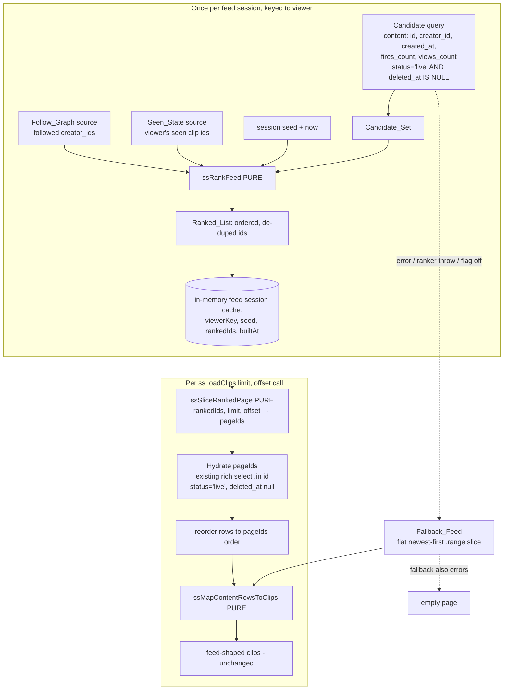

# Design Document

## Overview

ShowShak's feed is flat newest-first today. `ssLoadClips(limit, offset)` in
`showshak-shared.js` is the single feed query: it selects live, non-deleted
`content` rows, orders by `created_at` descending, paginates with `.range()`, and
maps the rows through the pure `ssMapContentRowsToClips`. It is completely
follow-unaware even though the trust loop it should serve already exists — the
`follows` table, the `ssGetFollowing`/`ssIsFollowing`/`ssHydrateFollowing`
helpers, and real per-clip `fires_count` / `views_count` columns.

This feature replaces flat ordering with a **tiered, trust-weighted ordering**
while keeping the feed a simple **pull-on-read at beta scale** (≤ ~500 live
clips). The work splits cleanly into a pure core and an impure shell, matching the
project's shipped conventions (`watch-it-curator-availability`, `stack-sharing`):

1. **A pure Ranker (`ssRankFeed`)** — dual-exported (`window.*` + `module.exports`),
   DOM-free, fast-check property-tested. It takes a bounded `Candidate_Set` of live
   clips with only their public signals, the viewer's `Follow_Graph` and
   `Seen_State`, an explicit `seed`, and a `now` reference time, and returns a
   de-duplicated, fully ordered `Ranked_List` of clip ids (Req 1, 2, 3, 4, 5, 9, 10).

2. **A pure pagination slice (`ssSliceRankedPage`)** — turns a `Ranked_List` plus
   `(limit, offset)` into a contiguous page of ids, total and edge-safe (Req 6).

3. **An impure orchestration in `ssLoadClips`** — fetches the cheap candidate set,
   sources the follow graph and seen-state, calls `ssRankFeed` once per feed
   session (caching the `Ranked_List` + `seed`), slices the page, hydrates the full
   rows with the **existing** rich select, and maps via `ssMapContentRowsToClips`.
   The `ssLoadClips(limit, offset)` signature and returned clip shape are unchanged
   (Req 7), and every failure path degrades to today's flat feed (Req 8).

**Explicitly out of scope:** fan-out-on-write, precompute, materialized feed
tables, or any per-follow feed cache. Those are a future scale upgrade. At beta
scale a single cheap candidate query plus an in-memory rank is correct and fast,
and keeps the whole ordering decision inside one pure, testable function.

### Design principles honoured

- **Pure core / impure shell:** all ordering logic lives in `ssRankFeed` and its
  pure helpers — no DOM, no network, no global reads. Supabase queries and the
  session cache sit *above* it and hand it plain data. `node tests/run-all.js`
  stays green.
- **HIDE THE SCOREBOARD (Req 3):** the candidate query selects only `id`,
  `creator_id`, `created_at`, `fires_count`, `views_count`. The ranker reads only
  those public signals plus the follow graph and seen-state. It never reads,
  receives, or computes `watch_it_count`, `watch_events`, `analytics_daily`, reach,
  or any fires-received total, and the existing hydration select (already
  scoreboard-safe) is unchanged.
- **Backward compatible (Req 7):** an empty follow graph collapses Tiers 1 and 3,
  so the recency-ordered tiers reduce to newest-first — today's behaviour — until
  follows exist. `ssLoadClips` keeps its signature and clip shape.
- **Fail-soft (Req 8):** any candidate-query error, ranker error, or malformed
  input falls back to the current flat newest-first feed; if even that fails, an
  empty page is returned. The feed is never broken or empty when data exists.
- **No required migration:** seen-state is sourced from a cheap client-side store
  the app already has the inputs to populate; existing tables suffice. A server
  seen-state read and a popularity index are noted only as *optional*,
  founder-applied, non-blocking follow-ups.

## Architecture

Pull-on-read at beta scale: one cheap candidate query feeds a pure ranker whose
output is cached per feed session and sliced per page.



### Why `ssLoadClips` is the only seam

`ssLoadClips` is the single flat feed query in the app. Phasing the ranker behind
it means every feed surface that calls it inherits trust-weighted ordering with no
surface-specific code, and the change is reversible by a single localStorage flag
(`ss_ff_ranker='off'`) or by the automatic fallback. The clip shape returned to
callers is produced by the unchanged `ssMapContentRowsToClips`, so the feed page
(`showshak-feed.html`) needs no change (Req 7.3).

### Pure vs impure split

| Layer | Lives in | Touches |
|---|---|---|
| `ssRankFeed`, `ssSliceRankedPage`, `ssFeedTier`, `ssPopularityScore`, `_ssMulberry32`, `_ssXmur3`, `_ssSeededShuffle` | `showshak-shared.js` pure export block | nothing but their arguments — no DOM, no network, no globals (Req 10.1) |
| candidate fetch, follow-graph fetch, seen-state read, session cache, hydration, fallback | `ssLoadClips` + small impure helpers | Supabase, `localStorage`/`sessionStorage`, `window.ssCurrentUser` |

The ranker receives the randomization source as an explicit `seed` so it stays
pure and Tier 5 is reproducible (Req 10.2). The impure shell is the only place
that decides *where* the seed, follow graph, and seen-state come from.

## Components and Interfaces

### 1. `ssRankFeed(input)` — PURE, NEW (the core)

```js
/**
 * @param {object} input
 *   candidateSet : Array<CandidateEntry>   // see Data Models; may contain junk
 *   followGraph  : { creatorIds: string[] | Set<string> } | string[] | Set<string> | null
 *   seenState    : { available: boolean, seen: string[] | Set<string> } | string[] | Set<string> | null
 *   seed         : number | string          // explicit randomization source (Req 10.2)
 *   now          : number                    // ranking reference time, ms epoch (Req 1.6)
 * @returns {string[]}  Ranked_List — ordered, de-duplicated clip ids
 */
function ssRankFeed(input) { ... }
```

Algorithm (all steps pure, no mutation of inputs):

1. **Normalise inputs defensively (Req 8.3, 8.4, 8.5).**
   - `now` → finite number; if not, fall back to a fixed reference derived only
     from inputs (e.g. max valid `created_at` seen, else `0`) so the function
     stays total and deterministic. (The impure caller always passes a real
     `Date.now()`.)
   - `followIds` ← a `Set` of creator ids extracted from `followGraph` accepting
     any of the accepted shapes; missing/null/malformed → empty `Set` (Req 8.3,
     5.2).
   - `seen` ← `{ available, set }`. `available` is `false` when seen-state is
     missing/null/malformed or explicitly `{available:false}` (Req 8.4, 4.5);
     otherwise `set` is a `Set` of seen ids.
   - `seed` → run through `_ssXmur3` to a 32-bit integer if it is a string; if
     missing, default to a constant so the function never throws (determinism for
     that fixed default).

2. **Filter to eligible, de-duplicate by id (Req 2.1, 9.2, 9.4).** Keep only
   well-formed entries whose `status === 'live'` (exact, case-sensitive) and
   `deleted_at == null` and whose `id` is a non-empty string. Skip malformed
   entries entirely (Req 8.5, 9.4). On the first occurrence of an `id`, keep it;
   later duplicates of the same id are dropped (Req 2.1, 2.4). The result is the
   de-duplicated eligible set `E`.

3. **Assign each clip in `E` to exactly one tier via `ssFeedTier` (Req 1.1, 2.2).**
   For a clip `c`:
   - `followed = followIds.has(c.creator_id)`
   - `recent   = Number(createdAtMs(c)) >= now - RECENCY_WINDOW_MS` (Req 1.6)
   - `popular  = ssPopularityScore(c) > 0`  (has any public engagement)

   | Tier | Condition | Meaning |
   |---|---|---|
   | 1 | `recent && followed` | recent from followed curators |
   | 2 | `recent && !followed` | recent from non-followed curators |
   | 3 | `!recent && followed` | older from followed curators |
   | 4 | `!recent && !followed && popular` | older global popular |
   | 5 | `!recent && !followed && !popular` | everything else (long tail) |

   Each clip matches exactly one row (the rows are mutually exclusive and
   exhaustive), which *is* the "highest-priority tier" placement (Req 2.2) and is
   total over all eligible clips (Req 1.1). The Tier 4/Tier 5 split on
   `popular` is what makes Tier 5 ("everything else, randomized") non-empty and
   distinct from Tier 4 ("most-fired/most-viewed"), and it satisfies Req 5.3's
   requirement that an empty follow graph still distributes every clip across
   Tiers 2, 4, and 5.

4. **Order within each tier (Req 1.3, 1.4, 1.5, 4.1, 4.2).**
   - Compute the tier's **primary comparator**:
     - Tiers 1 & 2 — `created_at` descending; tie-break ascending `id` (Req 1.3).
     - Tiers 3 & 4 — `ssPopularityScore` descending; tie-break ascending `id`
       (Req 1.4).
     - Tier 5 — `_ssSeededShuffle(ids, rng)` over an id-sorted base list, where
       `rng = _ssMulberry32(seed)` (Req 1.5; deterministic for a fixed seed).
   - **Seen-state sub-partition (Req 4.1, 4.2, 4.3):** if `seen.available`, split
     the tier's members into `unseen` then `seen` sub-blocks and apply the tier's
     primary comparator **within each sub-block**; concatenate `unseen ++ seen`.
     If `!seen.available`, order the whole tier by the primary comparator with no
     partition (Req 4.5). Seen clips are ordered, never removed (Req 4.4 — they
     remain in the list via step 2's membership).
   - For Tier 5, the seeded shuffle is applied within each sub-block using the
     same `rng` stream, so the partition only ever moves a newly-seen clip from
     the unseen block down into the seen block (supporting monotonicity, Req 4.6).

5. **Concatenate tiers 1..5 in order (Req 1.2)** and return the id array. Every
   Tier-1 id precedes every Tier-2 id, etc. The returned set of ids equals the
   eligible de-duplicated id set (Req 2.3) with no duplicates (Req 2.4).

**Purity (Req 10.1):** no argument is mutated (work on copies), no I/O, no global
or ambient reads. Identical inputs (including `seed` and `now`) → identical output.

### 2. `ssSliceRankedPage(rankedIds, limit, offset)` — PURE, NEW

```js
/** @returns {string[]} contiguous page slice, total and edge-safe (Req 6) */
function ssSliceRankedPage(rankedIds, limit, offset) {
  if (!Array.isArray(rankedIds)) return [];
  var n = Number(limit), off = Number(offset);
  if (!Number.isInteger(n) || n <= 0) return [];          // Req 6.6
  if (!Number.isInteger(off) || off < 0) return [];        // Req 6.6
  if (off >= rankedIds.length) return [];                  // Req 6.5
  return rankedIds.slice(off, off + n);                    // Req 6.1
}
```

Because every page is a `slice` of the *same* cached `rankedIds`, consecutive
pages over one ranked list are contiguous, non-overlapping, and skip nothing
(Req 6.2), and never re-order or re-shuffle (Req 6.3) — the order is fixed the
moment the ranked list is built.

### 3. `ssPopularityScore(clip)` — PURE, NEW

```js
const SS_FEED_FIRE_WEIGHT = 3;   // a Fire (the like) is a stronger trust signal than a view
const SS_FEED_VIEW_WEIGHT = 1;
function ssPopularityScore(clip) {
  var f = (clip && Number.isFinite(+clip.fires_count)) ? Math.max(0, +clip.fires_count) : 0;
  var v = (clip && Number.isFinite(+clip.views_count)) ? Math.max(0, +clip.views_count) : 0;
  return f * SS_FEED_FIRE_WEIGHT + v * SS_FEED_VIEW_WEIGHT;
}
```

- Uses **only** `fires_count` and `views_count` — both Public_Signals (Req 3.1).
- Integer-valued (both inputs are integers), so popularity comparison is exact —
  no floating-point tie ambiguity; ties fall to the ascending-`id` tie-break
  (Req 1.4).
- `popular` for tiering is `score > 0`, i.e. the clip has at least one fire or one
  view. Zero-engagement older non-followed clips fall to Tier 5.
- Weight choice (3:1) is a single, documented constant pair; it is a product knob,
  not a correctness property. Any non-negative weights keep the properties valid.

### 4. Seeded PRNG — PURE, NEW (`_ssXmur3`, `_ssMulberry32`, `_ssSeededShuffle`)

A tiny, well-known, dependency-free pure PRNG keeps Tier 5 deterministic and
stable across pages while remaining a pure function of the seed (Req 6.4, 10.2).

```js
// xmur3: hash an arbitrary string seed → 32-bit unsigned integer.
function _ssXmur3(str) {
  var h = 1779033703 ^ String(str).length;
  for (var i = 0; i < String(str).length; i++) {
    h = Math.imul(h ^ String(str).charCodeAt(i), 3432918353);
    h = (h << 13) | (h >>> 19);
  }
  return function () { h = Math.imul(h ^ (h >>> 16), 2246822507); h = Math.imul(h ^ (h >>> 13), 3266489909); return (h ^= h >>> 16) >>> 0; };
}
// mulberry32: 32-bit seed → deterministic [0,1) generator.
function _ssMulberry32(seed) {
  var a = (typeof seed === 'number') ? (seed >>> 0) : _ssXmur3(seed)();
  return function () { a |= 0; a = (a + 0x6D2B79F5) | 0; var t = Math.imul(a ^ (a >>> 15), 1 | a); t = (t + Math.imul(t ^ (t >>> 7), 61 | t)) ^ t; return ((t ^ (t >>> 14)) >>> 0) / 4294967296; };
}
// Fisher–Yates over a COPY, driven by the seeded generator (no input mutation).
function _ssSeededShuffle(arr, rng) {
  var a = arr.slice();
  for (var i = a.length - 1; i > 0; i--) { var j = Math.floor(rng() * (i + 1)); var t = a[i]; a[i] = a[j]; a[j] = t; }
  return a;
}
```

For a fixed `seed`, `_ssMulberry32(seed)` produces the same stream every call, so
the Tier 5 order is identical across page requests in a session and across repeat
ranks with the same seed (Req 6.4, 10.2, and the monotonicity guard Req 4.6).

### 5. `ssLoadClips(limit, offset)` — IMPURE, CHANGED (Phase 2 orchestration)

Redesigned to orchestrate the pure core behind the candidate fetch, with the
fallback. Signature and returned clip shape unchanged (Req 7.3).

```
async function ssLoadClips(limit, offset):
  if ranker disabled (ss_ff_ranker === 'off') -> return _ssFeedFallbackPage(limit, offset)   // kill switch (Req 7, 8)
  try:
    session = await _ssEnsureFeedSession()        // builds + caches Ranked_List once per session
    if !session -> return _ssFeedFallbackPage(limit, offset)        // candidate fetch failed (Req 8.1)
    pageIds = ssSliceRankedPage(session.rankedIds, limit, offset)   // PURE (Req 6)
    if pageIds.length === 0 -> return []
    rows = await hydrate(pageIds)                  // existing rich select, .in('id', pageIds), live+non-deleted
    ordered = reorder rows to match pageIds order  // .in() does not preserve order
    return ssMapContentRowsToClips(ordered)        // unchanged shape (Req 7.3)
  catch:
    return _ssFeedFallbackPage(limit, offset)      // ranker / hydration error (Req 8.2)
```

`_ssEnsureFeedSession()` (impure helper):

```
key = viewerKey()    // ssCurrentUser()?.id || 'guest'
if _ssFeedSession && _ssFeedSession.key === key && fresh(_ssFeedSession): return it
candRes = await ssDB.from('content')
  .select('id, creator_id, created_at, fires_count, views_count')      // ONLY public signals (Req 3.3)
  .eq('status','live').is('deleted_at', null)
  .order('created_at', { ascending:false })                            // bounded; beta scale ≤ ~500
  .limit(SS_FEED_CANDIDATE_CAP)                                        // safety ceiling (e.g. 1000)
if candRes.error || !candRes.data: return null                         // → caller serves fallback (Req 8.1)
followGraph = { creatorIds: await _ssFollowedCreatorIds() }            // [] for guests (Req 5.2)
seenState   = _ssReadSeenState(key)                                    // {available, seen[]}; fail-soft (Req 8.4)
seed        = _ssFeedSeed(key)                                         // stable within session, varies across sessions
rankedIds   = ssRankFeed({ candidateSet: candRes.data, followGraph, seenState, seed, now: Date.now() })  // PURE
_ssFeedSession = { key, seed, rankedIds, builtAt: Date.now() }
return _ssFeedSession
```

- **Session lifetime / stability (Req 6.3, 6.4):** `_ssFeedSession` is a
  module-level variable. The ranked list and seed are computed once and reused for
  every `ssLoadClips` call in that feed session, so paging never reshuffles or
  duplicates. A "new session" (recompute) happens on: viewer change (`key`
  differs), an explicit pull-to-refresh hook, or staleness (`builtAt` older than a
  TTL, e.g. the feed page's normal reload). Within one continuous scroll the seed
  is constant → Tier 5 order is fixed across pages (Req 6.4).
- **Hydration is scoreboard-safe (Req 3.4):** it reuses the *existing* rich
  `ssLoadClips` select verbatim (the pre-ranker projection), which already exposes
  only public fields; no private metric is added. Re-enforces `status='live'` and
  `deleted_at IS NULL` in the `.in('id', …)` query so a clip that went unpublished
  between candidate fetch and hydration is dropped (and simply yields a slightly
  shorter page — never an error).

### 6. `_ssFeedFallbackPage(limit, offset)` — IMPURE, NEW (extracted from today's body)

The current flat feed, lifted out verbatim so it is the single safe path (Req 8.6):

```
try:
  res = await ssDB.from('content').select(<existing rich select>)
    .eq('status','live').is('deleted_at', null)
    .order('created_at', { ascending:false })
    .range(offset, offset + limit - 1)
  if res.error || !res.data: return []           // (Req 8.7 → empty page)
  return ssMapContentRowsToClips(res.data)
catch: return []                                  // (Req 8.7)
```

This is byte-for-byte today's behaviour, so an empty-follow deployment that never
even reaches the ranker (flag off) is identical to today, and any failure lands
here (Req 7, 8).

### 7. Follow-graph source `_ssFollowedCreatorIds()` — IMPURE, NEW

The pure ranker matches `followGraph` against each candidate's `creator_id` (a
uuid), but `ssGetFollowing()` is keyed by `username`. So the impure shell sources
**creator ids** directly:

```
async function _ssFollowedCreatorIds():
  if !ssDB || !ssCurrentUser?.(): return []                 // guest → empty (Req 5.2)
  me = ssCurrentUser(); if !me: return []
  { data } = await ssDB.from('follows')
      .select('creator_id').eq('follower_id', me.id).is('deleted_at', null)
  return (data || []).map(r => r.creator_id).filter(Boolean)
```

One cheap indexed query; fail-soft (any error → `[]` → ranker treats as empty
follow graph, Req 8.3). This is independent of the username-keyed
`ssGetFollowing()` UI store and reuses the same `follows` rows `ssHydrateFollowing`
already reads.

### 8. Seen-state source `_ssReadSeenState(key)` — IMPURE, NEW (no migration)

See Data Models for the storage rationale. Shape returned to the ranker:
`{ available: boolean, seen: string[] }`.

```
function _ssReadSeenState(key):
  try:
    if key === 'guest': return { available: false, seen: [] }     // guests → primary order (Req 4.5, 5.2)
    raw = localStorage.getItem('ss_seen_v1_' + key)
    if !raw: return { available: false, seen: [] }                // no data → unavailable (Req 4.5, 8.4)
    ids = JSON.parse(raw); if !Array.isArray(ids) || !ids.length: return { available: false, seen: [] }
    return { available: true, seen: ids }
  catch: return { available: false, seen: [] }                    // fail-soft (Req 8.4)
```

### Interfaces summary

| Symbol | File | Kind | Change |
|---|---|---|---|
| `ssRankFeed` | showshak-shared.js | PURE | NEW — the tiered ranker (dual-exported) |
| `ssSliceRankedPage` | showshak-shared.js | PURE | NEW — page slice (dual-exported) |
| `ssFeedTier` | showshak-shared.js | PURE | NEW — tier assignment (dual-exported, testable in isolation) |
| `ssPopularityScore` | showshak-shared.js | PURE | NEW — score formula (dual-exported) |
| `_ssXmur3` / `_ssMulberry32` / `_ssSeededShuffle` | showshak-shared.js | PURE | NEW — seeded PRNG |
| `ssLoadClips` | showshak-shared.js | IMPURE | CHANGED — orchestrates ranker + fallback (Phase 2) |
| `_ssEnsureFeedSession` | showshak-shared.js | IMPURE | NEW — candidate fetch + cache |
| `_ssFeedFallbackPage` | showshak-shared.js | IMPURE | NEW — today's flat feed, extracted |
| `_ssFollowedCreatorIds` | showshak-shared.js | IMPURE | NEW — followed creator ids |
| `_ssReadSeenState` | showshak-shared.js | IMPURE | NEW — client seen-state read |
| `ssMapContentRowsToClips` | showshak-shared.js | PURE | UNCHANGED — same clip shape (Req 7.3) |

## Data Models

### Candidate query projection (Req 3.3) — public signals only

```sql
select id, creator_id, created_at, fires_count, views_count
from content
where status = 'live' and deleted_at is null
order by created_at desc
limit :SS_FEED_CANDIDATE_CAP;   -- beta ceiling, e.g. 1000 (≥ expected ~500 live)
```

No other column is requested as a ranking signal (Req 3.3). `watch_it_count`,
`watch_events`, `analytics_daily`, reach, and fires-received totals are **never**
selected here (Req 3.2).

### `CandidateEntry` (ranker input element)

```
{
  id:          string,    // content uuid; the only identity used in the Ranked_List
  creator_id:  string,    // matched against Follow_Graph creator ids
  created_at:  string|number, // ISO timestamp or ms epoch; → ms via Date.parse / Number, NaN ⇒ treated as not-recent
  fires_count: number,    // Public_Signal
  views_count: number     // Public_Signal
}
```

The ranker tolerates extra/foreign fields by **ignoring** them: only the five
fields above are ever read, so a stray private field present in the input cannot
change the output (Req 3.5). Malformed entries (missing `id`, non-`'live'`
`status` if present, non-null `deleted_at`) are excluded (Req 8.5, 9.4).

> Note: the candidate query already filters to `status='live'` / `deleted_at null`,
> so those fields are usually absent from `CandidateEntry`. The ranker still
> *honours them if present* (treating a non-`live`/deleted entry as ineligible,
> Req 9.2) so it is correct even on hand-fed or stale rows — mirroring how
> `ssMapContentRowsToClips` re-enforces the same guard.

### `Follow_Graph` (ranker input)

Accepted shapes (all normalised to a `Set<string>` of creator ids):
`{ creatorIds: string[] | Set<string> }`, or a bare `string[]` / `Set<string>`, or
`null`/missing/malformed → empty (Req 5.2, 8.3). The impure shell passes
`{ creatorIds: [...] }` from `_ssFollowedCreatorIds()`.

### `Seen_State` (ranker input)

`{ available: boolean, seen: string[] | Set<string> }`, or a bare list (treated as
available), or `null`/missing/malformed → `{ available:false }` (Req 4.5, 8.4).
`seen` holds clip ids the viewer has already viewed.

### `Ranked_List` (ranker output) / `Page`

`Ranked_List` = `string[]` of clip ids: a de-duplicated permutation of the eligible
candidate ids in tier-then-within-tier order. `Page` = the `ssSliceRankedPage`
slice of it, hydrated into the unchanged feed clip shape by `ssMapContentRowsToClips`.

### Seen-state storage — `localStorage 'ss_seen_v1_<uid>'` (NO migration required)

- **What is read.** A per-viewer JSON array of clip ids the viewer has already
  seen, in `localStorage`, keyed by user id. This is the cheapest possible source
  (synchronous, local, no round-trip) and persists across sessions, satisfying the
  cross-session monotonicity intent (Req 4.6): a clip recorded as seen in one
  session is still seen in the next.
- **How it is populated (no new schema).** The app already records a view through
  `ssRecordView` (per-session de-duped) and writes to `view_events`. The same code
  path appends the clip id to `ss_seen_v1_<uid>` (a tiny additive write next to the
  existing recorder — implemented in Phase 2 wiring, not a migration). This reuses
  signal the app already produces; **no table, column, grant, or policy change is
  required.**
- **Why not read `view_events` directly.** `view_events` deliberately has **no
  SELECT grant** for `anon`/`authenticated` (migration 0019 keeps analytics
  private), so the browser cannot read it today. Reading the viewer's own seen
  clips server-side would therefore require a *new* migration (a SELECT policy
  scoped to `user_id = auth.uid()`). To honour "no new migration if existing tables
  suffice," seen-state is sourced client-side instead.
- **Optional, non-blocking follow-ups (NOT required for this feature):**
  - A founder-applied SELECT policy on `view_events` scoped strictly to
    `user_id = auth.uid()` would let the shell hydrate seen-state server-side for
    cross-device continuity. It is optional; the feature ships and is correct
    without it (the ranker simply sees `{available:false}` → primary order).
  - If the candidate query ever needs popularity-side ordering pushed to SQL at
    larger scale, an index such as
    `create index on content (fires_count desc, views_count desc) where status='live' and deleted_at is null;`
    is advisable — but it is **optional** at beta scale (the ranker sorts in
    memory over ≤ ~500 rows) and non-blocking.

### Feature flag (existing convention)

`localStorage 'ss_ff_ranker'`. When `=== 'off'`, `ssLoadClips` bypasses the ranker
and serves `_ssFeedFallbackPage` (today's flat feed). Mirrors the project's
`_ssFeatureOff` pattern (`ss_ff_tiering`, `ss_ff_segcache`, …) so the founder can
disable trust-weighted ordering on-device without a redeploy. Default ON.

## Correctness Properties

*A property is a characteristic or behavior that should hold true across all valid
executions of a system — essentially, a formal statement about what the system
should do. Properties serve as the bridge between human-readable specifications and
machine-verifiable correctness guarantees.*

Here, property-based testing **is** the right tool: `ssRankFeed` and its pure
helpers are total functions over a large, structured input space (arbitrary
candidate sets, follow graphs, seen-states, seeds, and reference times) with clear
universal behaviours — a de-duplicating permutation, tier partition + priority,
per-tier comparators, whitelist purity, seen-state partition/monotonicity, empty-
follow degradation, eligibility filtering, determinism, and totality. These are
tested with `fast-check` under the existing `tests/_pbt.js` convention.

The prework folded redundant criteria together so each property below carries
unique value: tier assignment + priority into P2; all "exactly once / kept /
Tier-5 membership" into P1; the public-signals criteria into the inertness
property P5; the seen-state criteria into P6 (present) / P7 (absent) / P8
(monotonic). Impure-shell behaviours (candidate query projection, fallback control
flow, `ssLoadClips` shape) and process requirements (dual export, suite-green
checkpoints) are verified by example/integration tests and checkpoints — see
Testing Strategy — and are not property-tested.

### Property 1: De-duplicated permutation of the eligible id set

*For any* candidate set (including one containing duplicate ids and already-seen
clips), follow graph, seen-state, seed, and reference time, the set of ids in the
Ranked_List equals exactly the set of distinct eligible candidate ids — every
eligible id appears, no ineligible or absent id appears — and each id appears
exactly once (the output multiset has count 1 per id), so the Ranked_List is a
de-duplicated permutation of the eligible input ids and already-seen clips are
retained rather than removed.

**Validates: Requirements 2.1, 2.3, 2.4, 4.4, 1.5**

### Property 2: Tier partition and priority ordering

*For any* candidate set, follow graph, and reference time, every eligible clip is
placed in exactly the tier its definition selects (`recent×followed×popular`, with
`recent` defined by the 14-day Recency_Window relative to `now`), placed only in
that single highest-priority tier, and the Ranked_List is ordered so that the tier
index is non-decreasing along the list — every Tier 1 id precedes every Tier 2 id,
every Tier 2 precedes every Tier 3, every Tier 3 precedes every Tier 4, and every
Tier 4 precedes every Tier 5. A non-empty follow graph populates Tiers 1 and 3
without any change to the function's contract.

**Validates: Requirements 1.1, 1.2, 1.6, 2.2, 7.4**

### Property 3: Within-recency-tier ordering (recency desc, id tie-break)

*For any* candidate set, within Tiers 1 and 2 (and within each seen/unseen
sub-block of those tiers) every adjacent pair of clips is ordered by `created_at`
descending, and where two clips share the same `created_at` they are ordered by
ascending clip `id`.

**Validates: Requirements 1.3**

### Property 4: Within-popularity-tier ordering (score desc, id tie-break)

*For any* candidate set, within Tiers 3 and 4 (and within each seen/unseen
sub-block of those tiers) every adjacent pair of clips is ordered by
`ssPopularityScore` descending, and where two clips have an equal popularity score
they are ordered by ascending clip `id`.

**Validates: Requirements 1.4**

### Property 5: Public-signals-only (private fields are inert)

*For any* candidate set and any extra fields injected onto its entries that are not
in the ranking whitelist (`id`, `creator_id`, `created_at`, `fires_count`,
`views_count`, eligibility `status`/`deleted_at`) — including private metrics such
as `watch_it_count`, `watch_events`, reach, fires-received totals, or
`analytics_daily` figures with arbitrary values — `ssRankFeed` produces exactly the
same Ranked_List as it does when those fields are absent.

**Validates: Requirements 3.1, 3.5**

### Property 6: Seen-state de-prioritization within a tier (no cross-tier movement)

*For any* candidate set and any available seen-state, within every tier no
already-seen clip precedes any unseen clip (each tier is an unseen sub-block
followed by a seen sub-block), each sub-block is ordered by that tier's primary
rule, and the tier each clip is assigned to is identical to its assignment when
seen-state is absent (seen-state never moves a clip across tiers).

**Validates: Requirements 4.1, 4.2, 4.3**

### Property 7: Seen-state absent ⇒ primary order only

*For any* candidate set, when seen-state is unavailable or empty (including
missing, null, or malformed seen-state), each tier is ordered solely by that
tier's primary ordering rule with no seen/unseen partitioning, and the Ranked_List
equals the one produced with no seen-state.

**Validates: Requirements 4.5**

### Property 8: Cross-session seen-state monotonicity

*For any* candidate set, follow graph, fixed seed, and fixed reference time, when
seen-state grows from a set `S` to a superset `S ∪ X`, every clip newly added to
the seen set occupies a within-tier position no higher (no smaller index within
its tier) than it did under `S`, and never moves to a different tier.

**Validates: Requirements 4.6**

### Property 9: Empty-follow degradation

*For any* candidate set ranked with an empty (or missing/malformed) follow graph,
Tiers 1 and 3 are empty, every eligible clip appears exactly once distributed
across Tiers 2, 4, and 5, the list is ordered so that every Tier 2 clip precedes
every Tier 4 clip and every Tier 4 clip precedes every Tier 5 clip, and the recent
subset (Tier 2) is ordered newest-first (created_at desc, id tie-break) —
equivalent to the Fallback_Feed ordering over that recent subset. An empty
candidate set yields an empty Ranked_List.

**Validates: Requirements 5.1, 5.3, 5.4, 7.1**

### Property 10: Determinism and purity (fixed seed)

*For any* fixed inputs (candidate set, follow graph, seen-state, seed, and
reference time), two successive calls to `ssRankFeed` return deeply-equal
Ranked_Lists — including an identical Tier 5 order for a fixed seed — and neither
call mutates any input argument (each argument deep-equals its pre-call value).

**Validates: Requirements 10.1, 10.2**

### Property 11: Live and non-deleted filtering

*For any* candidate set that includes clips whose `status` is not exactly `'live'`
(including null, missing, wrong-case, or other values) or whose `deleted_at` is
non-null or malformed, none of those clips appear anywhere in the Ranked_List, in
any tier; when every candidate is excluded by these criteria the Ranked_List is
empty.

**Validates: Requirements 9.2, 9.3, 9.4, 9.5**

### Property 12: Totality (never throws on malformed input)

*For any* input whatsoever — including null/undefined/non-array candidate sets,
entries that are null or missing `id`/`creator_id`/`created_at`, non-numeric
counts, malformed or missing follow graph, malformed or missing seen-state, and
non-numeric seed or reference time — `ssRankFeed` returns a well-formed array of
unique eligible ids without throwing, excluding every malformed entry.

**Validates: Requirements 8.3, 8.4, 8.5**

### Property 13: Pagination slice is contiguous, complete, and edge-safe

*For any* ranked id list and any `limit`/`offset`, `ssSliceRankedPage` returns the
contiguous slice `rankedIds[offset .. offset+limit)` of length at most `limit`;
concatenating the consecutive pages at offsets `0, limit, 2·limit, …` reproduces
the ranked list exactly (no id duplicated, no id skipped, order preserved); an
`offset` greater than or equal to the list length yields an empty page; and a
non-positive `limit` or negative `offset` yields an empty page without throwing.

**Validates: Requirements 6.1, 6.2, 6.3, 6.5, 6.6**

## Error Handling

| Failure / input | Surface | Handling |
|---|---|---|
| Candidate query returns an error or no data | `_ssEnsureFeedSession` → `ssLoadClips` | Returns `null`; `ssLoadClips` serves `_ssFeedFallbackPage(limit, offset)` (Req 8.1). No throw. |
| `ssRankFeed` throws (should not — it is total, Property 12) | `ssLoadClips` try/catch | Caught; serve `_ssFeedFallbackPage` (Req 8.2). |
| Missing / null / malformed follow graph | `ssRankFeed` | Normalised to empty follow-id set → ranks as empty-follow (Req 8.3, 5.2); no throw. |
| Missing / null / malformed seen-state | `ssRankFeed` | Treated as `{available:false}` → primary order only (Req 8.4, 4.5); no throw. |
| Missing / null / malformed candidate set or entries | `ssRankFeed` | Non-array → `[]`; malformed entries skipped; remaining de-duplicated (Req 8.5); no throw. |
| Non-`'live'` / deleted / malformed-eligibility entries | `ssRankFeed` filter | Excluded from every tier (Req 9.2–9.5). |
| `offset >= length`, `limit <= 0`, or `offset < 0` | `ssSliceRankedPage` | Empty page, no throw (Req 6.5, 6.6). |
| Clip unpublished/deleted between candidate fetch and hydration | hydration `.in('id',…)` re-filter | Dropped by `status='live'`/`deleted_at null` re-enforcement; page is simply shorter — never an error. |
| Hydration query error | `ssLoadClips` try/catch | Serve `_ssFeedFallbackPage` (Req 8.2). |
| Fallback query also errors / no data | `_ssFeedFallbackPage` | Returns `[]` (empty page), no propagation (Req 8.7). |
| Follow-graph / seen-state source query errors | `_ssFollowedCreatorIds` / `_ssReadSeenState` | Fail-soft to `[]` / `{available:false}`; ranking proceeds degraded, never throws (Req 8.3, 8.4). |
| Ranker feature flag `ss_ff_ranker='off'` | `ssLoadClips` | Bypass ranker; serve `_ssFeedFallbackPage` (today's feed) — on-device kill switch. |

Guiding rule (consistent with the codebase): the feed is **fail-soft** end to end.
The pure ranker is total and never throws; the impure shell wraps every async
boundary so that any failure degrades to the flat newest-first feed, and a total
failure degrades to an empty page — never a broken or thrown feed.

## Testing Strategy

### Property-based tests (pure core) — `tests/prop-feed-*.test.js`

Following the existing convention (`tests/_pbt.js`, `fast-check`, dual-export,
`installDomStub()` before `require('../showshak-shared.js')`, one design property
per `tests/prop-*.test.js` file, `{ numRuns: ITER }` with `ITER = 200`,
`process.exit(1)` on failure, auto-discovered by `tests/run-all.js`):

- **One file per property (P1–P13)**, each tagged with the exact comment form and
  the requirement-link line, e.g.:
  ```js
  // Feature: feed-follows, Property 2: Tier partition and priority ordering
  // **Validates: Requirements 1.1, 1.2, 1.6, 2.2, 7.4**
  ```
- Each property test runs **≥ 100 iterations** (ITER = 200) — Req 10.4.
- **Generators must cover:**
  - candidate entries with random `creator_id`, `created_at` straddling the 14-day
    boundary (just inside, exactly at, just outside `now − 1,209,600,000 ms`),
    random non-negative `fires_count`/`views_count` (incl. zeros for the Tier 4/5
    split), and **colliding** `created_at` and colliding popularity scores to
    exercise the ascending-`id` tie-breaks (P3, P4);
  - **duplicate ids** within a candidate set (P1);
  - empty, single-element, and large (up to a few hundred) candidate sets;
  - empty vs non-empty follow graphs, and follow graphs in each accepted shape
    (P2, P9);
  - seen-state available / empty / unavailable, and `S ⊆ S∪X` pairs with a fixed
    seed for monotonicity (P6, P7, P8);
  - **injected private fields** (`watch_it_count`, `reach`, `analytics_daily`, …)
    with arbitrary values for the inertness property (P5);
  - **malformed inputs** for totality (P12): null/undefined/non-array candidate
    sets, null entries, entries missing `id`/`creator_id`/`created_at`, non-numeric
    counts, malformed follow graph and seen-state, non-numeric `seed`/`now`;
  - non-`'live'`/wrong-case `status`, non-null/malformed `deleted_at` (P11);
  - `ssSliceRankedPage` over random lists with random `limit`/`offset` including
    non-positive `limit`, negative `offset`, and `offset ≥ length` (P13).

### Example / unit tests (impure shell) — `tests/unit-feed-*.test.js`

A small number of example-based tests with a stubbed `ssDB` (mirroring
`tests/unit-recorder-fire-and-forget.test.js`) for behaviours that are not pure
properties:

- Candidate query error ⇒ `ssLoadClips` returns the fallback page (Req 8.1).
- Forced ranker throw ⇒ fallback page (Req 8.2).
- Fallback issues the flat `status='live'`/`deleted_at null`/`created_at desc`
  range query and maps rows via `ssMapContentRowsToClips` (Req 8.6).
- Fallback query error ⇒ empty page, no throw (Req 8.7).
- `ss_ff_ranker='off'` ⇒ fallback served (kill switch).
- Candidate projection assertion: the select list is exactly
  `id, creator_id, created_at, fires_count, views_count` and contains no private
  column (Req 3.3).
- `ssLoadClips` returns clips whose field set matches the pre-ranker shape, and
  session caching reuses one ranked list across consecutive `(limit, offset)`
  calls without reshuffling (Req 6.3, 6.4, 7.3).

### Smoke / checkpoints

- Loadability + dual export: `require('../showshak-shared.js')` exposes
  `ssRankFeed`, `ssSliceRankedPage`, `ssFeedTier`, `ssPopularityScore` on
  `module.exports` and `window.*` (Req 10.3).
- **Phase 1 checkpoint:** `node tests/run-all.js` green with the full P1–P13 suite
  while `ssLoadClips` is still unchanged (Req 10.5).
- **Phase 2 checkpoint:** `node tests/run-all.js` green after wiring, with the
  existing feed/clip-shape tests still passing (Req 7.3, 10.5).

PBT is **not** applied to: the candidate SQL projection, the fallback control
flow, the `ssLoadClips` response shape, or the session cache — these are I/O /
configuration concerns verified by the example/integration tests and checkpoints
above, not universal input→output properties.

## Phasing

Each phase is independently shippable and leaves `node tests/run-all.js` green.

### Phase 1 — Pure ranker + property tests in isolation (no wiring change)

1. Add the pure functions to the `showshak-shared.js` pure export block:
   `ssPopularityScore`, `ssFeedTier`, `_ssXmur3`, `_ssMulberry32`,
   `_ssSeededShuffle`, `ssRankFeed`, `ssSliceRankedPage`; dual-export
   (`window.* ` + `module.exports`) — Req 10.1, 10.3.
2. Author `tests/prop-feed-*.test.js` for Properties 1–13 (one file each), tagged
   and ≥ 100 iterations — Req 10.4.
3. **`ssLoadClips` is untouched.** Run `node tests/run-all.js` → green. The feed
   behaves exactly as today; the ranker exists but is not yet called (Req 10.5).

### Phase 2 — Wire `ssLoadClips` behind the candidate fetch + hydrate, with fallback

4. Extract today's flat-feed body into `_ssFeedFallbackPage(limit, offset)`
   verbatim (Req 8.6).
5. Add the impure helpers `_ssEnsureFeedSession`, `_ssFollowedCreatorIds`,
   `_ssReadSeenState`, `_ssFeedSeed`, and the module-level `_ssFeedSession` cache.
6. Rewrite `ssLoadClips` to orchestrate: candidate fetch → `ssRankFeed` (cached per
   session) → `ssSliceRankedPage` → hydrate (existing rich select) → reorder →
   `ssMapContentRowsToClips`, with try/catch → `_ssFeedFallbackPage` on any error
   (Req 8.1, 8.2) and the `ss_ff_ranker='off'` kill switch. Signature and clip
   shape unchanged (Req 7.3).
7. Append the seen-state write next to `ssRecordView` (append clip id to
   `ss_seen_v1_<uid>`) — additive, no migration.
8. Add `tests/unit-feed-*.test.js` for the shell behaviours. Run
   `node tests/run-all.js` → green (Req 10.5).

### Optional / non-blocking follow-ups (NOT required to ship)

- Founder-applied SELECT policy on `view_events` scoped to `user_id = auth.uid()`
  for server-side, cross-device seen-state (the feature is correct without it).
- Founder-applied popularity index on `content` for SQL-side ordering if the live
  clip count grows well beyond beta scale.

Backward-compatibility holds throughout: with an empty follow graph the ranker
degrades to newest-first recency tiers (Req 7.1), and with the flag off or any
failure `ssLoadClips` is byte-for-byte today's feed (Req 7, 8).
