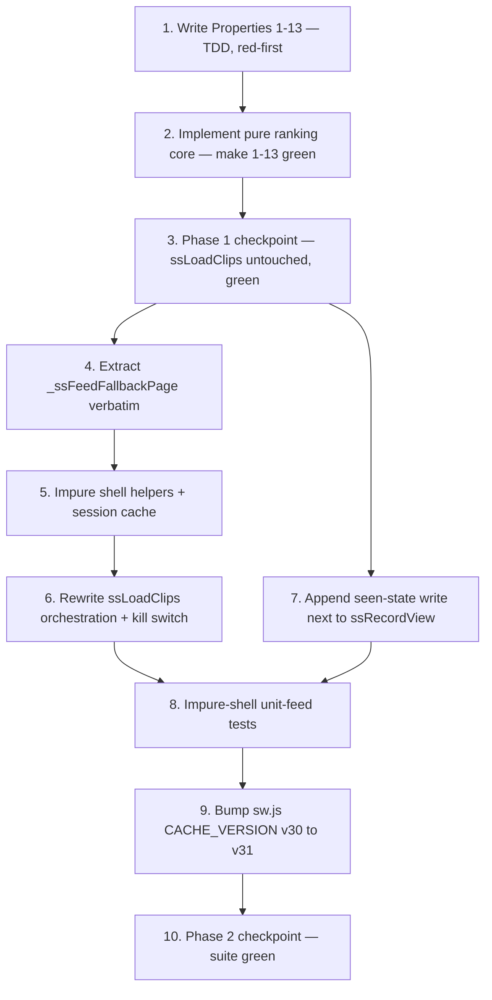

# Implementation Plan

## Overview

Two independently-shippable, dependency-ordered phases that follow the design exactly —
a **pure ranking core** first, then the **impure `ssLoadClips` wiring** behind a fallback.

**Phase 1** adds the pure functions to the `showshak-shared.js` pure export block
(`ssPopularityScore`, `ssFeedTier`, `_ssXmur3`, `_ssMulberry32`, `_ssSeededShuffle`,
`ssRankFeed`, `ssSliceRankedPage`), all dual-exported (`window.*` + `module.exports`),
and the 13 fast-check property tests (`tests/prop-feed-*.test.js`, one design property per
file). Phase 1 **does not touch `ssLoadClips`** — the feed behaves exactly as today; the
ranker exists but is not yet called (Req 10.5).

**Phase 2** wires the ranker behind `ssLoadClips` with an automatic flat-feed fallback and a
kill switch, appends the additive client-side seen-state write, adds the impure-shell
example tests (`tests/unit-feed-*.test.js`, stubbed `ssDB`), and bumps `sw.js`
`CACHE_VERSION` so the founder picks the change up on-device. The `ssLoadClips(limit, offset)`
signature and returned clip shape are unchanged (Req 7.3).

Conventions (matching shipped specs `watch-it-curator-availability`, `stack-sharing`): pure
logic lives in `showshak-shared.js`, dual-exported; each correctness property gets its own
`tests/prop-feed-*.test.js` fast-check file (`installDomStub()` before
`require('../showshak-shared.js')`, `{ numRuns: ITER }` with `ITER = 200`,
`process.exit(1)` on failure), auto-discovered by `node tests/run-all.js`. Impure-shell
example tests are `tests/unit-feed-*.test.js` with a stubbed `ssDB` (mirroring
`tests/unit-recorder-fire-and-forget.test.js`). **TDD-leaning:** the 13 property tests are
written FIRST (task 1) and are red until the pure core lands (task 2). Pure vanilla
HTML/CSS/JS, no build step. **No migration is required** for this feature — seen-state is
client-side `localStorage`. Run `node tests/run-all.js` after every `showshak-shared.js`
change; keep the suite GREEN at every checkpoint.

## Tasks

### PHASE 1 — Pure ranker + property tests in isolation (ship alone; no wiring change)

- [x] 1. Write the 13 property tests for the pure ranker (TDD — author FIRST, before task 2)
  - **IMPORTANT**: These encode the target ranker behaviour and are EXPECTED to be red until
    the pure core in task 2 lands. Author each as its own `tests/prop-feed-*.test.js` file
    (fast-check; `const { ITER, installDomStub } = require('./_pbt.js')`; `installDomStub()`
    before `require('../showshak-shared.js')`; `{ numRuns: ITER }` with `ITER = 200`;
    `process.exit(1)` on failure; auto-discovered by `node tests/run-all.js`). Tag each file
    with the exact comment form
    `// Feature: feed-follows, Property <n>: <text>` followed by
    `// **Validates: Requirements X.Y**`.
  - **Generators across the suite must cover** (design Testing Strategy): candidate entries
    with random `creator_id`, `created_at` straddling the 14-day boundary (just inside,
    exactly at `now − 1,209,600,000 ms`, just outside), random non-negative
    `fires_count`/`views_count` including zeros for the Tier 4/5 split, and **colliding**
    `created_at` and colliding popularity scores for the ascending-`id` tie-breaks; duplicate
    ids within a candidate set; empty / single-element / large (up to a few hundred) candidate
    sets; empty vs non-empty follow graphs in each accepted shape; seen-state
    available / empty / unavailable and `S ⊆ S∪X` pairs with a fixed seed; injected private
    fields with arbitrary values; malformed inputs (null/undefined/non-array sets, null
    entries, missing `id`/`creator_id`/`created_at`, non-numeric counts, malformed follow
    graph / seen-state, non-numeric `seed`/`now`); non-`'live'`/wrong-case `status` and
    non-null/malformed `deleted_at`; and random `limit`/`offset` (incl. non-positive `limit`,
    negative `offset`, `offset ≥ length`) for `ssSliceRankedPage`.

  - [x] 1.1 Property 1 — De-duplicated permutation of the eligible id set
    - `tests/prop-feed-dedup-permutation.test.js`: for any candidate set (incl. duplicate ids
      and already-seen clips), follow graph, seen-state, seed, and `now`, the set of ids in
      the Ranked_List equals exactly the distinct eligible candidate ids, each id appears
      exactly once, and already-seen clips are retained (not removed).
    - **Property 1: De-duplicated permutation of the eligible id set**
    - **Validates: Requirements 2.1, 2.3, 2.4, 4.4, 1.5**
    - _Files: tests/prop-feed-dedup-permutation.test.js_

  - [x] 1.2 Property 2 — Tier partition and priority ordering
    - `tests/prop-feed-tier-priority.test.js`: every eligible clip is placed in exactly the
      tier its `recent×followed×popular` definition selects (`recent` = 14-day window relative
      to `now`), only that single highest-priority tier, and the Ranked_List has a
      non-decreasing tier index (every Tier N id precedes every Tier N+1 id). A non-empty
      follow graph populates Tiers 1 and 3.
    - **Property 2: Tier partition and priority ordering**
    - **Validates: Requirements 1.1, 1.2, 1.6, 2.2, 7.4**
    - _Files: tests/prop-feed-tier-priority.test.js_

  - [x] 1.3 Property 3 — Within-recency-tier ordering (recency desc, id tie-break)
    - `tests/prop-feed-recency-order.test.js`: within Tiers 1 and 2 (and within each
      seen/unseen sub-block) every adjacent pair is ordered by `created_at` descending, with
      ties broken by ascending clip `id`. Generators must include colliding `created_at`.
    - **Property 3: Within-recency-tier ordering**
    - **Validates: Requirements 1.3**
    - _Files: tests/prop-feed-recency-order.test.js_

  - [x] 1.4 Property 4 — Within-popularity-tier ordering (score desc, id tie-break)
    - `tests/prop-feed-popularity-order.test.js`: within Tiers 3 and 4 (and within each
      seen/unseen sub-block) every adjacent pair is ordered by `ssPopularityScore` descending,
      with ties broken by ascending clip `id`. Generators must include colliding scores.
    - **Property 4: Within-popularity-tier ordering**
    - **Validates: Requirements 1.4**
    - _Files: tests/prop-feed-popularity-order.test.js_

  - [x] 1.5 Property 5 — Public-signals-only (private fields are inert)
    - `tests/prop-feed-public-signals-inert.test.js`: injecting arbitrary non-whitelist fields
      (`watch_it_count`, `watch_events`, `reach`, fires-received totals, `analytics_daily`, …)
      onto candidate entries produces exactly the same Ranked_List as when those fields are
      absent.
    - **Property 5: Public-signals-only (private fields are inert)**
    - **Validates: Requirements 3.1, 3.5**
    - _Files: tests/prop-feed-public-signals-inert.test.js_

  - [x] 1.6 Property 6 — Seen-state de-prioritization within a tier (no cross-tier movement)
    - `tests/prop-feed-seen-partition.test.js`: for any candidate set and available seen-state,
      within every tier no seen clip precedes any unseen clip (unseen sub-block then seen
      sub-block), each sub-block ordered by the tier's primary rule, and each clip's tier
      assignment is identical to its assignment with seen-state absent.
    - **Property 6: Seen-state de-prioritization within a tier**
    - **Validates: Requirements 4.1, 4.2, 4.3**
    - _Files: tests/prop-feed-seen-partition.test.js_

  - [x] 1.7 Property 7 — Seen-state absent ⇒ primary order only
    - `tests/prop-feed-seen-absent.test.js`: when seen-state is unavailable or empty (incl.
      missing, null, malformed), each tier is ordered solely by its primary rule with no
      seen/unseen partition, and the Ranked_List equals the one produced with no seen-state.
    - **Property 7: Seen-state absent ⇒ primary order only**
    - **Validates: Requirements 4.5**
    - _Files: tests/prop-feed-seen-absent.test.js_

  - [x] 1.8 Property 8 — Cross-session seen-state monotonicity
    - `tests/prop-feed-seen-monotonic.test.js`: for fixed candidate set, follow graph, seed and
      `now`, when seen-state grows from `S` to `S ∪ X`, every clip newly added to the seen set
      occupies a within-tier position no higher (no smaller within-tier index) than under `S`,
      and never changes tier.
    - **Property 8: Cross-session seen-state monotonicity**
    - **Validates: Requirements 4.6**
    - _Files: tests/prop-feed-seen-monotonic.test.js_

  - [x] 1.9 Property 9 — Empty-follow degradation
    - `tests/prop-feed-empty-follow.test.js`: with an empty (or missing/malformed) follow
      graph, Tiers 1 and 3 are empty, every eligible clip appears exactly once across Tiers 2,
      4, 5, every Tier 2 precedes every Tier 4 and every Tier 4 precedes every Tier 5, and the
      Tier 2 (recent) subset is newest-first (created_at desc, id tie-break). Empty candidate
      set ⇒ empty Ranked_List.
    - **Property 9: Empty-follow degradation**
    - **Validates: Requirements 5.1, 5.3, 5.4, 7.1**
    - _Files: tests/prop-feed-empty-follow.test.js_

  - [x] 1.10 Property 10 — Determinism and purity (fixed seed)
    - `tests/prop-feed-determinism-purity.test.js`: for fixed inputs (candidate set, follow
      graph, seen-state, seed, `now`), two successive `ssRankFeed` calls return deeply-equal
      Ranked_Lists (incl. identical Tier 5 order for the fixed seed), and neither call mutates
      any input argument (each deep-equals its pre-call value).
    - **Property 10: Determinism and purity (fixed seed)**
    - **Validates: Requirements 10.1, 10.2**
    - _Files: tests/prop-feed-determinism-purity.test.js_

  - [x] 1.11 Property 11 — Live and non-deleted filtering
    - `tests/prop-feed-live-filter.test.js`: clips whose `status` is not exactly `'live'`
      (null, missing, wrong-case, other) or whose `deleted_at` is non-null/malformed never
      appear in any tier; when every candidate is excluded by these criteria the Ranked_List
      is empty.
    - **Property 11: Live and non-deleted filtering**
    - **Validates: Requirements 9.2, 9.3, 9.4, 9.5**
    - _Files: tests/prop-feed-live-filter.test.js_

  - [x] 1.12 Property 12 — Totality (never throws on malformed input)
    - `tests/prop-feed-rank-totality.test.js` (named `-rank-` to avoid colliding with the shipped
      feed-clip-load-performance `tests/prop-feed-totality.test.js`): for any input whatsoever (null/undefined/non-array
      candidate sets, null entries, entries missing `id`/`creator_id`/`created_at`, non-numeric
      counts, malformed/missing follow graph and seen-state, non-numeric `seed`/`now`),
      `ssRankFeed` returns a well-formed array of unique eligible ids without throwing,
      excluding every malformed entry.
    - **Property 12: Totality (never throws on malformed input)**
    - **Validates: Requirements 8.3, 8.4, 8.5**
    - _Files: tests/prop-feed-rank-totality.test.js_

  - [x] 1.13 Property 13 — Pagination slice is contiguous, complete, and edge-safe
    - `tests/prop-feed-slice.test.js`: for any ranked id list and any `limit`/`offset`,
      `ssSliceRankedPage` returns the contiguous slice `rankedIds[offset .. offset+limit)` of
      length ≤ `limit`; concatenating consecutive pages at offsets `0, limit, 2·limit, …`
      reproduces the ranked list exactly (no dup, no skip, order preserved); `offset ≥ length`
      ⇒ empty page; non-positive `limit` or negative `offset` ⇒ empty page without throwing.
    - **Property 13: Pagination slice is contiguous, complete, and edge-safe**
    - **Validates: Requirements 6.1, 6.2, 6.3, 6.5, 6.6**
    - _Files: tests/prop-feed-slice.test.js_

- [x] 2. Implement the pure ranking core in the `showshak-shared.js` pure export block (make Properties 1–13 green)
  - [x] 2.1 Add `ssPopularityScore(clip)` + the `SS_FEED_FIRE_WEIGHT` (3) / `SS_FEED_VIEW_WEIGHT` (1) constants
    - Integer-valued score `f·3 + v·1` reading **only** `fires_count` and `views_count`,
      clamping non-finite/negative to 0. Dual-export (`window.*` + `module.exports`).
    - _Files: showshak-shared.js_
    - _Requirements: 3.1, 1.4_

  - [x] 2.2 Add the seeded PRNG `_ssXmur3`, `_ssMulberry32`, `_ssSeededShuffle`
    - Dependency-free pure PRNG per the design; `_ssSeededShuffle` runs Fisher–Yates over a
      COPY (no input mutation). Dual-export. These make Tier 5 deterministic for a fixed seed.
    - _Files: showshak-shared.js_
    - _Requirements: 1.5, 6.4, 10.2_

  - [x] 2.3 Add `ssFeedTier(clip, { followIds, now })` — tier assignment, testable in isolation
    - Returns 1–5 from the mutually-exclusive, exhaustive `recent×followed×popular` table
      (`recent` = `createdAtMs ≥ now − 1,209,600,000`; `popular` = `ssPopularityScore > 0`).
      Total over all eligible clips. Dual-export.
    - _Files: showshak-shared.js_
    - _Requirements: 1.1, 1.6, 2.2, 5.3_

  - [x] 2.4 Add `ssRankFeed(input)` — the tiered, trust-weighted ranker
    - Pure, total, no input mutation, no I/O, no globals. Steps: defensively normalise
      `now`/`followIds`/`seen`/`seed`; filter to eligible (`status==='live'`,
      `deleted_at==null`, non-empty string `id`) and de-dup by id keeping first occurrence;
      assign each clip to one tier via `ssFeedTier`; order within each tier (Tiers 1/2 by
      `created_at` desc + ascending-`id` tie-break, Tiers 3/4 by `ssPopularityScore` desc +
      ascending-`id` tie-break, Tier 5 by `_ssSeededShuffle` over an id-sorted base with
      `_ssMulberry32(seed)`); when `seen.available`, split each tier into unseen-then-seen
      sub-blocks and apply the tier's primary comparator within each sub-block; concatenate
      Tiers 1..5 and return the id array. Dual-export.
    - _Files: showshak-shared.js_
    - _Requirements: 1.1, 1.2, 1.3, 1.4, 1.5, 2.1, 2.2, 2.3, 2.4, 3.1, 3.5, 4.1, 4.2, 4.3, 4.4, 4.5, 5.1, 5.2, 9.2, 9.3, 9.4, 9.5, 10.1, 10.2, 8.3, 8.4, 8.5_

  - [x] 2.5 Add `ssSliceRankedPage(rankedIds, limit, offset)` — pure, edge-safe page slice
    - Non-array ⇒ `[]`; non-positive `limit` or negative `offset` ⇒ `[]`; `offset ≥ length`
      ⇒ `[]`; otherwise `rankedIds.slice(offset, offset + limit)`. Dual-export.
    - _Files: showshak-shared.js_
    - _Requirements: 6.1, 6.2, 6.3, 6.5, 6.6_

  - [x] 2.6 Verify Properties 1–13 pass and the existing suite stays green
    - **IMPORTANT**: Re-run the SAME tests from task 1 — do NOT write new tests. Run
      `node tests/run-all.js`. **EXPECTED OUTCOME**: `prop-feed-*` (Properties 1–13) PASS and
      every pre-existing `tests/prop-*.test.js` / `tests/*.test.js` still PASS. Confirm the
      dual export: `require('../showshak-shared.js')` exposes `ssRankFeed`, `ssSliceRankedPage`,
      `ssFeedTier`, `ssPopularityScore` on both `module.exports` and `window.*` (Req 10.3).
    - _Files: tests/prop-feed-*.test.js, showshak-shared.js_
    - _Requirements: 10.3, 10.4_

- [x] 3. Phase 1 checkpoint — `ssLoadClips` untouched, suite green
  - Confirm `ssLoadClips` is still the original flat feed (not yet calling the ranker) and run
    `node tests/run-all.js`; the full P1–P13 suite plus all pre-existing tests MUST be green
    (Req 10.5). Phase 1 is independently shippable — the feed behaves exactly as today.
    Ensure all tests pass, ask the user if questions arise.
  - _Requirements: 10.5_

### PHASE 2 — Wire `ssLoadClips` behind candidate fetch + hydrate, with fallback (after Phase 1)

- [x] 4. Extract today's flat-feed body into `_ssFeedFallbackPage(limit, offset)` (verbatim)
  - Lift the current `ssLoadClips` body — the existing rich `content` select with
    `status='live'`, `deleted_at IS NULL`, `created_at` desc, `.range(offset, offset+limit-1)`,
    mapped via `ssMapContentRowsToClips` — into a new impure helper unchanged byte-for-byte, so
    it is the single safe degradation path. On query error/no data or any throw it returns an
    empty page (`[]`), no propagation.
  - _Files: showshak-shared.js_
  - _Requirements: 8.6, 8.7_

- [x] 5. Add the impure shell helpers and the module-level session cache
  - [x] 5.1 Add `_ssReadSeenState(key)` — client seen-state read (fail-soft, no migration)
    - Reads `localStorage 'ss_seen_v1_' + key`; returns `{ available, seen }`; guest / missing
      / empty / malformed / any throw ⇒ `{ available:false, seen:[] }`.
    - _Files: showshak-shared.js_
    - _Requirements: 4.5, 8.4, 5.2_

  - [x] 5.2 Add `_ssFollowedCreatorIds()` — followed creator ids (fail-soft)
    - Guest / no `ssCurrentUser` ⇒ `[]`; else one indexed query
      `follows.select('creator_id').eq('follower_id', me.id).is('deleted_at', null)`, mapped to
      a `creator_id` list; any error ⇒ `[]` (ranker treats as empty follow graph).
    - _Files: showshak-shared.js_
    - _Requirements: 5.2, 8.3_

  - [x] 5.3 Add `_ssFeedSeed(key)` and the module-level `_ssFeedSession` cache + `_ssEnsureFeedSession()`
    - `_ssFeedSeed(key)` is stable within a session and varies across sessions.
      `_ssEnsureFeedSession()` reuses a fresh same-viewer `_ssFeedSession`; otherwise issues the
      **public-signals-only** candidate select
      (`id, creator_id, created_at, fires_count, views_count`, `status='live'`,
      `deleted_at IS NULL`, `created_at` desc, `.limit(SS_FEED_CANDIDATE_CAP)`), returns `null`
      on error/no data, sources follow graph + seen-state + seed, calls `ssRankFeed(...)` once,
      and caches `{ key, seed, rankedIds, builtAt }`.
    - _Files: showshak-shared.js_
    - _Requirements: 3.3, 6.3, 6.4, 8.1_

- [x] 6. Rewrite `ssLoadClips(limit, offset)` to orchestrate the ranker behind the fallback
  - Kill switch first: `localStorage 'ss_ff_ranker' === 'off'` ⇒ `_ssFeedFallbackPage`. Else in
    a try/catch: `_ssEnsureFeedSession()` (null ⇒ fallback, Req 8.1) → `ssSliceRankedPage` (pure)
    → empty page ⇒ `[]` → hydrate `pageIds` via the **existing rich select** with `.in('id', …)`
    re-enforcing `status='live'`/`deleted_at IS NULL` → reorder rows to `pageIds` order (since
    `.in()` does not preserve order) → `ssMapContentRowsToClips`. Any throw ⇒
    `_ssFeedFallbackPage` (Req 8.2). Signature and returned clip shape unchanged (Req 7.3).
  - _Files: showshak-shared.js_
  - _Requirements: 3.4, 6.1, 7.3, 7.4, 8.1, 8.2_

- [x] 7. Append the additive seen-state write next to `ssRecordView` (no migration)
  - Where the app records a view (`ssRecordView`), additively append the clip id to
    `localStorage 'ss_seen_v1_' + uid` (per-viewer JSON array, de-duped). No table/column/grant
    change; existing view-recording behaviour unchanged. This is the populate side of the
    `_ssReadSeenState` read and supports cross-session monotonicity (Req 4.6).
  - _Files: showshak-shared.js_
  - _Requirements: 4.6_

- [x] 8. Add the impure-shell example tests (`tests/unit-feed-*.test.js`, stubbed `ssDB`)
  - Mirror `tests/unit-recorder-fire-and-forget.test.js`: stub `ssDB`, `installDomStub()`,
    auto-discovered by `node tests/run-all.js`.

  - [x] 8.1 Fallback / kill-switch control flow — `tests/unit-feed-fallback.test.js`
    - Candidate query error ⇒ `ssLoadClips` returns the fallback page (Req 8.1); forced ranker
      throw ⇒ fallback page (Req 8.2); `ss_ff_ranker='off'` ⇒ fallback served (kill switch);
      fallback issues the flat `status='live'`/`deleted_at null`/`created_at desc` range query
      and maps via `ssMapContentRowsToClips` (Req 8.6); fallback query error ⇒ empty page, no
      throw (Req 8.7).
    - _Files: tests/unit-feed-fallback.test.js_
    - _Requirements: 8.1, 8.2, 8.6, 8.7_

  - [x] 8.2 Candidate projection is exactly the 5 public columns — `tests/unit-feed-projection.test.js`
    - Assert the candidate select list is exactly `id, creator_id, created_at, fires_count,
      views_count` and contains no private column (`watch_it_count`, `watch_events`, reach,
      `analytics_daily`, fires-received totals).
    - _Files: tests/unit-feed-projection.test.js_
    - _Requirements: 3.2, 3.3_

  - [x] 8.3 Clip-shape parity + session-cache reuse — `tests/unit-feed-shape-cache.test.js`
    - `ssLoadClips` returns clips whose field set matches the pre-ranker shape (Req 7.3); and
      consecutive `(limit, offset)` calls within one session reuse a single ranked list (one
      candidate fetch, no reshuffle, contiguous non-overlapping pages) (Req 6.3, 6.4).
    - _Files: tests/unit-feed-shape-cache.test.js_
    - _Requirements: 6.3, 6.4, 7.3_

- [x] 9. Bump `sw.js` `CACHE_VERSION` so the founder picks up the change on-device
  - Change `CACHE_VERSION` from `'v30'` to `'v31'` in `sw.js` so the new service-worker cache
    is published; the founder picks it up by reopening the installed PWA (twice). No other
    `sw.js` logic changes.
  - _Files: sw.js_
  - _Requirements: 7.3_

- [x] 10. Phase 2 checkpoint — suite green, existing feed/clip-shape tests still pass
  - Run `node tests/run-all.js`; the full suite (P1–P13 + the new `unit-feed-*` + all
    pre-existing tests) MUST be green, and `ssLoadClips` returns feed-shaped clips matching the
    pre-change response shape (Req 7.3, 10.5). Ensure all tests pass, ask the user if questions
    arise.
  - _Requirements: 7.3, 10.5_

## Task Dependency Graph



Critical path: 1 → 2 → 3 → 4 → 5 → 6 → 8 → 9 → 10. Task 1 (property tests) is authored
first and is red until task 2 lands. Task 7 (seen-state write) is independent of the
fallback/orchestration chain once Phase 1 is checkpointed, so it can run in parallel with
tasks 4–6.

```json
{
  "waves": [
    { "wave": 1, "tasks": ["1"], "dependsOn": [] },
    { "wave": 2, "tasks": ["2"], "dependsOn": ["1"] },
    { "wave": 3, "tasks": ["3"], "dependsOn": ["2"] },
    { "wave": 4, "tasks": ["4", "7"], "dependsOn": ["3"] },
    { "wave": 5, "tasks": ["5"], "dependsOn": ["4"] },
    { "wave": 6, "tasks": ["6"], "dependsOn": ["5"] },
    { "wave": 7, "tasks": ["8"], "dependsOn": ["6", "7"] },
    { "wave": 8, "tasks": ["9"], "dependsOn": ["8"] },
    { "wave": 9, "tasks": ["10"], "dependsOn": ["9"] }
  ]
}
```

## Notes

- **TDD-leaning**: the 13 `tests/prop-feed-*.test.js` files (task 1) are written FIRST and are
  red until the pure core in task 2 lands; they encode de-dup/permutation, tier
  partition+priority, the per-tier comparators, public-signals inertness, seen-state
  partition/monotonicity, empty-follow degradation, live filtering, determinism/purity,
  totality, and the pagination slice. Each is its own file, one design property each, ≥ 100
  iterations (`ITER = 200`) — Req 10.4.
- **Pure core stays pure**: `ssRankFeed`, `ssSliceRankedPage`, `ssFeedTier`,
  `ssPopularityScore`, and the PRNG helpers are dual-exported (`window.*` + `module.exports`)
  with no DOM/network/global reads. The impure helpers (`_ssEnsureFeedSession`,
  `_ssFollowedCreatorIds`, `_ssReadSeenState`, `_ssFeedSeed`, `_ssFeedFallbackPage`) and the
  `_ssFeedSession` cache live outside the pure export block. Run `node tests/run-all.js` after
  every `showshak-shared.js` change; keep the suite green at every checkpoint.
- **No migration required.** Seen-state is client-side `localStorage 'ss_seen_v1_<uid>'`,
  populated additively next to `ssRecordView` (task 7). No table, column, grant, or policy
  change ships with this feature.
- **Optional, non-blocking founder follow-ups (NOT tasks in this plan):** a founder-applied
  `view_events` SELECT policy scoped to `user_id = auth.uid()` (for server-side, cross-device
  seen-state) and a founder-applied popularity index on `content` (for SQL-side ordering at
  larger-than-beta scale). The feature ships and is correct without either.
- **Frontend-only & fail-soft.** Each phase is independently shippable. With an empty follow
  graph the ranker degrades to newest-first recency tiers (Req 7.1); with `ss_ff_ranker='off'`
  or any failure `ssLoadClips` is byte-for-byte today's flat feed (Req 7, 8). The only
  founder-side step is the `CACHE_VERSION` bump pickup — reopen the installed PWA twice.
- **No scope creep.** No fan-out-on-write, no precompute, no materialized feed tables, and no
  player changes — those are explicitly out of scope.

## Workflow Complete

This planning workflow is complete — requirements, design, and this task plan are the
artifacts. No implementation has been done. To begin, open
`.kiro/specs/feed-follows/tasks.md` and click **Start task** next to a task item (begin with
task 1 in Phase 1).
