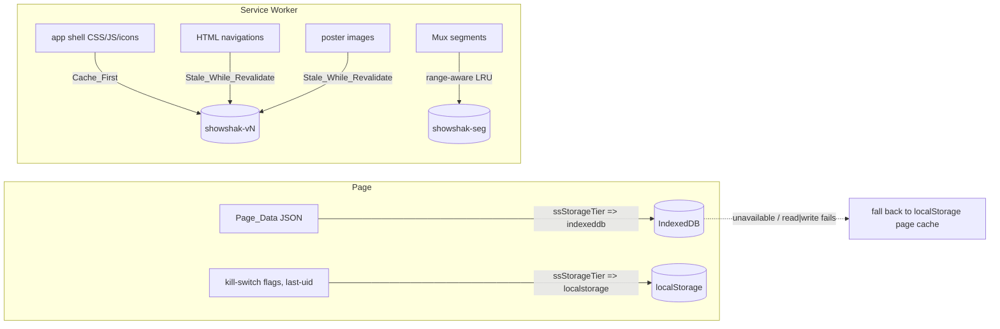

# Design Document

## Overview

ShowShak's data layer is already A-grade; the felt pain is on the **client navigation
and clip-advance edges**. Opening Discover or Watchlist paints black gradient frames
first, then data and posters trickle in *after* the page boots, because each page only
starts loading its clip list and posters once it mounts. Profile already feels instant
because the Feed prewarms it during idle (`ssPrewarmProfile`); Discover and Watchlist
have a page cache (`ssReadPageCache` / `ssWritePageCache`) but nothing warms their
**data** or **posters** ahead of navigation.

This feature establishes one **prefetch + cache pipeline** built to current (2026)
standards, governed by a single principle that already runs the Feed: *warm the next
thing during idle, paint instantly from cache, then revalidate — and never let anything
prefetched starve or destabilize what the user is actively looking at.* It is delivered
in three independently shippable phases so the Feed never breaks:

1. **Phase 1 — Cross-page data + poster prewarm.** During Feed `Idle_Time`, warm
   Discover's and Watchlist's `Page_Data` (into the existing page cache) and decode the
   first `SS_PREWARM_POSTER_COUNT` posters into the browser image cache, so those tabs
   paint real content on first paint. This is the founder's main visible win and needs
   nothing from later phases.
2. **Phase 2 — Generic prewarm helper + storage tiering + SW per-resource strategies.**
   One reusable `Cross_Page_Prewarm` path for any `Target_Page`; move structured
   `Page_Data` off synchronous `localStorage` into `IndexedDB`; keep URL-addressable
   resources (app shell, CSS/JS, posters, segments) in `Cache_Storage` with the right
   per-resource strategy; restrict `localStorage` to tiny flags.
3. **Phase 3 — Clip segment-byte prefetch + device-verified Segment_Cache + platform
   enhancements.** Warm upcoming clips' HLS segment **bytes** within the existing player
   cap (never mounting extra players); turn on the opt-in SW `Segment_Cache` with a
   bounded `Back_Buffer`; on Android add Speculation Rules prerender + a deeper prefetch
   budget; everywhere add cross-document View Transitions — with iOS falling back to
   lean manual prewarm.

### The 5-layer cache model (formalized)

The whole design rests on five distinct layers, each with its own medium, lifetime, and
eviction. Most "caching" confusion comes from conflating them, so they are named and kept
separate. The first four exist today; this feature **adds tiering discipline at L1** (move
structured data to IndexedDB) and **lands L4** (the persisted Segment_Cache) behind a kill
switch, while preserving the locked L2/L3 player decisions exactly.

| Layer | Medium | Holds | Evict / lifetime | Bound | This feature |
|---|---|---|---|---|---|
| **L0** App shell | `Cache_Storage` (SW, `showshak-<CACHE_VERSION>`) | HTML/CSS/JS/icons/manifest | `CACHE_VERSION` bump | small | Req 5.1 Cache_First; Req 5.2 HTML SWR |
| **L1** Metadata / Page_Data | **`IndexedDB`** (structured) + `localStorage` SWR fallback | ids, captions, posterURL, `playback_id`, linked titles, public signals | TTL 6h / window | `SS_PAGE_CACHE_MAX` clips | **Req 4** move to IndexedDB; Phase 1 prewarm fills it |
| **L2** Mounted players | live `<mux-player>` DOM | decoded video + buffer | LRU band around active | **`SS_MAX_LIVE_PLAYERS = 2` (LOCKED)** | Req 12 — untouched; prefetch NEVER mounts here |
| **L3** In-memory MSE buffer | per-player media buffer | forward + `Back_Buffer` seconds | player-managed | `Back_Buffer` cap | **Req 7.5** cap the back-buffer |
| **L4** Persisted segments | `Cache_Storage` (SW, `showshak-seg`) | HLS init + media segments | byte-bounded LRU + window | `SS_SEG_CACHE_CEILING` | **Req 6/7** segment-byte prefetch + range-aware Segment_Cache |

L0 and L4 are **separate Cache Storage buckets with separate lifecycles**: `showshak-seg`
is excluded from the activate-time cleanup so a deploy never re-downloads warmed video.
Posters (URL-addressable, L1's visual half) live in the L0 bucket under a SWR strategy.

### Design principles honoured

- **Idle-warm, paint-from-cache, revalidate.** Every page follows `Cache_Then_Revalidate`:
  paint the last cached `Page_Data` instantly, re-query, and re-render only if the list
  changed (`ssFeedListChanged`). Prewarm runs strictly off the first-paint critical path
  via `requestIdleCallback` (with a `setTimeout` fallback).
- **Active always wins the pipe.** Reused verbatim from `feed-clip-load-performance`: only
  the active clip ever fully buffers; segment prefetch happens with spare, budgeted
  bandwidth and stops at the `Circuit_Breaker`.
- **Pure core, property-tested.** Every *magnitude / decision* (what to prewarm, how many
  posters, which storage tier, which budget, which flags are on, what to evict) is a pure,
  total, never-throw, dual-exported helper with no DOM/network. The impure shell (idle
  scheduling, IndexedDB I/O, SW interception, Speculation Rules / View Transition wiring)
  consumes those decisions as data — mirroring the existing `ssRankFeed` (pure) /
  `ssLoadClips` (impure) and `ssPrewarmProfile` / `ssReadPageCache` split.
- **Fail-soft + kill-switched everywhere.** Each capability sits behind its own
  `ss_ff_<name>` flag; any miss / quota / eviction / unknown-API / thrown error degrades to
  today's load-after-mount behaviour. The Feed works with every switch on or off.
- **Bounded footprint.** Every cache is bounded by entry count, byte ceiling, or TTL; iOS
  respects a ~50 MB origin quota and never assumes persistence; Android gets a deeper budget.
- **Scoreboard-safe.** Only `Public_Signals` ever enter a prefetched/cached payload — never
  fires-received totals or watch-it tap counts.
- **Locked player decisions preserved (Req 12).** Keep `<mux-player>` (no swap, no raw-hls.js
  rewrite, no MP4, no CDN swap); ONE player behaviour for iOS+Android; recycled pool;
  `SS_MAX_LIVE_PLAYERS = 2` never raised; no unbounded memory cache.

## Architecture

### Phase 1 — Cross-page prewarm from the Feed (idle)

```mermaid
flowchart TD
  FEED[Feed loaded, first paint done] --> IDLE[requestIdleCallback / setTimeout fallback]
  IDLE --> DEC{ssShouldPrewarm(target, current, doneSet)}
  DEC -- skip (current page / already done / off) --> NOOP[do nothing]
  DEC -- warm --> Q[query Target_Page Page_Data]
  Q --> SAN[ssPublicSignalsOnly: strip Scoreboard fields]
  SAN --> WRITE[ssWritePageData -> L1 page cache]
  SAN --> POS[ssPosterPrewarmList(pageData, SS_PREWARM_POSTER_COUNT)]
  POS --> DECODE[decode posters into browser image cache]
  Q -. any error .-> FAIL[leave today's load-after-mount unchanged]
```

On navigating to a `Target_Page`, the page paints from the cached `Page_Data`, decodes the
already-warmed posters with no new request, then revalidates against the DB and re-renders
only if changed.

### Phase 2 — Storage tiering + per-resource SW strategies



`ssStorageTier(resourceKind)` is the pure router; the IndexedDB read/write and SW strategy
branches are the impure shell that already exists in `sw.js` (extended, not replaced — no
Workbox, no build step).

### Phase 3 — Segment prefetch, Segment_Cache, device split

```mermaid
flowchart TD
  ACT[active-clip change] --> TIER[ssNetworkTier(effectiveType)]
  ACT --> DEV[ssDeviceProfile(ua)]
  TIER --> BUD[ssResolvePrefetchBudget(device, tier)]
  DEV --> BUD
  BUD --> DEEP{Active buffer satisfied AND Circuit_Breaker closed?}
  DEEP -- yes --> WARM[prefetch upcoming clips' HLS bytes -> SW Segment_Cache; charge byte budget]
  DEEP -- no --> IDLEx[defer to active clip]
  WARM --> CAP[NEVER mount > SS_MAX_LIVE_PLAYERS players; bytes only]

  PLAYER[mux-player / hls.js / iOS native HLS] -->|GET segment + Range| SW2[SW fetch handler]
  SW2 --> KS{ss_ff_segcache on?}
  KS -- off --> PASS[do NOT intercept; Mux exactly as today]
  KS -- on --> HIT{in Segment_Cache?}
  HIT -- yes, range --> R206[slice -> HTTP 206]
  HIT -- yes, full --> R200[serve 200]
  HIT -- no --> NET[fetch full segment, store, serve]
  SW2 -. ssSegmentEvictionPlan .-> EV[evict out-of-window, then LRU to ceiling]

  DEV --> SPEC{android AND Speculation_Rules supported?}
  SPEC -- yes --> SR[register Speculation_Rules prerender]
  SPEC -- no / fail --> MAN[manual Cross_Page_Prewarm]
  NAVI[page navigation] --> VT{ssNavStrategy: View_Transitions supported?}
  VT -- yes --> VTGO[cross-document View Transition]
  VT -- no / fail --> PLAIN[standard navigation, no regression]
```

### Where each piece lives

| Concern | Location | Pure? |
|---|---|---|
| `ssShouldPrewarm`, `ssPosterPrewarmList`, `ssPublicSignalsOnly`, `ssStorageTier`, `ssDeviceProfile`, `ssResolvePrefetchBudget`, `ssResolveKillSwitches`, `ssStorageTrimPlan` | `showshak-shared.js` (pure export block) | **pure** |
| Reused pure helpers: `ssNetworkTier`, `ssNetworkPolicy`, `ssPreloadTier`, `ssShouldDeepen`, `ssSegmentEvictionPlan`, `ssNavStrategy`, `ssFeedListChanged` | `showshak-shared.js` | **pure** |
| Idle scheduling + cross-page prewarm loop | `showshak-shared.js` (new `ssPrewarmPages`, mirrors `ssPrewarmProfile`) | impure |
| Page_Data read/write tiering (IndexedDB + localStorage fallback) | `showshak-shared.js` (`ssReadPageData` / `ssWritePageData` wrap existing `ssReadPageCache`/`ssWritePageCache`) | impure |
| Poster decode | `showshak-shared.js` (`_ssWarmImage`, exists) | impure |
| Per-resource SW strategies + Segment_Cache + 206 | `sw.js` (extend existing hand-rolled handler) | impure |
| Segment-byte prefetch within cap | `showshak-shared.js` (`ssWarmClips` / `_ssDeepenController`, exist) | impure |
| Speculation Rules / View Transitions wiring | page bootstraps + `showshak-shared.js` | impure |

## Components and Interfaces

### Pure decision core (new helpers)

All new helpers are added to the dual-exported block in `showshak-shared.js`, total,
deterministic, and never throw on malformed input — same contract as the existing pure core.

#### `ssShouldPrewarm(targetPage, currentPage, doneSet)` → `boolean`  (R1.3, R3.3, R3.5)
Returns `true` iff `targetPage` is a known `Target_Page`, is **not** the `currentPage`, and is
**not** already in `doneSet` (warmed this session). Any non-string / unknown page → `false`.
This is the single gate the idle loop calls per target; it encodes "skip current page", "skip
already-done", and "warm an eligible non-current page".

#### `ssPosterPrewarmList(pageData, count)` → `string[]`  (R2.1, R2.4, R2.6)
Returns the first `min(count, pageData.length)` poster URLs from `pageData`, skipping
entries with no poster URL. Clamps to what exists (fewer clips → fewer posters) and never
returns more than `count` (more clips → exactly `count`). Non-array / non-finite count → `[]`.

#### `ssPublicSignalsOnly(record)` → `object`  (R11.1–R11.4)
Returns a shallow copy of `record` with every `Scoreboard` field removed
(`fires_received`, `fires_received_total`, `watch_taps`, `watch_it_taps`, and any field on the
denylist), preserving all `Public_Signals` (e.g. `fires_count`, `views_count`, follower
count). A record carrying both kinds is **kept** (not skipped) with only its public fields.
Non-object → `{}`. Idempotent: sanitizing an already-sanitized record is a fixpoint.

#### `ssStorageTier(resourceKind)` → `'cache_storage' | 'indexeddb' | 'localstorage'`  (R4.1–R4.3)
Pure router: URL-addressable resources (`'app_shell'`, `'css'`, `'js'`, `'poster'`,
`'segment'`, `'html'`) → `'cache_storage'`; structured `'page_data'` → `'indexeddb'`; tiny
`'flag'`, `'last_uid'`, `'cache_meta'` → `'localstorage'`. Unknown kind → `'localstorage'`
(the smallest, safest tier). This makes the tiering rule testable independent of the I/O.

#### `ssDeviceProfile(ua)` → `'android' | 'ios'`  (R8)
Classifies the platform from a user-agent string: iOS (`iPhone|iPad|iPod`, and
iPadOS-as-Mac-with-touch when signalled) → `'ios'`; otherwise → `'android'` (the deeper-budget
default, since the only platform that needs the lean treatment is iOS). Non-string → `'ios'`
(fail lean — never grant the deep budget on uncertainty).

#### `ssResolvePrefetchBudget(deviceProfile, networkTier)` → `{ byteBudget, prefetchDepth, storageBudget }`  (R8.3–R8.5)
Pure budget resolver combining device + network tier. Guarantees:
`android.byteBudget ≥ ios.byteBudget` for the same tier (R8.5); `ios.storageBudget ===
SS_IOS_STORAGE_BUDGET` and `android.storageBudget ≥ SS_IOS_STORAGE_BUDGET`; on `android` +
`fast` the `prefetchDepth` equals the fast-tier depth `SS_PREFETCH_DEPTH.fast` (R8.3).
Unknown device → iOS row; unknown tier → medium row (via `ssNetworkPolicy`).

#### `ssResolveKillSwitches(rawFlags, defaults)` → `object`  (R10.5)
Given a raw flag map (possibly partial / unreadable) and the documented `defaults`, returns
the effective on/off state for **every** capability. If `rawFlags` is absent or unreadable
(`null`/non-object), returns `defaults` for **all** capabilities — never a mix of present
flags and defaulted ones. A present flag overrides its default; an absent one takes its
default. This is the all-or-defaults rule that prevents a half-configured pipeline.

#### `ssStorageTrimPlan(entries, budgetBytes)` → `{ evict: string[], keep: string[] }`  (R8.7)
Generic byte-bounded LRU planner for the iOS storage guard: given cache `entries`
(`{ key, bytes, lastUsed }`) and a `budgetBytes`, evict least-recently-used first until kept
bytes ≤ budget; partitions the input keys exactly; never sheds below a single entry. Mirrors
`ssSegmentEvictionPlan` but tier-agnostic (it governs total Pipeline storage on iOS, not just
segments). Non-array / non-finite budget → `{ evict: [], keep: [] }`.

### Reused pure helpers (no change)

- `ssNetworkTier` / `ssNetworkPolicy` — Network_Tier → depth/resolution (Phase 3 budget).
- `ssPreloadTier` / `ssShouldDeepen` — active-wins preload ladder + deepening gate (Phase 3).
- `ssSegmentEvictionPlan` — Segment_Cache eviction (Phase 3, already mirrored in `sw.js`).
- `ssNavStrategy(env)` — View Transitions vs instant navigation decision (Req 9).
- `ssFeedListChanged` — re-render only when the list actually changed (Cache_Then_Revalidate).

### Impure integration

#### Phase 1 — `ssPrewarmPages()` (mirrors `ssPrewarmProfile`)
Scheduled from the Feed via `requestIdleCallback(fn, { timeout })` with a `setTimeout`
fallback (R1.2). For each `Target_Page` (Discover, Watchlist), gate on `ssShouldPrewarm`,
then query its `Page_Data`, sanitize through `ssPublicSignalsOnly`, write to the page cache
(`ssWritePageData`), and decode `ssPosterPrewarmList(...)` via `_ssWarmImage`. Maintains a
session `doneSet` so a target is warmed at most once per Feed session (R1.3). Every step is
wrapped fire-and-forget; any failure leaves today's load-after-mount path untouched (R1.5).
A poster decode failure continues with the rest (R2.5). Gated by `ss_ff_prewarm`.

#### Phase 2 — storage tiering
`ssWritePageData(name, clips)` / `ssReadPageData(name)` wrap an IndexedDB object store
(async, off the main thread, R4.4). On any IndexedDB failure or absence they fall back to the
existing synchronous `ssWritePageCache` / `ssReadPageCache` localStorage path (R4.5). Both
clamp to `SS_PAGE_CACHE_MAX` clips per target (R4.6). The SW `fetch` handler gains an explicit
poster branch (Stale_While_Revalidate, R5.3) and keeps the existing Cache_First for versioned
libs and SWR for HTML/static; app shell strategy is Cache_First with the documented read-only
fallback (R5.6). Gated by `ss_ff_idb` (Page_Data tiering) and `ss_ff_poster_swr`.

#### Phase 3 — segment prefetch + Segment_Cache + platform
- **Segment-byte prefetch** reuses `ssWarmClips` / `_ssDeepenController`: warm upcoming clips'
  init + first media segments into the SW `Segment_Cache`, charging `_ssChargePrefetch`. It
  warms **bytes only** and never touches the player pool, so `SS_MAX_LIVE_PLAYERS` is
  structurally preserved (R6.2, R12.1). Depth from `ssResolvePrefetchBudget` (R6.3); stops at
  the `Circuit_Breaker` (R6.4); a failed prefetch falls back to the player's own fetch (R6.5).
- **Segment_Cache** is the existing `sw.js` `showshak-seg` bucket: when `ss_ff_segcache` is
  `on`, intercept Mux segments, serve 206 by slicing the cached full body, fetch+store on a
  miss (R7.1, R7.2, R7.7), bypass to network on an unsatisfiable range (R7.3), and evict via
  `ssSegmentEvictionPlan` (R7.4). When `off`, do not intercept Mux at all (R7.6). The player
  `Back_Buffer` is capped to `SS_BACK_BUFFER_S` (R7.5).
- **Android-deeper / iOS-lean:** `ssDeviceProfile` + `ssResolvePrefetchBudget` grant Android
  the deeper byte/depth budget (R8.3, R8.5) and keep iOS within `SS_IOS_STORAGE_BUDGET`,
  evicting via `ssStorageTrimPlan` when total Pipeline storage exceeds it (R8.7) and never
  assuming persistence (R8.4). On Android with Speculation Rules support, register a
  prerender entry for the next likely page (R8.1); on iOS / unsupported / registration
  failure, fall back to manual `Cross_Page_Prewarm` (R8.2, R8.6). Gated by `ss_ff_speculation`.
- **View Transitions:** `ssNavStrategy(env)` decides; supported → cross-document View
  Transition (R9.1), unsupported or failure → standard navigation with no regression
  (R9.2–R9.4). Gated by `ss_ff_viewtransition`.

## Data Models

### Page_Data (cached payload — Public_Signals only)
```
PageData = Clip[]                       // already PAGE-SHAPED, capped to SS_PAGE_CACHE_MAX
Clip = {
  id: string,
  caption: string,
  posterUrl: string,                    // image.mux.com thumbnail
  muxPlaybackId: string,
  titleLinks: TitleLink[],
  fires_count?: number,                 // Public_Signal — allowed
  views_count?: number                  // Public_Signal — allowed
  // NEVER: fires_received, fires_received_total, watch_taps, watch_it_taps (Scoreboard)
}
```
Stored in IndexedDB (`ss_pagedata` store, key `name|uid`, value `{ v, ts, clips }`), with the
existing `localStorage` `ss_page_<name>_v<N>_<uid>` envelope as the fallback tier.

### Segment_Cache entry (L4)
Cache Storage response in `showshak-seg`, keyed by the Mux segment URL **without** the Range
header (one full body serves all ranges). Side index `{ href → { key, bytes, lastUsed,
clipDistance } }` maintained in the SW; eviction snapshot fed to `ssSegmentEvictionPlan`.

### Session state (module-level in `showshak-shared.js`)
`_ssPrefetchBytes:int`, `_ssCircuitOpen:bool` (exist), reset in `initFeed`; plus a
prewarm `doneSet` (Set of warmed target-page names this session).

### Kill switches (localStorage `ss_ff_<name>`, all default OFF except where noted)

| Flag | Capability | Default |
|---|---|---|
| `ss_ff_prewarm` | Cross_Page_Prewarm (Phase 1) | off → today's load-after-mount |
| `ss_ff_idb` | IndexedDB Page_Data tiering (Phase 2) | off → localStorage page cache |
| `ss_ff_poster_swr` | Poster Stale_While_Revalidate (Phase 2) | off → today's poster fetch |
| `ss_ff_segprefetch` | Segment-byte prefetch (Phase 3) | off → no prefetch |
| `ss_ff_segcache` | SW Segment_Cache (Phase 3, exists) | off → Mux not intercepted |
| `ss_ff_speculation` | Speculation Rules (Phase 3) | off → manual prewarm |
| `ss_ff_viewtransition` | View Transitions (Phase 3) | off → standard navigation |

`ssResolveKillSwitches` applies the all-or-defaults rule (R10.5): if storage is unreadable,
ALL capabilities use their documented default rather than mixing present + defaulted flags.

### Tunable constants (named, dual-exported)

| Constant | Default | Req | Notes |
|---|---|---|---|
| `SS_PREWARM_POSTER_COUNT` | 12–15 (set 12) | R2.2 | posters decoded per Target_Page prewarm |
| `SS_PAGE_CACHE_MAX` | 60 (exists) | R4.6 | clips retained per Target_Page |
| `SS_PREFETCH_DEPTH` | `{slow:1, medium:3, fast:5}` (exists) | R6.3, R8.3 | clips ahead eligible per Network_Tier |
| `SS_SESSION_BYTE_BUDGET` | ~150 MB (exists) | R6.4 | per-session non-active prefetch ceiling |
| `SS_SEG_CACHE_CEILING` | ~200 MB (exists) | R7.4 | Segment_Cache LRU-by-bytes ceiling |
| `SS_SEG_CACHE_WINDOW` | `{behind:5, ahead:5}` (exists) | R7.4 | segment eviction eligibility window |
| `SS_BACK_BUFFER_S` | ~30 s (new) | R7.5 | player back-buffer cap (bounded retained bytes) |
| `SS_IOS_STORAGE_BUDGET` | ~50 MB (new) | R8.4, R8.7 | iOS origin-quota ceiling for total Pipeline storage |
| `SS_ANDROID_STORAGE_BUDGET` | ≥ iOS (new) | R8.5 | Android deeper storage budget |

Spend-now generosity is **config**, not architecture: every magnitude above is a constant the
team can dial without touching control logic.

## Correctness Properties

*A property is a characteristic or behavior that should hold true across all valid
executions of a system — essentially, a formal statement about what the system should do.
Properties serve as the bridge between human-readable specifications and machine-verifiable
correctness guarantees.*

Each property below is a pure, total decision over a large input space, exercised with
`fast-check` under `tests/_pbt.js` (`installDomStub()` before `require('../showshak-shared.js')`,
`{ numRuns: ITER }`, `ITER ≥ 100`), one file per property, auto-discovered by
`tests/run-all.js` (which must stay green including the existing suite). The impure shell
(idle scheduling, IndexedDB I/O, SW interception, 206 slicing, Speculation Rules / View
Transition wiring) is verified on-device — see Testing Strategy.

### Property 1: Prewarm gate skips current and already-warmed, warms eligible

*For any* `targetPage`, `currentPage`, and `doneSet`, `ssShouldPrewarm(targetPage,
currentPage, doneSet)` returns `true` if and only if `targetPage` is a known Target_Page,
`targetPage !== currentPage`, and `targetPage` is not in `doneSet`; for every other input
(unknown/non-string page, target equal to current, or target already in `doneSet`) it
returns `false`. Total and deterministic.

**Validates: Requirements 1.3, 3.3, 3.5**

### Property 2: Poster prewarm list clamps to count and to available posters

*For any* `pageData` array and `count`, `ssPosterPrewarmList(pageData, count)` returns a list
whose length equals `min(count, number of entries with a poster URL)`; it never exceeds
`count`, never pads beyond the posters that exist, and every returned element is a real
poster URL drawn in order from `pageData`. Non-array input or non-finite `count` yields `[]`.

**Validates: Requirements 2.1, 2.4, 2.6**

### Property 3: Scoreboard-safe sanitization

*For any* source `record`, `ssPublicSignalsOnly(record)` returns an object that contains no
Scoreboard field (`fires_received`, `fires_received_total`, `watch_taps`, `watch_it_taps`, or
any denylisted private engagement total), preserves every Public_Signal present, and — when
the record carries both kinds — returns the public fields rather than an empty/skipped result.
Sanitizing an already-sanitized record is a fixpoint (idempotent). Non-object → `{}`.

**Validates: Requirements 11.1, 11.2, 11.3, 11.4**

### Property 4: Storage tier routing

*For any* `resourceKind`, `ssStorageTier(resourceKind)` maps every URL-addressable kind
(`app_shell`, `css`, `js`, `html`, `poster`, `segment`) to `'cache_storage'`, structured
`page_data` to `'indexeddb'`, and tiny-flag kinds (`flag`, `last_uid`, `cache_meta`) to
`'localstorage'`; any unknown/garbage kind falls back to `'localstorage'`. Total and
deterministic — never throws.

**Validates: Requirements 4.1, 4.2, 4.3**

### Property 5: Page-cache bound

*For any* `clips` array, the value persisted by the Page_Data write path retains at most
`SS_PAGE_CACHE_MAX` clips — i.e. stored length equals `min(clips.length, SS_PAGE_CACHE_MAX)` —
so no Target_Page cache grows unbounded.

**Validates: Requirements 4.6, 12.4**

### Property 6: Device profile classification

*For any* user-agent string, `ssDeviceProfile(ua)` returns `'ios'` for iOS user agents
(iPhone/iPad/iPod and iPadOS-as-desktop signals) and `'android'` otherwise; a non-string /
absent input returns `'ios'` (fail lean — never grant the deep budget on uncertainty). Total
and deterministic.

**Validates: Requirements 8.2**

### Property 7: Device prefetch-budget invariants

*For any* `networkTier`, `ssResolvePrefetchBudget('android', tier)` yields a `byteBudget` and
`storageBudget` no smaller than `ssResolvePrefetchBudget('ios', tier)`; the iOS `storageBudget`
equals `SS_IOS_STORAGE_BUDGET` for every tier; and for `('android', 'fast')` the resolved
`prefetchDepth` equals the fast-tier depth `SS_PREFETCH_DEPTH.fast` (and is ≥ the depth of any
other tier). Unknown device → iOS row; unknown tier → medium row.

**Validates: Requirements 8.3, 8.4, 8.5**

### Property 8: Kill-switch resolution is all-or-defaults

*For any* `rawFlags` and documented `defaults`, `ssResolveKillSwitches(rawFlags, defaults)`
returns an effective state for every capability: a present flag overrides its default, an
absent flag takes its default, and when `rawFlags` is unreadable (`null`/non-object) **every**
capability takes its documented default — never a mix of present and defaulted flags on the
unreadable path. Total and deterministic.

**Validates: Requirements 10.2, 10.5**

### Property 9: iOS storage-trim stays within budget and partitions input

*For any* cache `entries` (`{ key, bytes, lastUsed }`) and `budgetBytes`,
`ssStorageTrimPlan(entries, budgetBytes)` evicts least-recently-used entries first until kept
bytes ≤ `budgetBytes` (the documented floor: a single entry larger than the budget is kept);
no evicted entry has a newer `lastUsed` than any kept entry; and `evict ∪ keep` is exactly the
input key set with no loss or duplication. Non-array entries / non-finite budget →
`{ evict: [], keep: [] }`.

**Validates: Requirements 8.7, 12.4**

### Property 10: Totality of all new pure helpers

*For any* input — including `null`, `undefined`, wrong-typed, non-finite, or otherwise
malformed — every new pure helper (`ssShouldPrewarm`, `ssPosterPrewarmList`,
`ssPublicSignalsOnly`, `ssStorageTier`, `ssDeviceProfile`, `ssResolvePrefetchBudget`,
`ssResolveKillSwitches`, `ssStorageTrimPlan`) resolves without throwing and returns a
well-formed result of its documented shape.

**Validates: Requirements 1.5, 9.4, 13.3, 13.4**

### Reused properties (already covered, cited not re-authored)

These acceptance criteria are satisfied by existing pure helpers whose properties are already
in the suite; this feature relies on them rather than duplicating tests:

- **`ssFeedListChanged`** — re-render only when the list changed (Cache_Then_Revalidate).
  **Validates: Requirements 1.4**
- **`ssNetworkPolicy`** (depth per tier) + **`ssShouldDeepen`** (active-wins + budget + dwell
  gate). **Validates: Requirements 6.1, 6.3, 6.4**
- **`ssSegmentEvictionPlan`** — out-of-window eviction, LRU-to-ceiling, exact partition.
  **Validates: Requirements 7.4, 12.4**
- **`ssNavStrategy`** — View_Transitions vs instant navigation; total (always navigable).
  **Validates: Requirements 9.1, 9.2, 9.4**

## Error Handling

Guiding rule: a missing/failed cache, prefetch, query, unsupported API, or thrown error
degrades to **today's load-after-mount behaviour** — never a throw, a black page, a broken
clip, or a stuck navigation.

| Failure | Surface | Handling |
|---|---|---|
| Cross_Page_Prewarm query/decode fails | `ssPrewarmPages` | swallow; Target_Page keeps its load-after-mount path (R1.5) |
| Poster decode fails | prewarm loop | continue with remaining posters; no surfaced error (R2.5) |
| IndexedDB unavailable / read|write fails | `ssReadPageData`/`ssWritePageData` | fall back to the localStorage page cache (R4.5) |
| SW cache read fails | `sw.js` | fetch the resource from the network (R5.5) |
| App shell write fails, reads succeed | `sw.js` | keep serving the shell from read-only Cache_Storage via Cache_First (R5.6) |
| Segment prefetch fails | `ssWarmClips`/deepen loop | fall back to the player's own fetch (R6.5) |
| Range unsatisfiable / opaque body | `sw.js` Segment_Cache | bypass cache → network; never throw a 416 (R7.3) |
| Quota exceeded / over budget | SW + iOS guard | run `ssSegmentEvictionPlan` / `ssStorageTrimPlan`; serve from network (R7.4, R8.7) |
| Speculation Rules registration fails | platform wiring | fall back to manual Cross_Page_Prewarm (R8.6) |
| View Transition fails to start | nav wiring | complete the navigation without the transition (R9.3) |
| Any Pipeline op throws | per-capability try/catch | catch → degrade to load-after-mount (R10.3) |
| Flags unreadable / partial | `ssResolveKillSwitches` | documented defaults for ALL capabilities (R10.5) |
| Primary error handler itself fails | outer safety net | higher-level catch degrades to load-after-mount (R10.6) |
| Unknown `effectiveType` | `ssNetworkTier` | → `medium` tier (existing) |
| Unknown device / tier | `ssResolvePrefetchBudget` | → iOS row / medium row (fail lean) |

## Testing Strategy

**Dual approach.** Pure decisions get property tests (universal coverage); the impure shell
and platform/IO behaviour get on-device verification and a few example/integration checks.

**Property tests (pure core).** Properties 1–10 above, one `tests/prop-*.test.js` file each,
using `fast-check` with `ITER ≥ 100` runs. Each file is tagged with a header comment
`Feature: prefetch-cache-pipeline, Property N: <property text>` and references the validated
requirements. `node tests/run-all.js` must stay green including the entire existing suite
(R13.4, R13.5). New helpers are dual-exported (`window.*` + `module.exports`) so the Node
tests can `require` them (R13.3). Suggested file names:
`prop-prewarm-gate`, `prop-poster-clamp`, `prop-scoreboard-safe`, `prop-storage-tier`,
`prop-page-cache-bound`, `prop-device-profile`, `prop-device-budget`, `prop-killswitch-resolve`,
`prop-storage-trim`, `prop-pipeline-totality`.

**Example / constant checks.**
- `SS_PREWARM_POSTER_COUNT` ∈ [12, 15] (R2.2).
- `SS_MAX_LIVE_PLAYERS === 2`, unchanged (R12.1).
- `SS_BACK_BUFFER_S` is a finite positive constant (R7.5).

**On-device / founder verification (impure, per phase).**
- *Phase 1:* prewarm runs after first paint (rIC + setTimeout fallback), Discover/Watchlist
  paint from cache with prewarmed posters and no new poster request, prewarm failure leaves
  load-after-mount intact (R1.1, R1.2, R2.3, R2.5).
- *Phase 2:* Page_Data reads are async from IndexedDB (no main-thread jank), IndexedDB
  disabled → localStorage fallback serves the paint, SW serves app shell Cache_First, HTML +
  posters Stale_While_Revalidate, write-fail/read-success keeps the shell serving
  (R4.4, R4.5, R5.1–R5.6).
- *Phase 3:* prefetch warms bytes only and the live player count never exceeds
  `SS_MAX_LIVE_PLAYERS`; Segment_Cache on → 206 slicing correct, miss fetched+stored,
  unsatisfiable range bypasses, off → Mux untouched; Back_Buffer capped; Android registers
  Speculation Rules (fallback to manual on failure); View Transitions animate where supported
  and degrade cleanly (R6.1, R6.2, R6.5, R7.1–R7.3, R7.6, R7.7, R8.1, R8.6, R9.1, R9.3).
- *Cross-cutting:* toggle every kill switch on, then off — the Feed works both ways; injected
  throws across phases degrade to load-after-mount (R10.1, R10.3, R10.4, R10.6).

**Code review (constraints).** No bundler/build step, hand-rolled SW with no Workbox, one
player behaviour across devices, recycled `<mux-player>` pool with no swap/raw-hls/MP4/CDN
swap (R5.4, R12.2, R12.3, R13.1, R13.2).

## Rollout phases

Phased so the Feed never breaks and each increment is independently shippable (R14):

- **Phase 1 — Cross-page data + poster prewarm.** `ssShouldPrewarm`, `ssPosterPrewarmList`,
  `ssPublicSignalsOnly`, `ssPrewarmPages` (mirrors `ssPrewarmProfile`); writes into the
  existing page cache; gated by `ss_ff_prewarm`. The founder's main visible win; needs nothing
  later. *(R14.1, R14.2)*
- **Phase 2 — Generic helper + storage tiering + SW strategies.** `ssStorageTier`,
  `ssReadPageData`/`ssWritePageData` (IndexedDB + localStorage fallback), SW poster SWR branch;
  gated by `ss_ff_idb`, `ss_ff_poster_swr`. *(R3, R4, R5)*
- **Phase 3 — Segment prefetch + Segment_Cache + platform split.** Reuse the segment
  prefetch/deepen loop within the cap; `ss_ff_segcache` Segment_Cache with capped Back_Buffer;
  `ssDeviceProfile` + `ssResolvePrefetchBudget` for Android-deeper/iOS-lean; `ssStorageTrimPlan`
  for the iOS guard; Speculation Rules + View Transitions; gated by `ss_ff_segprefetch`,
  `ss_ff_segcache`, `ss_ff_speculation`, `ss_ff_viewtransition`. *(R6, R7, R8, R9)*

While any later phase is undeployed the earlier phases remain fully functional, and every
phase keeps `node tests/run-all.js` green and the live Feed working (R14.3, R14.4).

## Honesty notes (verified vs to-confirm-on-device)

- **Verified from code:** the existing pure core this feature reuses (`ssNetworkTier`,
  `ssNetworkPolicy`, `ssPreloadTier`, `ssShouldDeepen`, `ssSegmentEvictionPlan`, `ssNavStrategy`,
  `ssFeedListChanged`), the `ssPrewarmProfile` / `ssReadPageCache` / `ssWritePageCache` patterns
  the new prewarm path mirrors, the hand-rolled `sw.js` strategies + the `showshak-seg`
  range-aware Segment_Cache with its 206 slicer and kill switch, and `SS_MAX_LIVE_PLAYERS = 2`.
- **To confirm on device:** IndexedDB async read latency vs the synchronous localStorage paint
  on a cold load; that posters decoded during prewarm are reused with no re-request across the
  separate HTML pages; the real iOS origin quota behaviour vs `SS_IOS_STORAGE_BUDGET`; and that
  Speculation Rules prerender does not double-fire view/analytics side effects (coordinated with
  the `pwa-black-screen-load` prerender guards). The design is fail-soft for all four, so a
  wrong assumption degrades to today's behaviour, never breakage.
