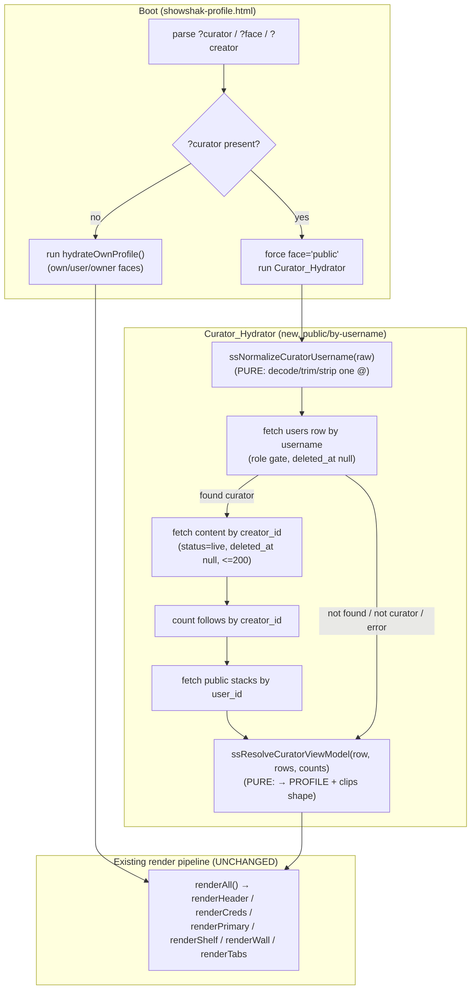

# Design Document

## Overview

The **public curator profile** is the page any Visitor sees at
`showshak-profile.html?face=public&curator=<username>`. The founder's intent is exact and is
the single guiding constraint for this design:

> *"The public profile should look EXACTLY like the curator's own profile — same layout, same
> way clips are shown — just without the private dashboard/analytics. Think Instagram: the
> account owner sees their dashboard and tools, but when a normal user visits a creator's
> profile they just see the creator's info and clips, in the same profile design."*

So this is **one profile shell reused for everyone**. The visual shell already exists.
`showshak-profile.html` is a single-page, three-face app (`face = 'user' | 'owner' | 'public'`)
driven by one shared render pipeline (`renderHeader`, `renderCreds`, `renderShelf`,
`renderTabs`/`switchTab`, `renderPrimary`, `renderWall`, `renderCockpit`, `renderAnalytics`,
`renderFollowing`). The `public` face is already built and already hides the cockpit, the
analytics charts, the Create/Analytics tabs, Edit Profile, and the "Preview as" switcher.

**This feature changes only the data, not the UI.** Today the public `?curator=` path is
hydrated from a mock-derived `sessionStorage` stash (`ss_view_curator_v1`) that Discover writes
from hardcoded mock data, and `hydrateOwnProfile()` deliberately bails when `?curator=` is
present (`if (_params.get('curator')) return;`). The result is the public face renders a mock
identity and `MOCK_CLIPS`, never the real curator.

The fix is a new **Curator_Hydrator**: given `?curator=<username>`, it fetches the real `users`
row (by `username`), the real live `content` clips (by `creator_id`), the real follower count
(`follows` by `creator_id`), and the public `stacks` (`visibility = 'public'`), then feeds the
existing `PROFILE` object and a dedicated viewed-curator clips cache that the existing render
pipeline already consumes. `renderHeader` / `renderPrimary` / `renderShelf` / `renderCreds`
then render real data with **zero UI changes**.

### Goals

- Resolve the Viewed_Curator from `?curator=<username>` to a real `users` row (`role = curator`).
- Render that curator's real identity, real live clips, real follower + clip counts, and public
  shared stacks — through the existing public-face render pipeline.
- Strictly preserve the "hide the scoreboard" philosophy: no fires-received / Watch-It / reach
  on the public face, and zero owner-scoped analytics requests.
- Fail soft on every backend edge (no DB, query error, not found, not a curator, zero clips):
  the page renders a clean state and never throws or goes blank.

### Non-Goals

- **No UI redesign.** The three-face shell, layout, and clip cards already exist and are reused
  as-is.
- **No changes to the owner or user faces**, the Analytics_Cockpit, or the upload flow.
- **No new SQL.** No migrations, table grants, or RLS policies are added or changed
  (Requirement 14). The required public reads already exist (see Assumptions in requirements.md).
- **No analytics changes** of any kind.

## Architecture

The feature lives entirely in the browser layer. It adds one async hydrator and two pure
helpers; it reuses the existing render pipeline and the existing `ssMapContentRowsToClips`
mapper from `showshak-shared.js`.

### The single-shell, three-face model

`showshak-profile.html` decides `face` at boot from the URL, then `renderAll()` fans out to the
per-section render functions. Every render function already branches on `isPublic()` /
`isOwner()` / `isUserOwn()` and on `isSignedInOwn()` (the REAL-vs-MOCK gate). The public face
already hides owner surfaces. The only reason the public face shows mock data is the **data
source**, not the rendering.



### Where the new hydrator slots into the load sequence

Today the boot IIFE is:

```js
(async function boot() {
  await hydrateOwnProfile();   // bails immediately when ?curator= is present
  if (isSignedInOwn()) { /* clean baseline */ }
  renderWall(); renderAll();
  fetchOwnFollowers(); fetchOwnAnalytics(); hydrateMyClipsFromDB();
})();
```

The Curator_Hydrator runs **instead of** the own-profile path when `?curator=` is present, and
forces `face = 'public'`. The owner-scoped async calls (`fetchOwnFollowers`, `fetchOwnAnalytics`,
`hydrateMyClipsFromDB`) are all already gated on `isSignedInOwn()`, which is **false** whenever
`?curator=` is present (`isSignedInOwn()` returns `_signedIn && !_params.get('curator')`). So
they no-op for the public view automatically — that satisfies Requirement 6.4 (zero owner-scoped
analytics requests) with no extra guarding. The new boot shape:

```js
(async function boot() {
  if (_params.get('curator')) {
    await hydrateCuratorProfile();   // NEW: public/by-username path, force face='public'
  } else {
    await hydrateOwnProfile();
    if (isSignedInOwn()) { /* clean baseline */ }
  }
  renderWall(); renderAll();
  if (!_params.get('curator')) {
    fetchOwnFollowers(); fetchOwnAnalytics(); hydrateMyClipsFromDB();
  }
}());
```

### The two pure seams (testability)

This project relies on property-based testing with `fast-check` + the Node test runner. The
async hydrator itself is I/O-bound and not directly property-testable, so the design **extracts
its decision logic into two pure helpers** in `showshak-shared.js`, exported under the existing
`module.exports` block, exactly like `ssMapContentRowsToClips` and the upload helpers:

1. **`ssNormalizeCuratorUsername(raw)`** — pure string normalizer. URL-decodes, trims, strips
   exactly one leading `@`, and returns either the cleaned username or `null` when the result is
   empty (Requirement 1.1, 1.3, 1.6, 8.1).
2. **`ssResolveCuratorViewModel(usersRow, contentRows, followerCount)`** — pure view-model
   resolver. Maps a `users` row + raw `content` rows + a follower count into the exact
   `{ profile, clips, stats, found }` shape the render pipeline consumes, applying the role gate,
   the identity fallbacks (Req 2), the `ssMapContentRowsToClips` projection (Req 3), the
   stats clamp (Req 4), and the not-found shape (Req 8). It contains **no Supabase, no DOM, no
   network** — the async hydrator does the I/O and hands rows to this function.

`ssMapContentRowsToClips` is already pure and already covered by the existing suite; the resolver
reuses it so the public clips match the feed/viewer clip shape and `ssOpenClip` works unchanged.

## Components and Interfaces

### New pure helpers (in `showshak-shared.js`, exported for tests)

```js
/* Normalize a raw ?curator value into a queryable username, or null.
   PURE: URL-decode → trim → strip exactly ONE leading '@' → trim again.
   Returns null when the result is empty (Req 1.6 / 8.1 not-found w/o querying). */
function ssNormalizeCuratorUsername(raw) { /* ... */ }

/* Resolve a Viewed_Curator view-model from already-fetched backend data.
   PURE: no Supabase, no DOM, no network. Inputs:
     usersRow      : the users row (or null/undefined when not found)
     contentRows   : raw content rows (or null) — projected via ssMapContentRowsToClips
     followerCount : non-negative integer (or anything; clamped to >= 0 integer)
   Returns:
     { found: boolean,
       profile: { name, handle, photo, letter, bio, genres, verified } | null,
       clips: Clip[],            // [] when not found / no rows
       stats: { followers, clips } }   // both non-negative integers
   Role gate: a row whose role !== 'curator' yields found=false (Req 1.5, 8). */
function ssResolveCuratorViewModel(usersRow, contentRows, followerCount) { /* ... */ }

module.exports = { /* existing exports */, ssNormalizeCuratorUsername, ssResolveCuratorViewModel };
```

**`ssNormalizeCuratorUsername` semantics (exact):**

| raw input | result |
| --- | --- |
| `"alice"` | `"alice"` |
| `"@alice"` | `"alice"` |
| `"%40alice"` (encoded `@`) | `"alice"` |
| `"  @alice  "` | `"alice"` |
| `"@@alice"` | `"@alice"` (only ONE leading `@` stripped — Req 1.3) |
| `""`, `"   "`, `"@"`, `"%40"` | `null` (Req 1.6) |
| malformed percent-escape | treat decode as identity, then trim/strip (never throws) |

**`ssResolveCuratorViewModel` semantics (exact):**

- `usersRow` null/undefined OR `usersRow.role !== 'curator'` → `{ found:false, profile:null,
  clips:[], stats:{ followers:0, clips:0 } }` (Req 1.4, 1.5, 8).
- Otherwise `found:true` with:
  - `profile.name` = `usersRow.name` when non-empty, else `usersRow.username` (Req 2.1, 2.8).
  - `profile.handle` = `'@' + usersRow.username` (Req 2.2).
  - `profile.photo` = `usersRow.avatar_url` when non-empty, else `null` (Req 2.3, 2.4).
  - `profile.letter` = first char of `name` when non-empty, else first char of `username`,
    uppercased (Req 2.4).
  - `profile.bio` = `usersRow.bio` when non-empty, else `''` (Req 2.5, 2.9).
  - `profile.genres` = `usersRow.genres` when a non-empty array, else `[]` (Req 2.7, 2.10).
  - `profile.verified` = `!!usersRow.verified` (Req 2.6).
  - `clips` = `ssMapContentRowsToClips(contentRows)` — most-recent-first order preserved
    (the caller queries ordered, the mapper preserves order) (Req 3.2, 3.3).
  - `stats.clips` = `clips.length` (Req 4.3).
  - `stats.followers` = `followerCount` coerced to a non-negative integer, else `0` (Req 4.1, 4.2).

### New async hydrator (in `showshak-profile.html`)

```js
/* PUBLIC / by-username sibling of hydrateOwnProfile() + fetchOwnFollowers().
   Reads by username / creator_id instead of auth.uid(). Forces face='public'.
   Fail-soft at every step; never throws (Req 9). */
async function hydrateCuratorProfile() {
  face = 'public';
  const username = ssNormalizeCuratorUsername(_params.get('curator'));
  if (!username || !window.ssDB) { applyCuratorViewModel(ssResolveCuratorViewModel(null)); return; }

  // 1. users row by username (Req 1.1, 1.2) — fail-soft → not-found (Req 9.2)
  let usersRow = null;
  try {
    const { data } = await window.ssDB.from('users')
      .select('id, username, name, bio, avatar_url, genres, verified, role')
      .eq('username', username).is('deleted_at', null).maybeSingle();
    usersRow = data || null;
  } catch (e) { usersRow = null; }

  const vm0 = ssResolveCuratorViewModel(usersRow, [], 0);
  if (!vm0.found) { applyCuratorViewModel(vm0); return; }   // not found / not curator (Req 8)

  // 2. live clips by creator_id (Req 3.1) — fail-soft → [] (Req 9.3, 9.4)
  let contentRows = [];
  try {
    const { data } = await window.ssDB.from('content')
      .select(CONTENT_SELECT /* same projection ssLoadClips uses */)
      .eq('creator_id', usersRow.id).eq('status', 'live').is('deleted_at', null)
      .order('created_at', { ascending: false }).range(0, 199);
    contentRows = data || [];
  } catch (e) { contentRows = []; }

  // 3. follower count by creator_id (Req 4.2) — fail-soft → 0 (Req 9.5)
  let followers = 0;
  try {
    const { count } = await window.ssDB.from('follows')
      .select('*', { count: 'exact', head: true })
      .eq('creator_id', usersRow.id).is('deleted_at', null);
    followers = (typeof count === 'number') ? count : 0;
  } catch (e) { followers = 0; }

  // 4. public stacks by user_id (Req 5) — fail-soft → [] (Req 9.6)
  try { _viewedCuratorStacks = await fetchCuratorPublicStacks(usersRow.id); }
  catch (e) { _viewedCuratorStacks = []; }

  applyCuratorViewModel(ssResolveCuratorViewModel(usersRow, contentRows, followers), usersRow);
}
```

`applyCuratorViewModel(vm, usersRow)` writes the resolved view-model into `PROFILE`, sets the
dedicated `_viewedCuratorClips` cache, records the not-found flag, and stores the resolved real
`id` + `username` for the Follow control (Req 13.6). It does **not** read `ss_view_curator_v1`
for any field (Req 7.2).

### Render-pipeline integration points (small, surgical)

The shell is reused; the only edits make the public render functions read the viewed-curator
cache instead of `MOCK_CLIPS` when `?curator=` is present.

| Function | Today | Change |
| --- | --- | --- |
| `renderPrimary()` | `const list = isSignedInOwn() ? mine : [...mine, ...MOCK_CLIPS];` | when `?curator=` → `list = _viewedCuratorClips` (no MOCK merge) (Req 3.3, 3.5, 7.3) |
| `renderWall()` | public branch maps `MOCK_CLIPS` gradients | when `?curator=` → first 5 of `_viewedCuratorClips`; default brand backdrop when empty (Req 3.4, 10.2) |
| `getMyClips()` / `myClipsCount()` | own vs mock+MOCK | when `?curator=` → `_viewedCuratorClips` / its length (Req 4.3, 10.3) |
| `renderCreds()` | public reads `PROFILE.followers` / `PROFILE.clipsPosted` | unchanged — values now come from the real view-model (Req 4) |
| `renderShelf()` | public filters `currentCollections()` (mock) to `vis==='public'` | when `?curator=` → render `_viewedCuratorStacks` (already public-only) (Req 5) |
| not-found state | none | new public empty/not-found block keyed off `_viewedCuratorFound === false` (Req 8) |

`applyAvatar()`, `renderHeader()`, the `pv-switch` hide, and the public tab set are already
correct and unchanged. The bug where the old `?curator=` block forced `PROFILE.photo = null` is
removed — `photo` now comes from the resolver (`avatar_url`) (Req 2.3).

### Reused existing interfaces (unchanged)

- `ssMapContentRowsToClips(rows)` — pure row→clip mapper (already tested), reused for clip shape.
- `ssOpenClip(...)` — opens the shared Clip_Viewer; `renderPrimary` already sets
  `window._PROFILE_PRIMARY = list`, so passing `_viewedCuratorClips` makes the viewer carry only
  Real_Clips (Req 11.1, 11.2, 11.3); its existing try/catch covers Req 11.4.
- `ssToggleFollow` / `ssIsFollowing` / `paintPublicFollow` / `togglePublicFollow` — the public
  Follow control already wires through these; the resolved real `id`/`username` are passed so the
  follow write targets the real curator (Req 13).

## Data Models

### Backend rows read (SELECT only — no new SQL, Req 14)

```
users    : id, username, name, bio, avatar_url, genres, verified, role, deleted_at
content  : id, description, fires_count, meta, status, mux_playback_id, url,
           thumbnail_url, duration_sec, creator_id, deleted_at, created_at,
           creator:creator_id(username,name,avatar_url),
           title:title_id(name,year,synopsis,providers,cached_at),
           platform:platform_id(id,name,color,abbr)
follows  : follower_id, creator_id, deleted_at            (count by creator_id)
stacks   : id, name, user_id, visibility, sort_no, created_at, deleted_at
```

These reads rely on grants/RLS that already exist (`0003` users read, `0002` content read,
`0006` follows/social read, `0001`/`0006` public stacks). If an implementation step finds a
required public `SELECT` is **not** already granted, it must stop, report the specific table and
grant to the founder, and must **not** author or apply any migration/RLS SQL (Req 14.3).

### Client view-model (produced by `ssResolveCuratorViewModel`)

```
CuratorViewModel {
  found:   boolean
  profile: { name:string, handle:string, photo:string|null, letter:string,
             bio:string, genres:string[], verified:boolean } | null
  clips:   Clip[]                       // ssMapContentRowsToClips output, most-recent-first
  stats:   { followers:int>=0, clips:int>=0 }
}
```

### New module-level state (in `showshak-profile.html`)

```
_viewedCuratorClips  : Clip[]   // dedicated viewed-curator clip cache the render reads
_viewedCuratorStacks : Stack[]  // public stacks for the shelf
_viewedCuratorFound  : boolean  // drives the not-found render branch
_viewedCuratorId     : string   // resolved real id for the Follow write (Req 13.6)
```

`Clip` is the exact shape `ssMapContentRowsToClips` returns (used app-wide by feed/discover/
viewer), so no new clip shape is introduced.

## Correctness Properties

*A property is a characteristic or behavior that should hold true across all valid executions of
a system — essentially, a formal statement about what the system should do. Properties serve as
the bridge between human-readable specifications and machine-verifiable correctness guarantees.*

The async hydrator does I/O (not directly property-testable), so its decision logic is extracted
into two pure helpers — `ssNormalizeCuratorUsername` and `ssResolveCuratorViewModel` — plus the
already-pure, already-tested `ssMapContentRowsToClips`. The properties below target those pure
seams. Each runs a minimum of 100 generated iterations with `fast-check`. After reflection, the
many identity/clip/stats criteria were consolidated into five mutually non-redundant properties;
all remaining criteria (DOM negatives, wiring, resilience, fixed queries, the no-SQL constraint)
are covered by example/integration/smoke tests in the Testing Strategy.

### Property 1: Username normalization

*For any* raw `?curator` string, `ssNormalizeCuratorUsername` URL-decodes it (never throwing on a
malformed escape), trims surrounding whitespace, and strips **exactly one** leading `@`; the
result either is `null` (when the input reduces to empty, whitespace-only, or a lone `@`) or is a
non-empty string that has **no** leading `@`. Re-applying the function to a non-null result yields
the same value (idempotence), and inputs differing only by surrounding whitespace or `@`-encoding
(`%40`) normalize to the same value.

**Validates: Requirements 1.1, 1.3, 1.6, 8.1**

### Property 2: Resolved identity reflects the real users row with safe fallbacks

*For any* `users` row with `role = 'curator'`, `ssResolveCuratorViewModel` returns `found = true`
with a `profile` whose `name` is the row's `name` when non-empty else its `username`, `handle` is
`'@' + username`, `photo` is `avatar_url` when non-empty else `null`, `letter` is the uppercased
first character of `name` (or `username` when `name` is empty), `bio` is the row's `bio` when
non-empty else `''`, `genres` is the row's `genres` when a non-empty array else `[]`, and
`verified` is the boolean coercion of the row's `verified` — and no field ever equals a mock or
placeholder constant.

**Validates: Requirements 1.2, 2.1, 2.2, 2.3, 2.4, 2.5, 2.6, 2.7, 2.8, 2.9, 2.10, 7.1, 12.4**

### Property 3: Role gate and not-found shape

*For any* input where the `users` row is `null`/`undefined` **or** has a `role` other than
`'curator'`, `ssResolveCuratorViewModel` returns `found = false`, `profile = null`, `clips = []`,
and `stats = { followers: 0, clips: 0 }`; and *for any* row with `role = 'curator'` it returns
`found = true`.

**Validates: Requirements 1.4, 1.5, 8.3, 8.4, 10.1**

### Property 4: Clips come only from real rows, MOCK-free and order-preserving

*For any* array of `content` rows, `ssResolveCuratorViewModel(...).clips` is exactly
`ssMapContentRowsToClips(rows)`: it contains only clips whose ids come from `live`, non-deleted
input rows (never any `MOCK_CLIPS` id), preserves the input's most-recent-first order, and the
Hero_Wall source is the first `min(5, clips.length)` of that same array — so when the rows are
empty or all non-live the resulting clip array (and wall source) is empty.

**Validates: Requirements 3.2, 3.3, 3.4, 3.5, 7.3, 10.1, 11.3, 12.4**

### Property 5: Stats are non-negative integers and clip count matches the clip array

*For any* clip array and *any* `followerCount` input (including negative, fractional, `NaN`,
non-numeric, or very large values), `ssResolveCuratorViewModel(...).stats` yields a `followers`
that is a non-negative integer (defaulting to `0` when the input is not a valid non-negative
count) and a `clips` equal to the length of the resolved clip array — so an empty clip array
always produces `clips: 0`.

**Validates: Requirements 4.1, 4.2, 4.3, 8.4, 10.3**

## Error Handling

ShowShak's Fail_Soft convention governs every branch: the page must render and never throw or go
blank. The hydrator wraps each backend call in its own `try/catch` and degrades that step
independently, mirroring the existing `hydrateOwnProfile` / `fetchOwnFollowers` patterns.

| Condition | Handling | Render outcome | Req |
| --- | --- | --- | --- |
| `?curator` absent/empty/whitespace/`@`-only | normalizer → `null`; skip all queries | not-found state | 1.6, 8 |
| `window.ssDB` unavailable | guard before querying | not-found state | 9.1 |
| `users` query throws / returns no row | catch → `usersRow = null` → resolver `found=false` | not-found state (username shown, `@` stripped) | 1.4, 8.1, 9.2 |
| Matched row `role !== 'curator'` | resolver role gate → `found=false` | not-found state | 1.5, 8 |
| `content` query throws | catch → `contentRows = []` | empty clips, no MOCK; wall default backdrop; Clips count 0 | 9.3, 9.4 |
| `follows` count throws | catch → `followers = 0` | identity + clips still render; Followers 0 | 9.5 |
| `stacks` query throws | catch → `_viewedCuratorStacks = []` | existing empty shared-stacks state | 9.6 |
| Curator has zero live clips | resolver → `clips = []` | empty-clips message; single default backdrop; Clips 0 | 10.1, 10.2, 10.3 |
| `ssOpenClip` missing/throws on tap | existing try/catch around the call | stay on profile, viewer not opened | 11.4 |
| Follow create/remove throws | catch → keep prior button state + toast | control reverts, no throw | 13.5 |
| `ss_view_curator_v1` stash present | never read for resolved fields | backend values win | 7.2, 7.4 |

Owner-scoped analytics requests are structurally impossible on the public view: `fetchOwnAnalytics`
/ `fetchOwnFollowers` / `hydrateMyClipsFromDB` are gated on `isSignedInOwn()` (false whenever
`?curator=` is present) and the boot path does not call them on the curator branch (Req 6.4).

## Testing Strategy

The repo uses a no-build, dependency-free app plus a Node test harness: plain `node` test files
under `tests/`, the `fast-check` dev dependency, and `tests/run-all.js` discovered by
`npm test`. New pure helpers are exported from `showshak-shared.js` under the existing
`module.exports` block; tests `require('./_pbt.js')`, call `installDomStub()` **before** requiring
`showshak-shared.js`, then exercise the pure helpers. Run with `npm test` or
`node tests/run-all.js`.

### Property-based tests (fast-check, ≥ 100 iterations each)

One design property per file, following the existing `tests/prop-*.test.js` convention. Each file
is tagged with the exact comment form and a requirements link:

```
// Feature: public-curator-profile, Property <n>: <property text>
// **Validates: Requirements X.Y**
```

- `tests/prop-curator-username-normalize.test.js` — Property 1. Generators: arbitrary strings,
  strings with leading whitespace + `0..n` leading `@`, and `%40`-encoded variants. Asserts
  decode/trim/single-`@` semantics, `null` for empty/`@`-only, no leading `@` in output, and
  idempotence.
- `tests/prop-curator-identity.test.js` — Property 2. Generators: arbitrary `users` rows
  (`role='curator'`) varying name/username/avatar_url/bio/genres/verified presence and emptiness.
  Asserts the fallback chain and the no-mock-placeholder guarantee.
- `tests/prop-curator-notfound.test.js` — Property 3. Generators: `null`/`undefined` rows and
  rows with arbitrary non-`curator` role strings. Asserts the not-found shape and the
  curator → `found=true` direction.
- `tests/prop-curator-clips.test.js` — Property 4. Generators: arbitrary `content` row arrays
  mixing `live`/non-`live`/deleted rows in random order, plus occasional MOCK-shaped ids. Asserts
  `clips === ssMapContentRowsToClips(rows)`, MOCK-free, order preserved, and the `min(5,n)` wall
  slice.
- `tests/prop-curator-stats.test.js` — Property 5. Generators: arbitrary clip arrays and
  arbitrary `followerCount` (negative, float, `NaN`, strings, large). Asserts non-negative integer
  followers (default 0) and `clips === clips.length`.

`ssMapContentRowsToClips` itself is already covered by the existing suite and is not retested.

### Example / unit tests

- Public stats bar renders exactly Followers + Clips, no fires/Watch-It/reach (Req 4.4).
- Public face hides cockpit, analytics charts, "Preview as", and per-clip stat numbers; tab
  switches keep them hidden (Req 6.1, 6.2, 6.3, 6.5, 6.6); the boot curator branch does not invoke
  `fetchOwnAnalytics`/`fetchOwnFollowers` (Req 6.4).
- Public stacks shelf: renders N cards in order with names; empty → existing empty state; never
  renders private/friends stacks (Req 5.2, 5.3, 5.4).
- Not-found state shows the unavailable message, zero clip cards, Followers 0 / Clips 0, owner
  surfaces hidden, no throw (Req 8.2, 8.5, 8.6).
- Stash precedence: with a populated `ss_view_curator_v1`, resolved values win (Req 7.2, 7.4).
- Clip tap wires `window._PROFILE_PRIMARY = _viewedCuratorClips` and calls `ssOpenClip`; missing
  `ssOpenClip` does not throw (Req 11.1, 11.2, 11.4).
- Follow control: reflects existing follow state, toggles create/remove via `ssToggleFollow`,
  repaints immediately, reverts on error, and carries the resolved real id/username (Req 13).

### Integration tests (1–3 examples each — fixed queries, not PBT)

- `content` query uses `creator_id` + `status='live'` + `deleted_at IS NULL`, ordered
  `created_at desc`, limited to 200 (Req 3.1).
- `follows` count query filters `creator_id` + `deleted_at IS NULL` (Req 4.2).
- `stacks` query filters `user_id` + `visibility='public'` + `deleted_at IS NULL`, ordered
  `sort_no asc, created_at desc`, limited to 50 (Req 5.1).
- All three curator queries are identical with and without an authenticated session (Req 12.1,
  12.2, 12.3, 12.5).

### Smoke / review checks (no-SQL constraint)

- Grep confirms the hydrator issues **only** `.select()` against `users`/`content`/`follows`/
  `stacks` and no `INSERT`/`UPDATE`/`DELETE` on `users`/`content`/`stacks` (the sole write is the
  existing owner-scoped follow) (Req 14.1, 14.4).
- Review confirms no migration/grant/RLS files are added or modified for this feature; if a
  required public `SELECT` is found missing, the step stops and reports the table + grant to the
  founder rather than authoring SQL (Req 14.2, 14.3).

Property-based tests use `fast-check` (do not hand-roll PBT), each configured for ≥ 100 iterations,
each tagged with its design property number and requirements link.
