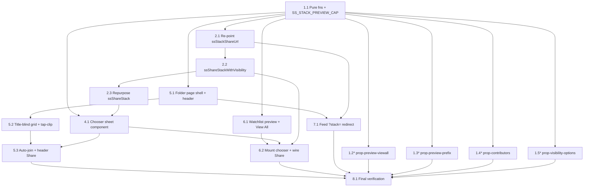

# Implementation Plan

## Overview

Single phase (the design ships the pure functions, the new route, the Watchlist preview
change, the feed redirect, and the share chooser as one cohesive unit). The work is
**ordered for a green-at-every-step build**: pure DOM-free logic and its property tests land
first, then the impure share-layer helpers in the same module, then the reusable chooser
sheet, then the pages that consume them (folder route, Watchlist), then the feed redirect,
then final verification.

Pure logic lives in `showshak-shared.js` (dual-exported for Node + fast-check). Run
`node tests/run-all.js` after every `showshak-shared.js` change and keep the suite green at
every checkpoint. The four new fast-check files mirror the existing `tests/_pbt.js`
conventions (`installDomStub()` before requiring the module, `ITER` >= 100/200 via
`numRuns`, the `// Feature: stack-folder-view, Property <n>` + `// **Validates: …**` tags,
and `process.exitCode` so buffered output flushes).

**NO founder-run migration.** This feature adds none — it consumes the existing
`get_shared_stack` RPC payload exactly as `ssLoadSharedStackById(id)` already returns it
(Req 14, design "Data Models"). There is no SQL file to write and nothing for the founder to
apply in the Supabase SQL editor.

## Tasks

- [x] 1. Pure preview/attribution/visibility logic + property tests (`showshak-shared.js`)
  - [x] 1.1 Add the three pure functions and the preview-cap constant, dual-exported
    - Add `ssStackPreviewClips(clips, cap)` → `{ shown, viewAll }` where
      `shown = clips.slice(0, min(cap, clips.length))` (order-preserving prefix, same clip
      references, non-array/empty `clips` → `[]`, non-positive/non-number `cap` →
      `SS_STACK_PREVIEW_CAP`) and `viewAll = clips.length > cap` (strictly greater).
    - Add `ssStackContributors(owner, members)` → owner-first, de-duplicated, order-preserving
      attribution list (dedupe by `user_id`/`id`, fall back to `username`; owner emitted once
      even if present in `members`; no non-owner member → `[owner]`).
    - Add `ssShareVisibilityOptions(role, currentVisibility)` → `['private','unlisted']` for a
      normal user and `['private','unlisted','public']` for a curator (reuse the same curator
      rule as `ssStackShelfPlacement` / `ssIsCuratorAccountSync`; `currentVisibility` only
      marks the current choice and never widens the set).
    - Add `var SS_STACK_PREVIEW_CAP = 12;` as the single source of truth.
    - All four DOM-free and added to BOTH the `window.*` export block and the
      `module.exports` block, exactly like the existing stack-sharing rules.
    - _Requirements: 10.1, 10.2, 10.3, 10.4, 10.5, 11.1, 11.2, 11.3, 11.4, 11.5, 12.1, 12.2, 12.3, 12.4, 12.5; Design "New pure functions"_

  - [x]* 1.2 Write `tests/prop-stack-preview-viewall.test.js`
    - **Property 1: Preview "View All" biconditional** — `viewAll === true` iff
      `clips.length > cap`; `false` when `clips.length <= cap`.
    - Generators: arrays of arbitrary length × integer caps including `0`, `len`, `len±1`,
      large; fold in empty/non-array `clips` and non-positive/non-number `cap`.
    - **Validates: Requirements 4.2, 4.3, 10.1, 10.2**

  - [x]* 1.3 Write `tests/prop-stack-preview-prefix.test.js`
    - **Property 2: Preview shown is the order-preserving prefix** — `shown` equals
      `clips.slice(0, min(cap, clips.length))`; length never exceeds the cap; no clip dropped
      from within the prefix and none duplicated.
    - Generators: arrays of clips with unique ids (to detect drop/dup) × caps.
    - **Validates: Requirements 4.1, 4.4, 10.3, 10.4**

  - [x]* 1.4 Write `tests/prop-stack-contributors.test.js`
    - **Property 3: Contributors are owner-first, de-duplicated, order-preserving** — first
      element is the owner, followed by every other member in original relative order, each
      identity at most once; no non-owner member → exactly `[owner]`.
    - Generators: arbitrary owner × `members[]` including owner-in-members, duplicate ids,
      and empty.
    - **Validates: Requirements 3.1, 3.2, 3.3, 3.4, 11.1, 11.2, 11.3, 11.4**

  - [x]* 1.5 Write `tests/prop-share-visibility-options.test.js`
    - **Property 4: Share options are role-gated and independent of current visibility** —
      curator → exactly `['private','unlisted','public']`, otherwise exactly
      `['private','unlisted']`; `public` present iff curator; set never changes with
      `currentVisibility`.
    - Generators: role ∈ {curator, user, random strings, null} × visibility ∈ {private,
      unlisted, public, junk}.
    - **Validates: Requirements 8.3, 8.4, 12.1, 12.2, 12.3, 12.4**

- [x] 2. Share-layer impure helpers (`showshak-shared.js`)
  - [x] 2.1 Re-point `ssStackShareUrl(stack)`
    - Change the path segment from `showshak-feed.html?stack=` to
      `showshak-stack.html?stack=`; still return `null` for private/mock ids and still never
      include a title.
    - _Requirements: 1.1, 8.5; Design "Re-pointed / new impure helpers"_

  - [x] 2.2 Add `ssShareStackWithVisibility(stack, visibility)` (thin)
    - Persist via `ssSetStackVisibility(stack.id, visibility, stack.highlighted)`; for a
      non-private choice build the URL via `ssStackShareUrl` and invoke `navigator.share`
      (clipboard fallback) with the existing title-blind `title`/`text`; for `private` do not
      generate a link.
    - _Requirements: 8.2, 8.5, 9.2; Design "Re-pointed / new impure helpers", "The share-chooser flow"_

  - [x] 2.3 Repurpose `ssShareStack(stack)` to open the chooser
    - Delegate to the visibility chooser sheet instead of auto-promoting; **delete** the
      interim `private → unlisted` auto-promote branch.
    - _Requirements: 8.1, 9.1; Design "The share-chooser flow"_

- [x] 3. Checkpoint — Ensure all tests pass
  - Run `node tests/run-all.js` and `node --check showshak-shared.js`; ensure all tests pass
    (45 files once the four new property tests exist), ask the user if questions arise.

- [x] 4. Shared visibility-chooser sheet component
  - [x] 4.1 Build the reusable bottom-sheet (markup + CSS + tiny controller)
    - A small bottom-sheet mounted on both Watchlist and the folder page; render one row per
      option returned by `ssShareVisibilityOptions(role, currentVisibility)`, mark the current
      visibility, and on selection call `ssShareStackWithVisibility(stack, visibility)`.
    - Keep it "dumb": all option-gating stays in the pure function, all persistence/share in
      the impure helper; use the standard CSS tokens/components for styling.
    - _Requirements: 8.1, 8.2, 8.3, 8.4, 8.5; Design "Shared chooser sheet (reusable)"_

- [x] 5. New folder route page `showshak-stack.html`
  - [x] 5.1 Page shell, boot, load, and header
    - Create `showshak-stack.html` with the shared chrome (`<div id="ss-nav"></div>`), the
      standard CSS, and `showshak-shared.js`; parse `?stack=<id>` from `location.search`
      (absent/invalid → "unavailable" state, no RPC call); `await ssLoadSharedStackById(id)`
      (`null` → "unavailable", empty `clips` → empty state, never reveal a title); render
      `stack.name` + details (clip count, mode) and the attribution row built from
      `ssStackContributors(owner, members)` (owner-first @handles; collaborative shows the
      contributor row, view shows creator only).
    - _Requirements: 1.1, 1.2, 1.3, 1.5, 3.1, 3.2, 3.3, 3.4, 3.5, 7.1, 7.2, 7.3, 7.4, 14.1; Design "New page — showshak-stack.html"_

  - [x] 5.2 Title-blind grid + tap-clip handoff
    - Render `clips` as title-blind cards (creator + 🔥 `fires_count`; **no** title, **no**
      platform badge; collaborative may show the title-free `+ @contributor` chip from
      `added_by_username`), reusing the profile/discover grid card markup/CSS; tapping a card
      calls `ssOpenClip(clip, clips)` starting at the tapped clip with the whole stack as the
      swipe playlist.
    - _Requirements: 1.4, 2.1, 2.2, 2.3, 2.4, 6.1, 6.2, 6.3; Design "New page — showshak-stack.html"_

  - [x] 5.3 Collaborative auto-join + header Share → chooser
    - When `stack.mode === 'collaborative'`, run the relocated auto-join (signed-in, not
      member, room via `ssCanJoinStack` → `ssJoinStack`; signed-out → sign-in prompt; full →
      existing "stack is full" toast); wire the header Share button to open the chooser sheet
      from Task 4.
    - _Requirements: 7.5, 8.1; Design "New page — showshak-stack.html", "The share-chooser flow"_

- [x] 6. Watchlist preview + chooser wiring (`showshak-watchlist.html`)
  - [x] 6.1 Capped preview + View All tile + folder navigation
    - Replace the "map all `stack.clips`" render with
      `const { shown, viewAll } = ssStackPreviewClips(stack.clips, SS_STACK_PREVIEW_CAP);`,
      render `shown` with the existing title-blind `.wl-clip` markup (unchanged, creator + 🔥
      only), append a "View All" tile only when `viewAll` is true that navigates to
      `showshak-stack.html?stack=<id>`; add `onclick` → folder route on the stack name and
      header bar.
    - _Requirements: 4.1, 4.2, 4.3, 4.4, 4.5, 5.1, 5.2, 5.3; Design "Watchlist preview change"_

  - [x] 6.2 Mount the chooser sheet + wire Share through it
    - Mount the shared visibility-chooser sheet (Task 4) on the Watchlist; route the row
      Share action through the chooser (→ `ssShareStackWithVisibility`); keep the existing
      visibility controls in the stack's ⋮ menu (both call the same `ssSetStackVisibility`).
    - _Requirements: 8.1, 8.2, 8.6, 9.1; Design "The share-chooser flow", "Shared chooser sheet"_

- [x] 7. Feed `?stack=` redirect (`showshak-feed.html`)
  - [x] 7.1 Reduce the `ssFeedStackDeepLink` handler to a redirect
    - When `?stack=<id>` is present,
      `location.replace('showshak-stack.html?stack=' + encodeURIComponent(stackId))`; remove
      the clip-opening + collaborative auto-join code (now owned by the folder route); leave
      the `?clip=<id>` handler untouched.
    - _Requirements: 7.1, 13.2; Design "Feed handler (showshak-feed.html)"_

- [~] 8. Final verification
  - [x] 8.1 Static + suite + manual checklist
    - `node --check showshak-shared.js` (and the chooser-sheet controller script) clean; full
      `node tests/run-all.js` green at **45 files** (41 existing + the 4 new property tests);
      HTML diagnostics clean on `showshak-stack.html`, `showshak-watchlist.html`,
      `showshak-feed.html`. Confirm the new pure functions are additive and do not alter
      existing stack-sharing pure-function behavior.
    - Then the founder runs the design's manual checklist: (1) route + deep link + clean back
      button; (2) folder → viewer handoff with whole-stack playlist; (3) Watchlist preview cap
      + View All only when >12 + name/header/View All open the route; (4) shared link as
      guest / stranger-to-private (unavailable, no leak) / eligible collaborative (auto-joins
      on the route) + old feed `?stack=` link redirects; (5) share chooser role-correct
      options, persist, non-private native share with title-blind text, private = no link, no
      silent auto-promote, ⋮ menu still has visibility controls; (6) regressions — save-to-stack
      works, `?clip=` opens the viewer, new stacks default to private.
    - _Requirements: 1.5, 6.x, 8.x, 9.1, 9.2, 9.3, 13.1, 13.2, 13.3, 13.4, 14.2, 14.3_

## Notes

- Tasks marked with `*` are optional (the property-test files) and can be skipped for a
  faster MVP; the four core pure functions in 1.1 are never optional.
- **No new migration.** The feature reuses the `get_shared_stack` RPC / `ssLoadSharedStackById`
  payload as-is (Req 14); there is no founder-run SQL step in this plan.
- **Privacy is RLS/RPC-enforced.** The pure JS functions are UX-only and never the security
  boundary; the folder route renders exactly what the RPC returns (unavailable → `null` →
  "unavailable" state). Unlisted stays non-enumerable; re-pointing the share URL does not
  change the read path.
- **Title-blind everywhere** — folder grid cards and Watchlist preview cards show only creator
  + 🔥 fires; titles are revealed only in the Watch It sheet.
- Run `node tests/run-all.js` after each `showshak-shared.js` change; keep the suite green at
  every checkpoint.

## Task Dependency Graph



Critical path: 1.1 → 2.1 → 2.2 → 2.3 → 4.1 → 5.3 → 8.1. The property tests (1.2–1.5) run in
parallel once 1.1 lands; the folder page (5.x), Watchlist (6.x), and feed redirect (7.1) are
independent files that fan out once their shared dependencies are in place. Tasks touching
`showshak-shared.js` (1.1, 2.1, 2.2, 2.3) are sequenced into separate waves to avoid write
conflicts, as are the multi-step edits to `showshak-stack.html` (5.1→5.2→5.3) and
`showshak-watchlist.html` (6.1→6.2).

```json
{
  "waves": [
    { "wave": 1, "tasks": ["1.1"] },
    { "wave": 2, "tasks": ["1.2", "1.3", "1.4", "1.5", "2.1"] },
    { "wave": 3, "tasks": ["2.2"] },
    { "wave": 4, "tasks": ["2.3"] },
    { "wave": 5, "tasks": ["4.1", "5.1", "6.1"] },
    { "wave": 6, "tasks": ["5.2", "6.2", "7.1"] },
    { "wave": 7, "tasks": ["5.3"] },
    { "wave": 8, "tasks": ["8.1"] }
  ]
}
```
