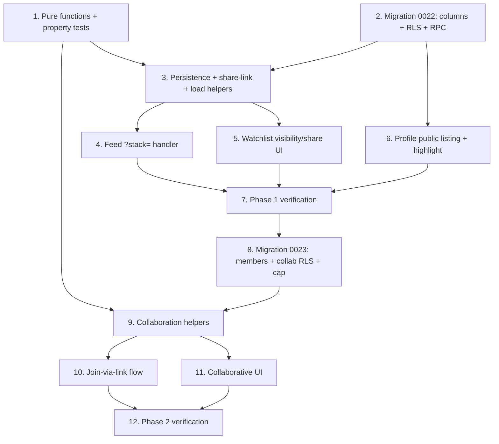

# Implementation Plan

## Overview

Phased so Phase 1 ships on its own. Pure logic goes in `showshak-shared.js` (dual-exported
for Node + fast-check). Migrations are founder-applied in the Supabase SQL editor (the
project's manual-migration flow) and are flagged **[founder-run]**. Run `node tests/run-all.js`
after every `shared.js` change.

## Tasks

### Phase 1 — Visibility + Viewing (shippable alone)

- [x] 1. Pure visibility/placement functions + property tests
  - [x] 1.1 Add `ssStackCanView`, `ssStackIsListed`, `ssStackShelfPlacement` and the
    `SS_STACK_MEMBER_CAP` constant to `showshak-shared.js` (dual-exported).
  - [x] 1.2 Add `ssCanContribute`, `ssCanJoinStack`, `ssCanRemoveStackItem` (used in Phase 2,
    defined now so the model is complete and tested).
  - [x] 1.3 Write fast-check property tests for all six (a `tests/prop-stack-*.test.js` set),
    covering every viewer/visibility/membership/cap combination — assert no view leak, no
    non-public listing, no cap violation, no cross-member removal.
  - _Requirements: 1, 2, 3, 6, 7, 8 (pure rules); Properties 1–6_

- [x] 2. **[founder-run]** Migration 0022 — visibility columns + RLS + shared-read RPC
  - [x] 2.1 Reconciled with the live schema: `visibility` + `is_highlight` already exist
    (0001) — normalize legacy `'friends'`→`'unlisted'`, add the visibility CHECK, reuse
    `is_highlight` (mapped to JS `highlighted`); add the genuinely-new `mode` column.
  - [x] 2.2 `stacks` SELECT policy (`read_stacks`) already = `user_id=auth.uid() OR
    visibility='public'` (no unlisted enumeration); recreated idempotently + owner UPDATE
    policy covers the new columns.
  - [x] 2.3 Add `get_shared_stack(p_stack_id uuid)` SECURITY DEFINER RPC returning
    `{stack, clips[]}` only when not-private-or-owner, clips projected in the feed's
    embed shape, ordered by the real `added_at` column; grant execute to anon+authenticated.
  - [x] 2.4 `notify pgrst, 'reload schema'`. (Founder applies in SQL editor.)
  - _Requirements: 1.1, 2.1, 2.2, 2.3, 2.4_

- [x] 3. Persistence + share-link + shared-load helpers (`showshak-shared.js`)
  - [x] 3.1 `ssSetStackVisibility(stackId, visibility, highlighted)` — owner UPDATE,
    fire-and-forget (mirrors `_ssDb*`); set `visibility` on stack create (default private).
  - [x] 3.2 `ssStackShareUrl(stack)` → `…/showshak-feed.html?stack=<id>` for non-private only.
  - [x] 3.3 `ssLoadSharedStackById(id)` → calls `get_shared_stack` RPC, maps clips via the
    existing mappers, returns `{stack, clips}` or null.
  - [x] 3.4 Rewire `ssShareStack(stack)` to use `ssStackShareUrl` (no title in copy); if the
    stack is private, prompt to make it shareable instead of generating a link.
  - _Requirements: 1.5, 4.1, 5.1, 5.2, 5.3, 5.4_

- [x] 4. Feed `?stack=<id>` deep-link handler (`showshak-feed.html`)
  - [x] 4.1 Sibling to the `?clip=` handler: read `?stack=`, call `ssLoadSharedStackById`,
    open the universal viewer with the stack's clips (`ssOpenClip(clips[0], clips)`).
  - [x] 4.2 Unavailable state when the RPC returns null; empty state when `clips` is empty;
    never reveal a title.
  - _Requirements: 4.1, 4.2, 4.3, 4.4_

- [x] 5. Watchlist controls (`showshak-watchlist.html`)
  - [x] 5.1 Per-stack visibility control (Private / Unlisted / Public — Public shown only to
    curators); persists via `ssSetStackVisibility`.
  - [x] 5.2 Real Share button using `ssStackShareUrl`; unlisted explainer ("anyone with the
    link can view").
  - _Requirements: 1.3, 1.4, 1.5, 5.1, 5.3_

- [x] 6. Profile listing reads the new visibility column (`showshak-profile.html`)
  - [x] 6.1 `fetchCuratorPublicStacks` lists stacks by `visibility='public'` and carries
    `is_highlight`→`highlighted` (+ real clip counts); `ownCollections` carries real
    `visibility`/`highlighted`. Render uses the property-tested `ssStackShelfPlacement`:
    highlighted → Highlights shelf, non-highlighted → Shared Stacks folder tab.
  - [x] 6.2 Owner highlight star on each public stack in the shelf (toggles `is_highlight`
    via `ssSetStackVisibility`). Shelf open + share wired to real `?stack=`/`ssShareStack`.
  - _Requirements: 3.1, 3.2, 3.3, 3.4_

- [x] 7. Phase 1 verification
  - [x] 7.1 `node --check` + full suite green (41 files); HTML diagnostics clean. Manual
    DB checks remain founder-run after applying 0022: unlisted link signed-out works,
    private link as stranger blocked, public stack listed, `select * from stacks` as anon
    returns only public rows (no unlisted enumeration).
  - _Requirements: 9.1, 9.2, 9.3_

### Phase 2 — Collaboration

- [x] 8. **[founder-run]** Migration 0023 — collaboration schema + RLS + cap
  - [x] 8.1 `stack_members` table; `stack_items.added_by` column.
  - [x] 8.2 Collaborative INSERT/DELETE policies on `stack_items` (member-or-owner insert;
    owner-or-contributor delete); read policy widened to members; replaced the old
    owner-only `stack_items_write` FOR-ALL policy.
  - [x] 8.3 BEFORE INSERT trigger on `stack_members` enforcing the member cap (6).
  - [x] 8.4 `join_stack(p_stack_id)` RPC (cap-gated, idempotent, owner auto-counted) +
    `get_shared_stack` enriched with mode/attribution/members/viewer_is_member + reload.
  - _Requirements: 6.3, 6.4, 7.1, 8.1, 8.2_

- [x] 9. Collaboration helpers (`showshak-shared.js`)
  - [x] 9.1 `ssJoinStack`, `ssAddClipToSharedStack` (sets `added_by`), `ssRemoveSharedStackItem`,
    `ssLeaveStack`, `ssRemoveStackMember`, `ssSetStackMode`; `_ssDbAddClip` now sets
    `added_by`; `ssLoadSharedStackById` surfaces members/member_count/viewer_is_member.
  - [x] 9.2 Reuses the Phase-1 pure functions at the call sites.
  - _Requirements: 6.2, 6.5, 6.6, 7.2, 7.3, 7.4, 8.3, 8.4_

- [x] 10. Join-via-link flow
  - [x] 10.1 Opening a collaborative `?stack=` link while signed in auto-joins (gated by
    `ssCanJoinStack`, RPC re-checks cap); signed-out → sign-in prompt; full → "stack is full".
  - _Requirements: 6.2, 6.4, 6.5_

- [x] 11. Collaborative UI
  - [x] 11.1a Owner View/Collaborative toggle in the Watchlist menu (shared stacks only);
    persists via `ssSetStackMode`; private forces view; member-cap explainer.
  - [x] 11.1b Member-side surfacing: `ssHydrateStacks` now also loads JOINED collaborative
    stacks (via the RPC, isolated/fail-soft) so they appear in the member's Watchlist + save
    picker; per-clip "+ @contributor" attribution; Leave Stack; the ⋮ menu hides owner-only
    actions for joined stacks; clip removal gated by `ssCanRemoveStackItem` (guest/owned path
    unchanged). Auto-join wired in the feed `?stack=` handler.
  - _Requirements: 7.2, 8.1, 8.2, 8.3, 8.4_

- [~] 12. Phase 2 verification
  - [x] 12.1a Full suite green (41 files); `node --check` clean; HTML diagnostics clean on
    feed/watchlist/profile/shared.
  - [ ] 12.1b Manual (founder, after applying 0023): two accounts co-add to one stack, cap
    blocks the 7th, a member can't remove another's clip, owner removes any + removes a member.
  - _Requirements: 9.3_

## Task Dependency Graph



Critical path: 1 + 2 → 3 → (4,5,6) → 7 → 8 → 9 → (10,11) → 12. Tasks 1 and 2 are
independent and can run in parallel; 4/5/6 are independent once 3 (and 2) land.

```json
{
  "waves": [
    { "wave": 1, "tasks": ["1", "2"] },
    { "wave": 2, "tasks": ["3", "6"] },
    { "wave": 3, "tasks": ["4", "5"] },
    { "wave": 4, "tasks": ["7"] },
    { "wave": 5, "tasks": ["8"] },
    { "wave": 6, "tasks": ["9"] },
    { "wave": 7, "tasks": ["10", "11"] },
    { "wave": 8, "tasks": ["12"] }
  ]
}
```

## Notes

- **Migrations are founder-run** (tasks 2 and 8) in the Supabase SQL editor — the agent
  writes the migration file; the founder applies it. Code that depends on a migration is
  written to fail soft until it's applied (no hard breakage).
- **Privacy is RLS/RPC-enforced.** The pure JS functions drive UX only; they are never the
  security boundary. The unlisted-enumeration guard (RPC-only read) is the key invariant.
- **No title leaks** anywhere in the share or shared-stack-view paths.
- **Phase 1 is independently shippable.** Phase 2 is additive and gated on engagement need;
  the schema is designed up front so Phase 2 requires no rework of Phase 1.
- Run `node tests/run-all.js` after each `shared.js` change; keep the suite green at every
  checkpoint.
