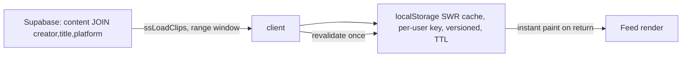

# ShowShak — Feed Clip-Load & Cache Pipeline

> **Purpose:** architecture doc for the feed's clip-loading + caching pipeline, to
> get a second opinion from a senior backend/infra engineer. Covers the *current*
> implementation and the *proposed A-grade* design. Honest about what's verified
> vs hypothesis.
>
> **Product:** ShowShak — a vertical short-clip *streaming-discovery* feed (think
> "TikTok format, Letterboxd soul"). Curators post ≤90s vertical clips; users
> swipe, and tap **Watch It** to go to the streaming platform. PWA, launching in
> India.

---

## 1. Context, scale & goals

**Stack (deliberately boring + cheap to run):**
- **Frontend:** vanilla HTML/CSS/JS PWA. No framework, no build step. Service worker for app-shell caching.
- **Video:** **Mux** (HLS via `<mux-player>` v3, which wraps hls.js on non-Safari and native HLS on Safari). Mux fronts its own CDN. Pay-as-you-go.
- **Data:** **Supabase** (Postgres + RLS + Edge Functions), Mumbai region. Anon key in client; RLS is the boundary.
- **Hosting:** GitHub Pages (static), `main` branch.

**Current target scale (pre-seed / demo):**
- ~20–25 curators × ~50–70 clips ⇒ **~1,000–1,750 total clips** (~10–20h unique content).
- ~5,000 registered users; realistically ~100–500 daily-active early.
- **~100k min/month** of Mux delivery budget (free credit) to play with.

**Key scale insight that shapes the whole design:** the catalog is **tiny and hot**
relative to the audience. Thousands of users hit the same ~1.5k clips ⇒ Mux's CDN
edge cache should run **near-100% hit rate**. So segment delivery is fast globally
and *generous prefetch is cheap to serve* (we reuse the same hot segments across
all users). The constraint isn't watched minutes — it's **prefetch waste** (clips
downloaded but skipped) and **runaway-bug blast radius** on the free budget.

**Target SLIs (what "A-grade / TikTok-feel" means here):**
| SLI | Target |
|---|---|
| Scroll → first frame of next clip (TTFF on swipe) | < 150–200 ms (feels instant) |
| Cold open: splash-clear → clip-1 playing | clip-1 ready *before* splash lifts |
| Rebuffer ratio (stall time / watch time) | < 1% |
| Scroll-back to a recently-seen clip | instant, **no re-download** |
| Audio correctness | only the visible clip is audible (already solved) |

---

## 2. The layered cache model (the mental model)

The single most important framing: there are **five distinct layers**, each with a
different medium, lifetime, and eviction model. Most "caching" confusion comes from
conflating them.

```
 Layer                         Medium                 Holds                    Lifetime / Evict        Bound
 ─────────────────────────────────────────────────────────────────────────────────────────────────────────
 L0  App shell                 Cache Storage (SW)     HTML/CSS/JS/icons        version bump (vN)       small
 L1  Clip METADATA             localStorage (SWR)     ids, captions, posterURL,1 page, TTL 6h          ~tens of KB
                                                       mux_playback_id
 L2  Mounted players           live <mux-player> DOM  decoded video + buffer   LRU band around active  ~4 elements
 L3  In-memory media buffer    per-player MSE buffer  forward/back seconds     player-managed          tier-tuned
 L4  Persisted media segments  Cache Storage / IDB    HLS init+media segments  byte-bounded LRU        ~150–250 MB
       (PROPOSED — not built yet)
```

- **L2 ≠ L3 ≠ L4.** Mounted players are expensive (CPU/RAM/decoders) → keep ~4.
  In-memory buffer is per-player and volatile. Persisted segments are cheap bytes
  on disk → can hold many more clips than we mount.
- **Video bytes never go in localStorage** (≈5–10 MB total, synchronous, string-only).
  They belong in **Cache Storage / IndexedDB** (async, range-aware, 100s of MB).
- **L1 (metadata) is what makes scroll-back/return *feel* instant on the data side;
  L4 (segments) is what makes it instant on the *video* side.**

---

## 3. Metadata pipeline (L1) — DB → client



**Current (implemented & working well):**
- `ssLoadClips(limit, offset)` pulls a window (`SS_CLIP_WINDOW = 10`) from Postgres.
- Per-user **stale-while-revalidate** cache in localStorage: key
  `ss_feed_cache_v{N}_{userId}`, capped 10 clips, **TTL 6h**, and **<30s ⇒ skip the
  revalidation query** entirely. Key resolves synchronously via a persisted
  `ss_last_uid` so a cold load doesn't miss while the async auth session resolves.
- Sliding-window pager fetches the next window at the leading edge.

**Proposed change:** expand the rolling metadata window to **~30 clips** (still tens
of KB) so scroll-back through recently-seen clips needs zero DB round-trips, and the
pager has more runway. Cheap, low-risk, pull-early.

---

## 4. Video pipeline (L2–L4) — Mux HLS

```mermaid
flowchart TD
  P[mux playback_id] --> M[stream.mux.com/{id}.m3u8]
  M --> CDN[Mux CDN edge - near-100pct hit at our scale]
  CDN --> SURF[VideoSurface = mux-player/hls.js]
  SURF --> POOL[Player Pool: ~4 mounted, LRU band around active]
  SURF --> BUF[per-player MSE buffer]
  CACHE[(L4 persisted segments - PROPOSED)] -. range 206 .-> SURF
```

**Current (implemented):**
- **Player pool:** `_poolRecycle` keeps ~4 mounted `<mux-player>`s in a band around
  the active index, **re-pointing** surfaces (swap `playback-id`) instead of
  destroy/recreate — avoids element churn and keeps scroll-back within the band fast.
- **Poster-first paint:** each frame paints the Mux thumbnail (`image.mux.com/.../thumbnail.jpg`)
  immediately, so a not-yet-mounted clip shows a real frame, not black.
- **ABR start seed:** `initial-bandwidth-estimate-kbps = 700` so the first segment is
  a low rendition that renders fast, then ABR climbs.
- **Network-aware tiers:** pure helpers classify `navigator.connection.effectiveType`
  → `{slow|medium|fast}` → `{preloadDepth, maxResolution}` (e.g. 1/480p, 3/720p, 5/1080p).
- **Service worker:** SWR for HTML + static; **Mux is explicitly NOT intercepted**
  (no persistent video cache today — a deliberate earlier decision).

---

## 5. Known problems in the current pipeline (verified from code)

These are the reasons the feed isn't yet "A-grade." (1)–(3) verified by reading the
code; impact ranking needs a device trace / Mux Data.

1. **No real next-clip video prefetch.** The "warm" step fetches only the tiny
   `.m3u8` *manifest*, not the init/media segments. So a swipe starts the next clip's
   actual bytes **cold**. This is the #1 gap vs TikTok (whose whole trick is "next
   clip's first chunk already on disk").
2. **The manifest warm is likely wasted.** It's fetched `mode:'no-cors'` → an
   **opaque** response. hls.js fetches the manifest with CORS to read it; the browser
   keys HTTP cache by request mode, so the opaque copy generally **isn't reused**. We
   spend a request and gain ~nothing.
3. **All ~4 mounted players use `preload="auto"`.** On a constrained mobile link they
   buffer concurrently and **contend with the active clip**, starving the one the user
   is actually watching. (Matches the short-video prefetch literature: naive
   "prefetch the next few fully" both wastes bandwidth and *causes* stalls.)
4. **No persistent segment cache (L4).** Scroll-back beyond the mounted band
   re-downloads. (Mux's own feed guidance explicitly calls out "scrolling back
   shouldn't re-download.")
5. **Cold first-ever open waits on the Supabase query** (Mumbai RTT). Mitigated for
   returns by the SWR cache, but the very first paint blocks.

---

## 6. Proposed A-grade design

### 6.1 Prefetch as a priority ladder (active always wins)

Replace blanket `preload="auto"` with a **distance-from-active tier**, gated by
network tier and a session budget:

```
 position rel. active     buffer policy
 ───────────────────────────────────────────────────────────
 active (0)               full buffer, highest priority — WINS the pipe
 +1, +2                   first segment now (instant swipe); deepen with spare pipe
 +3, +4                   first segment only (fast tier) / none (slow tier)
 −1, −2 (scroll-back)     served from L4 persisted cache, else first segment
 everything else          preload="none"
```

### 6.2 "Use the whole clip duration" (the founder's half/half idea, made safe)

A short clip only needs ~its own length of data; it buffers fully in the first part
of playback. **Once the active clip's buffer is satisfied, the pipe is genuinely
free** for the rest of the view. So:

- **First part of playback:** active clip buffers to full. Nothing competes.
- **Remaining playback:** spare pipe **progressively deepens** ahead — next-1 fully,
  next-2..4 first-segment — **bounded by**: network tier, a per-session **byte
  budget**, and a **dwell signal** (only deepen aggressively once the user has
  watched enough to suggest they'll continue).

This gives "3–4 clips ready" without the stall-risk or the bandwidth blow-up of
"download the next 4 in full immediately."

### 6.3 Cold-start lane (the ~3s splash is free prefetch time)

The PWA shows a ~3s brand splash on first launch (~700ms later). Today it's wasted
on the data front. Proposed:

```mermaid
sequenceDiagram
  participant Splash (inline, pre-script)
  participant LS as localStorage (L1)
  participant Mux
  participant Player
  Splash->>LS: read clips[0].playback_id + poster (synchronous)
  Splash->>Mux: prefetch clip-1 FIRST SEGMENT (CORS-correct) + poster img
  Note over Splash,Mux: overlaps script load + the 3s brand beat
  Player->>Mux: (later) requests clip-1 segment ⇒ CACHE HIT ⇒ instant play
  Splash->>Splash: lift when clip-1 canplay OR floor elapsed (capped by ceiling)
```

- **Returning users:** L1 cache is in localStorage synchronously ⇒ start clip-1's real
  bytes within ~100ms of launch, before mux-player even upgrades.
- **First-ever users:** fire the DB query first; prefetch the moment it returns
  (still inside the window).
- **Readiness-gated lift:** splash clears when **clip-1 can actually play**, or the
  brand floor elapses — whichever is later — capped by a hard ceiling so a stalled
  network can't make the splash sticky. Net: the brand beat becomes productive
  buffering, and the logo never clears onto a buffering clip.

### 6.4 Persistent segment cache (L4) — scroll-back without re-download

```
 Cache Storage (or IndexedDB), range-request aware (HTTP 206)
 ┌─────────────────────────────────────────────────────────────┐
 │ window = N clips BEHIND + N clips AHEAD of active ("5 + 5")  │
 │ store: init segment + media segments per clip in window      │
 │ evict: LRU, bounded by TOTAL BYTES (~150–250 MB), not count  │
 │ key:   playback_id + segment URI; respect Range headers      │
 └─────────────────────────────────────────────────────────────┘
```

- Bound by **bytes, not clip count** (clip sizes vary).
- LRU keyed on distance from active; the "5 old / 5 new" window is the eviction
  policy.
- At our hot-catalog scale this is very effective (high reuse).
- **Caveat:** highest-effort, highest-risk piece (range/206 correctness, quota
  handling, it spends Mux egress to fill). **Build + measure L1–L3 first**, then
  decide how far L4 goes.

### 6.5 Cost / budget guardrails (so "spend liberally now" is safe)

The strategy is: **bias toward experience now** (tiny hot catalog, 100k free
min/month), but bound it so a bug can't burn the budget and so we can dial it down
post-funding without a rewrite.

1. **Per-session prefetch byte ceiling + circuit breaker.** Hard cap; on breach, fall
   back to conservative (active-only). Blast-radius control for the free credit.
2. **Resolution cap.** Vertical phone clips don't need 1080p. Cap **720p (480p on slow
   tier)** ⇒ faster startup, less rebuffer on Indian mobile, lower delivery. Single
   biggest cost-*and*-experience lever. (`setMaxResolution` already exists per tier.)
3. **Everything is a tunable constant** — prefetch depth, byte budget, window size,
   resolution cap. Spend-now is *config*, not architecture.
4. **Mux Data** dashboards (TTFF, rebuffer %, by network tier/device) — we already
   label views with `metadata-video-id`/title. Measure before/after; watch
   consumption against the budget.

---

## 7. Failure modes & fallbacks (fail-soft everywhere)

| Failure | Handling |
|---|---|
| Network slow / `effectiveType` unknown | default to **medium** tier; shallow prefetch; cap 720p/480p |
| Session byte budget exceeded | circuit-break → active-only buffering |
| Player upgrade race (mux-player loads async) | poster-first frame; `canplay`/`loadeddata` re-assert play + sound |
| L4 segment cache miss / quota exceeded | transparent fallback to network (player just fetches normally) |
| Cold first-ever, no L1 cache | skeleton shimmer + splash covers the DB fetch; prefetch on query return |
| Range/206 not honored by store | bypass L4 for that asset; never block playback |
| Mux/CDN error on a clip | poster stays; synthesize "ended" after grace → advance feed |

Guiding rule: a missing/failed cache entry degrades to "fetch from network / today's
behaviour" — **never a thrown error, never a dead/black clip.**

---

## 8. Rollout phases (phased so the Feed never breaks)

The pure decisions (preload tier per index, "should we deepen?", "should the splash
lift?", LRU eviction) are **property-tested** (fast-check) — same discipline we use
for the rest of the pure core, which is dual-exported for Node.

- **Phase 0** — Instrument (Mux Data) + session byte ceiling/circuit-breaker. *Measure first.*
- **Phase 1** — Preload tiering (active wins) + replace opaque warm with real
  CORS-correct first-segment prefetch + 720p cap.
- **Phase 2** — Progressive "use the clip duration" deepening (network + dwell + budget bounded).
- **Phase 3** — Cold-start splash lane + readiness-gated lift.
- **Phase 4** — L1 metadata window → ~30 (early), **L4 persisted segment LRU** (gated; measure first).

---

## 9. Open questions for review (what I'd love a second opinion on)

1. **mux-player vs raw hls.js for control.** mux-player abstracts the loader; for
   precise per-tier buffer control + warming the *next* clip's first segment into a
   reusable cache, is it worth dropping to hls.js directly (own `Hls` instances,
   `startLoad`/`stopLoad`, `maxBufferLength`)? Trade-off: control vs Mux Data/UX niceties.
2. **L4 store choice: Cache Storage vs IndexedDB** for HLS segments with Range
   semantics. Cache Storage is simpler but Range/206 handling for `<video>`/MSE is
   fiddly; IndexedDB gives full control but we re-implement a byte server. Preference?
3. **Prefetch reuse correctness.** What's the most reliable way to ensure a manually
   prefetched segment (our `fetch`) is actually *reused* by hls.js's own fetch —
   matching request mode, credentials (`omit` for cross-origin Mux), and cache mode —
   rather than a duplicate download?
4. **Edge reality at our scale.** Is the "tiny hot catalog ⇒ near-100% Mux CDN hit"
   assumption sound, and does it make client-side L4 mostly redundant for *cold*
   starts (vs only helping true offline / same-segment scroll-back)?
5. **Prefetch policy.** Fixed depth + dwell gate vs a throughput-adaptive controller
   (the short-video prefetch literature leans adaptive). Worth the complexity at our
   scale, or is "active-wins + first-segment-ahead + 720p cap" 90% of the win?

---

*Honesty note: items in §5 (1)–(3) are verified from the current code; the impact
ranking and the §1 SLIs are targets pending a real device trace / Mux Data baseline.*
